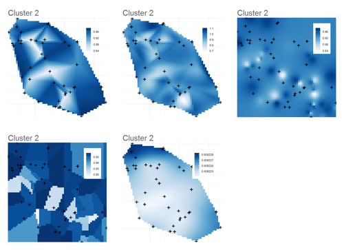
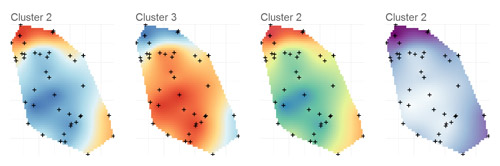

# pophelper 1.0.4

`pophelper` is an R package to help analyse output files generated from population analysis programs such as STRUCTURE and TESS. The `pophelper` package can be used to tabulate runs, summarise runs, perform the Evanno method, export files for CLUMPP and generate barplot figures. A detailed demonstration was prepared for `pophelper v1.0.0`, refer the [vignette](https://github.com/royfrancis/pophelper/blob/master/inst/doc/Vignette.pdf). Newer versions and updates is shown only on the github page (this page).

Also, try the short video demo [here](https://www.youtube.com/watch?v=iOqxXcQReJI).

## Installation  
You need to have R (> 3.0.0) installed on your system. Then, install the 'devtools' package. Then, you can install `pophelper` from `github` using the `devtools` package.

```coffee
install.packages('devtools',dep=T)
require(devtools)
install_github('pophelper', 'royfrancis')
require(pophelper)
```
For help on any function, use  
`?tabulateRunsStructure`  
`?evannoMethodStructure`

For functions where one or more files need to be selected, the selection can be performed interactively. Windows users can use `choose.files(multi=T)`. Mac users can use `file.choose()` for single selection and `tk_choose.files()` from `tcltk` package for multiple selection.

## List of Functions  
### STRUCTURE  
```coffee
tabulateRunsStructure()   #get a tabulation of a large number of STRUCTURE files
summariseRunsStructure()  #summarise runs by repeats for each K
evannoMethodStructure()   #perform the Evanno method on summarised data
runsToDfStructure()       #convert STRUCTURE run files to R dataframe
clumppExportStructure()   #Export data file and parameter file for use with CLUMPP
collectClumppOutput()     #Collect CLUMPP output into a common folder
plotRuns()                #Plot a barplot from STRUCTURE run files
PlotMultiline()           #Plot a multi-line barplot from STRUCTURE run file
plotRunsInterpolate()     #Interpolate clusters in a STRUCTURE run spatially
plotRunsSpatial()         #Cluster by max assignment and plot points spatially
```

### TESS  
```coffee
collectRunsTess()         #collect TESS output from multiple folders into one
tabulateRunsTess()        #get a tabulation of a large number of TESS files
summariseRunsTess()       #summarise runs by repeats for each K
runsToDfTess()            #convert TESS run files to R dataframe
clumppExportTess()        #Export data file and parameter file for use with CLUMPP
collectClumppOutput()     #Collect CLUMPP output into a common folder
plotRuns()                #Plot a barplot from TESS run files
plotMultiline()           #Plot a multi-line barplot from TESS run file
plotRunsInterpolate()     #Interpolate clusters in a TESS run spatially  
plotRunsSpatial()         #Cluster by max assignment and plot points spatially
```  
A long demo script with usage of all functions, see [here](https://github.com/royfrancis/pophelper/blob/master/inst/files/PophelperDemo.R)  

## Functions and workflow 
A list of important functions are shown below. Once the package is installed, and you have set a working directory, you can follow the mini tutorial below.

### 1. Tabulate runs  
Select multiple STRUCTURE or TESS runs and tabulate them into a table.

```coffee
#read sample STRUCTURE files from R package
flist<-list.files(path=system.file("/files/structure",package="pophelper"),full.names=T)
#read sample TESS files from R package
flist1<-list.files(path=system.file("/files/tess",package="pophelper"),full.names=T)
#Or select your own files
flist<-choose.files()

#tabulate STRUCTURE runs
df<-tabulateRunsStructure(files=flist)
#tabulate TESS runs
tabulateRunsTess(files=flist1)
```
### 2. Summarise runs  
The tabulated runs can be further condensed by repeats.

```coffee
#summarise STRUCTURE runs
df1<-summariseRunsStructure(df)
summariseRunsTess()
```

### 3. Evanno method  
This function calculates the Evanno derivatives, tables and figures. The output from `summariseRunsStructure()` can be provided as input.

```coffee
#perform evanno method
evannoMethodStructure(df1)
```
  
__Fig 1.__ *Evanno Method*

### 4. Convert to dataframe  
STRUCTURE and TESS run files can be converted to R dataframes using this function. If multiple files are selected, then a list of dataframes is returned.

```coffee
#convert STRUCTURE run files to R dataframe
runsToDfStructure(files=flist)

#convert TESS run files to R dataframe
runsToDfTess(files=flist1)
```
### 5. Generate CLUMPP output  
This function can be used to create files for use with CLUMPP. The function creates a combined file and paramfile in separate directories by K. If the CLUMPP executable takes more than a minute to run, set `parammode=3` when running clumppExport.

```coffee
#convert STRUCTURE runs for CLUMPP
clumppExportStructure(files=flist)

#convert TESS runs for CLUMPP
clumppExportTess(files=flist1)
```
 
__Fig 2.__ *Folders created from CLUMPP export and the contents of each folder.*

  
__Fig 3.__ *Folder showing CLUMPP results: aligned file, merged file and misc file.*

### 6. Collect CLUMPP output files  
The CLUMPP output files are created in multiple folders. This function helps to collect aligned files, merged files or both from multiple directories into a single directory. 

To follow this function in this tutorial, you will need to manually run CLUMPP.exe in each directory.

```coffee
#collect CLUMPP outputs into single directory
collectClumppOutput(prefix="STRUCTUREpop", filetype="both")  
collectClumppOutput(prefix="TESSpop", filetype="both")
```

### 7. Plot run files  
This function is used to plot barplots from STRUCTURE files, TESS files, combined files, aligned files or merged files.

* To plot separate files from STRUCTURE/TESS files  

```coffee
#plot separate figures
plotRuns(files=flist[1:2]) 
#plot separate figures
plotRuns(files=flist[1:2], imgoutput="sep")
```

* To plot joined files from STRUCTURE/TESS files  

```coffee
#plot joined figures
plotRuns(files=flist[1:2], imgoutput="join")
```

  
__Fig 4.__ *Left: Single run plotted separately. Right: Two runs joined together in one image.*  

* To plot with populations labels 

```coffee
#read labels for STRUCTURE
pops<-read.delim(system.file("files/structurepoplabels.txt",package="pophelper"),header=F)

#plot separately with labels
plotRuns(files=flist[1:2], imgoutput="sep", poplab=pops$V1) 
#plot joined with labels
plotRuns(files=flist[1:2], imgoutput="join", poplab=pops$V1) 

#create TESS labels
labs1 <- factor(c(rep("PopA",30),rep("PopB",45)))

#plot TESS runs with labels
plotRuns(files=flist1[1:2], imgoutput="sep", poplab=labs1) 
plotRuns(files=flist1[1:2], imgoutput="join", poplab=labs1) 
```

  
__Fig 5.__ *Left: Single run plotted separately with pop labels. Right: Two runs joined together in one image with pop labels.*

* To plot only joined files from table files (combined/aligned/merged)  

```coffee
#read table files
tabs1<-c(system.file("files/STRUCTUREpop_K4-combined.txt",package="pophelper"),
          system.file("files/STRUCTUREpop_K4-combined-aligned.txt",package="pophelper"),
          system.file("files/STRUCTUREpop_K4-combined-merged.txt",package="pophelper"))

#plot table files
plotRuns(files=tabs1, imgoutput="tab")
```

  
__Fig 6.__ *Left: Combined files (Three STRUCTURE runs for K=4). Middle: Aligned files (Three STRUCTURE runs for K=4 aligned using CLUMPP). Right: Merged file (Three runs for K=4 merged into one table/figure using CLUMPP).*

### 8. Plot Multiline  
This function is also used to create barplots from STRUCTURE, TESS or table files. The output is created as A4 format by default. The barplot is broken down to multiple rows to enable easier identification of individuals. The number of samples per line (`spl`) and number of lines per page (`lpp`) can be defined manually if required.

```coffee
#plot multiline
plotMultiline(files=flist[1]) 
plotMultiline(files=flist1[1]) 

#plotmultiline with custom setting
plotMultiline(files=flist[1], spl=75, lpp=10)
plotMultiline(files=flist1[1], spl=75, lpp=11)
```
  
__Fig 7.__ *Left: `plotMultiline` default output. Right: Modified output where `spl` and `lpp` were defined manually.*

#### 8.1 Sample plot outputs

  

__Fig 8.__ *Multiline plots with (left) standard colours, (middle) `rich.colors()` from `gplots` package and (right) `brewer.pal(8,"Spectral")` from `RColorBrewer` package.*


### 9. Collect TESS runs
TESS run files are generated from TESS into multiple folders. These file can be collect into a single folder using this function. 

```coffee
#collect TESS runs from multiple directories into one
collectRunsTess(runsdir = choose.dir())
```

### 10. Plot Interpolate Clusters in run files 
This function allows to spatially interpolate STRUCTURE and TESS clusters. Files needed are STRUCTURE or TESS run files and geographical coordinate files of same length. Note that the coordinate file must be tab-delimited text file with no headers. The first column must be x (latitude) and second column y (longitude). Note that none of the methods are able to handle missing coordinate data. All coordinates must be available. Coordinates must be in standard longitude-latitude (LL) decimal format (eg:21.0232, 43.0232).

```coffee
#specify path for datafile and coordsfile
flist1<-list.files(path=system.file("/files/tess",package="pophelper"),full.names=T)
df1 <- flist1[2]
cd1 <- system.file("/files/coords75.txt",package="pophelper")
#basic usage
plotRunsInterpolate(datafile=df1,coordsfile=cd1)
#adjusting legend size and legend text
plotRunsInterpolate(datafile,coordsfile,legendsize=0.4,legendtextsize=6)
#removing legend
plotRunsInterpolate(datafile,coordsfile,legend=FALSE)
```
The default interpolation algorithm is Kriging (`method="krig"`). By default, `exportplot=T` exports an image to the working directory. By default `clusters=NA` which means that all clusters in the file are plotted. By default, `imgoutput="join"`, therefore all clusters are plotted in a single figure. The default `gridsize=60` produces rather pixellated grids. Increase gridsize to produce finer grid but at a higher computational cost.

  

__Fig 9.__ *Interpolated plot of one TESS run file containing 6 clusters (K=6). The default interpolation algorithm (method) used was kriging. In this particular case, it is known that K=2, therefore only cluster 2 has useful information.*

We can choose only cluster 2 and try out different interpolation methods. Five methods are currently implemented: bilinear, bicubic, inverse distance weighting, nearest neighbour and kriging. Kriging is predictive while others are essentially direct spatial interpolation.

```coffee
p1<-plotRunsInterpolate(datafile,coordsfile,legendsize=0.3,legendtextsize=5,clusters=2,dataout=T,method="bilinear",exportplot=F)
p2<-plotRunsInterpolate(datafile,coordsfile,legendsize=0.3,legendtextsize=5,clusters=2,dataout=T,method="bicubic",exportplot=F)
p3<-plotRunsInterpolate(datafile,coordsfile,legendsize=0.3,legendtextsize=5,clusters=2,dataout=T,method="idw",exportplot=F)
p4<-plotRunsInterpolate(datafile,coordsfile,legendsize=0.3,legendtextsize=5,clusters=2,dataout=T,method="nn",exportplot=F)
p5<-plotRunsInterpolate(datafile,coordsfile,legendsize=0.3,legendtextsize=5,clusters=2,dataout=T,method="krig",exportplot=F)

png("MethodsComparison.png",height=16,width=22,res=200,units="cm",type="cairo")
grid.arrange(p1[[1]],p2[[1]],p3[[1]],p4[[1]],p5[[1]],nrow=2,ncol=3)
dev.off()
```
We specify `clusters=2` which plots only cluster 2. The `dataout=T` allows to save the ggplot plot object to a variable and then modify them or combine with other plots. Due to `exportplot=F`, no plots are exported.

  

__Fig 10.__ *Interpolated plot of one cluster (Cluster 2) of one TESS run file containing 6 clusters (K=6) showing different interpolation methods. Row 1 from left: bilinear, bicubic and Inverse distance weighting. Row 2 from left: Nearest neighbour and Kriging.*

The colours can be easily changed by feeding in required colours to the argument `colours`. The R package `RColorBrewer` has a wide range of nice colours.

```coffee
#view Colorbrewer colours
library(RColorBrewer)
display.brewer.all()

#sample plots with custom colours
p1<-plotRunsInterpolate(datafile,coordsfile,clusters=2:3,colours=brewer.pal(8,"RdYlBu"),legend=F,exportplot=F,dataout=T)
p2<-plotRunsInterpolate(datafile,coordsfile,clusters=2,colours=brewer.pal(8,"Spectral"),legend=F,exportplot=F,dataout=T)
p3<-plotRunsInterpolate(datafile,coordsfile,clusters=2,colours=rev(brewer.pal(8,"BuPu")),legend=F,exportplot=F,dataout=T)
png("PlotColours.png",height=8,width=24,res=200,units="cm",type="cairo")
grid.arrange(p1[[1]],p1[[2]],p2[[1]],p3[[1]],ncol=4)
dev.off()
```
  

__Fig 11.__ *Interpolation plots showing some of the colour palettes available in package. Left 2 plots are `brewer.pal(8,"RdYlBu")`, 3rd plot is `brewer.pal(8,"Spectral")` and 4th plot is `brewer.pal(8,"BuPu")`.*  

### 10. Plot Runs Spatial  
Estimate clusters using the highest probability of assignment for each individual and plot these clusters to spatial coordinates. The clusters are denoted by colour or point shape. The clusters can also be marked by confidence ellipses or convex hulls.

```coffee
#basic usage
plotRunsSpatial(datafile=sfile239,coordsfile=cfile239)
#needs more height. set height and width as required in cm.
plotRunsSpatial(datafile=sfile239,coordsfile=cfile239,height=12)
#set UTM coordinates. Better geographic distance representation over a scale such as normal countries.
plotRunsSpatial(datafile=sfile239,coordsfile=cfile239,height=12,setutm=T)
#without ellipses
plotRunsSpatial(datafile=sfile239,coordsfile=cfile239,height=12,ellipse=F)

#Create a 2x2 montage with varying parameters
#don't export, export data, add title
p1 <- plotRunsSpatial(datafile=sfile239,coordsfile=cfile239,exportplot=F,dataout=T, plottitle="Fig 1")
#without ellipse, with square points and transparency added
p2 <- plotRunsSpatial(datafile=sfile239,coordsfile=cfile239,exportplot=F,dataout=T, plottitle="Fig 2",ellipse=F,pointtype=15,pointtransp=0.4)
#without ellipse, with convex hulls, coordinates in UTM, points by cluster, custom colours,show axis
p3 <- plotRunsSpatial(datafile=sfile239,coordsfile=cfile239,exportplot=F,dataout=T, plottitle="Fig 3",ellipse=F,chull=T, setutm=T,pointtype=NA,pointsize=2,popcol=brewer.pal(5,"Dark2"),showaxis=T)
#no ellipse, with convex hull, decreased convexhull transparency, convexhull linetype, change cluster labels, custom colours, show axis
p4 <- plotRunsSpatial(datafile=sfile239,coordsfile=cfile239,exportplot=F,dataout=T, plottitle="Fig 4",ellipse=F,chull=T,chulltransp=0.2,chulltype=3,legendlabels=c("PopA","PopB","PopC","PopD","PopE"),popcol=brewer.pal(5,"Set1"),showaxis=T)

png("PlotRunsSpatial.png",height=20,width=20,res=250,units="cm",type="cairo")
grid.arrange(p1,p2,p3,p4,nrow=2,ncol=2)
dev.off()
```
  

__Fig 12.__ *Some of the plots created using the function `plotRunsSpatial()`. Fig 1: The basic usage of the function with title added `plottitle="Fig 1"`. Fig 2: The ellipses are turned off `ellipse=F` and the point shape is changed `pointtype=15` and transparency added to points `pointtransp=0.4`. Fig 3: Convex hulls are turned on `chull=T` and coordinates are transformed to UTM `setutm=T`. The points shapes are based on clusters `pointtype=NA`. Custom colours are used `brewer.pal(5,"Dark2")` and axis are shown `showaxis=T`. Fig 4: Convex hull transparency is lowered `chulltransp=0.2`, convex hull linetype is changed `chulltype=3`, legend labels are changed `legendlabels=c("PopA","PopB","PopC","PopD","PopE")`. Custom colours are used `brewer.pal(5,"Set1")`.*  

## References
[Evanno, G., Regnaut, S., and Goudet, J. (2005). Detecting the number of clusters of individuals using the software STRUCTURE: a simulation study. Molecular ecology, 14(8), 2611-2620](http://onlinelibrary.wiley.com/doi/10.1111/j.1365-294X.2005.02553.x/abstract)

[François, O., and Durand, E. (2010). Spatially explicit Bayesian clustering models in population genetics. Molecular Ecology Resources, 10(5), 773-784.](http://onlinelibrary.wiley.com/doi/10.1111/j.1755-0998.2010.02868.x/abstract)

[Jakobsson, M., and Rosenberg, N. A. (2007). CLUMPP: a cluster matching and permutation program for dealing with label switching and multimodality in analysis of population structure. Bioinformatics, 23(14), 1801-1806](http://bioinformatics.oxfordjournals.org/content/23/14/1801.short)

[Pritchard, J. K., Stephens, M., & Donnelly, P. (2000). Inference of population structure using multilocus genotype data. Genetics, 155(2), 945-959.](http://www.genetics.org/content/155/2/945.short)  

## Useful Links  
[STRUCTURE program](http://pritchardlab.stanford.edu/structure.html)  
[TESS program](http://membres-timc.imag.fr/Olivier.Francois/tess.html)  
[CLUMPP program](http://www.stanford.edu/group/rosenberglab/clumpp.html)  
[Structure Harvester](http://taylor0.biology.ucla.edu/structureHarvester)  
[Adegenet R package](http://adegenet.r-forge.r-project.org/)  

### Further work

If you have an issues, suggestions, new useful ideas or ways to improve this, feel free to contact me, or add a comment to the issues section here on github.  
Current ideas:

> Web app under construction.  
> Option to have custom labels in plotMultiline.  
> Use labels for plotMultiline from input structure file.  


### Disclaimer

Please make sure you verify all your results by eye atleast once per batch. Verify, verify and when you are done with that, reverify. And feel free to email me if there are any issues which I am sure there will be since all possibilities have not been exhaustively tested. Preferred email is roy.m.francis@outlook.com. My spam filter sometimes goes hyper and swallows emails. If you don't receive a reply from me in 48 hours, consider sending an email to roy.francis@ebc.uu.se as well.

The `pophelper` R package is offered free and without warranty of any kind, either expressed or implied. I will not be held liable to you for any damage arising out of the use, modification or inability to use this program. `pophelper` R package can be used, redistributed and/or modified freely for non-commercial purposes subject to the original source being properly cited. Licensed under GPL-3.

(c) 2014 Roy M Francis | roy.m.francis@outlook.com
