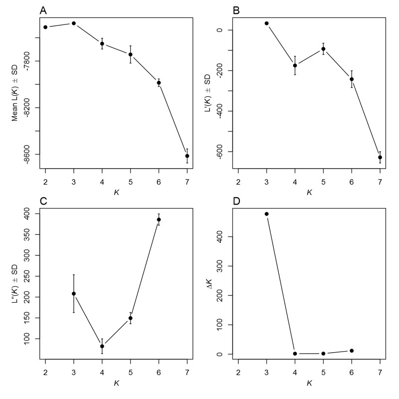
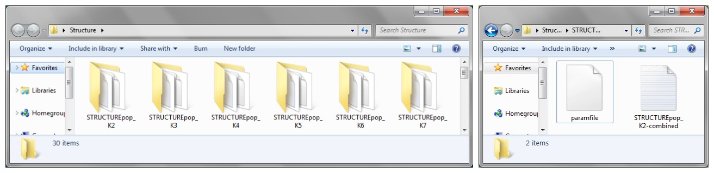
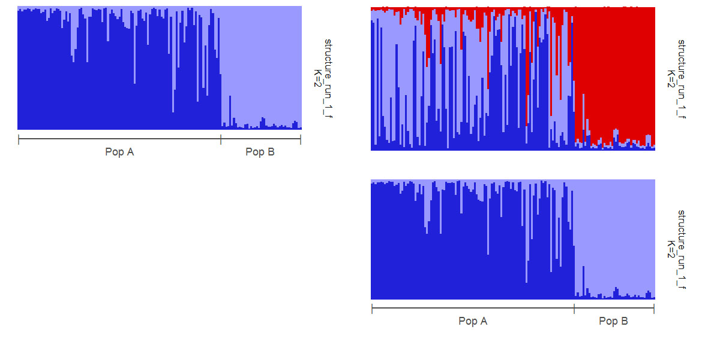
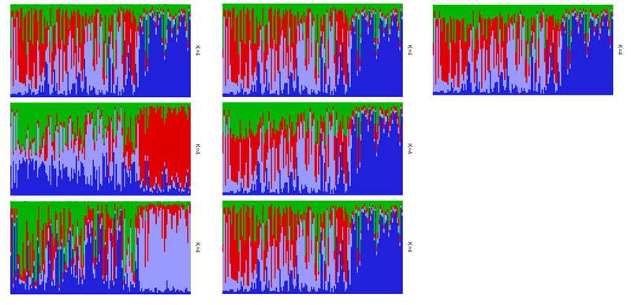
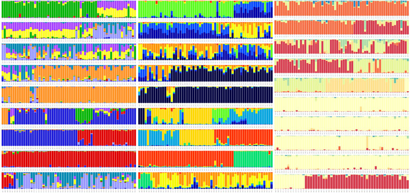

# pophelper 1.0.0

`pophelper` is an R package to analyse output files generated from population analysis programs such as STRUCTURE and TESS. The `pophelper` package can be used to tabulate runs, summarise runs, perform the Evanno method, export files for CLUMPP and generate barplot figures. A brief introduction and tutorial is provided here. For more detailed demonstration, refer the vignette within the R package.

## Installation  
You can install `pophelper` from `github` using the `devtools` package

```coffee
require(devtools)
install_github('pophelper', 'royfrancis')
require(pophelper)
```

## List of Functions  
A list of important functions are shown below. Once the package is installed, and you have set a working directory, you can follow the mini tutorial below.

### 1. Tabulate runs  
Select multiple STRUCTURE or TESS runs and tabulate them into a table.

```coffee
#read sample STRUCTURE files from R package
flist<-list.files(path=system.file("/files/structure",package="pophelper"),full.names=T)
#read sample TESS files from R package
flist1<-list.files(path=system.file("/files/tess",package="pophelper"),full.names=T)
#Or select your own files
flist<-choose.files()

#tabulate STRUCTURE runs
df<-tabulateRunsStructure(files=flist)
#tabulate TESS runs
tabulateRunsTess(files=flist1)
```
### 2. Summarise runs  
The tabulated runs can be further condensed by repeats. This is applicable only to STRUCTURE runs.

```coffee
df1<-summariseRunsStructure(df)
```

### 3. Evanno method  
This function calculates the Evanno derivatives, tables and figures. The output from `summariseRunsStructure()` can be provided as input.

```coffee
evannoMethodStructure(df1)
```
  
__Fig 1.__ Evanno Method

### 4. Convert to dataframe  
STRUCTURE and TESS run files can be converted to R dataframes using this function. If multiple files are selected, then a list of dataframes is returned.

```coffee
runsToDfStructure(files=flist)
runsToDfTess(files=flist1)
```
### 5. Generate CLUMPP output  
This function can be used to create files for use with CLUMPP. The function creates a combined file and paramfile in separate directories by K.

```coffee
clumppExportStructure(files=flist)  
clumppExportTess(files=flist1)
```
 
__Fig 2.__ Folders created from CLUMPP export and the contents of each folder.

  
__Fig 3.__ Folder showing CLUMPP results: aligned file, merged file and misc file.

### 6. Collect CLUMPP output files  
The CLUMPP output files are created in multiple folders. This function helps to collect aligned files, merged files or both from multiple directories into a single directory. 

To follow this function in this tutorial, you will need to manually run CLUMPP.exe in each folder.

```coffee
collectClumppOutput(prefix="STRUCTUREpop", filetype="both")  
collectClumppOutput(prefix="TESSpop", filetype="both")
```

### 7. Plot run files  
This function is used to plot barplots from STRUCTURE files, TESS files, combined files, aligned files or merged files.

* To plot separate files from STRUCTURE/TESS files  
```coffee
plotRuns(files=flist)  
plotRuns(files=flist, imgoutput="sep")
```

* To plot joined files from STRUCTURE/TESS files  
```coffee
plotRuns(files=flist, imgoutput="join")
```

  
__Fig 4.__ Left: Single run plotted separately. Right: Two runs joined together in one image  

* To plot with populations labels  
```coffee
plotRuns(files=flist, imgoutput="sep", poplab=pops$V1)  
plotRuns(files=flist, imgoutput="join", poplab=pops$V1)  
```

  
__Fig 5.__ Left: Single run plotted separately with pop labels. Right: Two runs joined together in one image with pop labels.

* To plot only joined files from table files (combined/aligned/merged)  
```coffee
plotRuns(files=flist, imgoutput="tab")
```

  
__Fig 6.__ Left: Combined files (Three STRUCTURE runs for K=4). Middle: Aligned files (Three STRUCTURE runs for K=4 aligned using CLUMPP). Right: Merged file (Three runs for K=4 merged into one table/figure using CLUMPP).

### 8. Plot Multiline  
This function is also used to create barplots from STRUCTURE, TESS or table files. The output is created as A4 format by default. The barplot is broken down to multiple rows to enable easier identification of individuals. The number of samples per line (`spl`) and number of lines per page (`lpp`) can be defined manually if required.

```coffee
plotMultiline(files=flist[1])  
plotMultiline(files=flist[1], spl=75, lpp=10)
```
  
__Fig 7.__ Left: `plotMultiline` default output. Right: Modified output.

#### 8.1 Sample plot outputs

  

__Fig 8.__ Multiline plots with (left) standard colours, (middle) `rich.colors()` from `gplots` package and (right) `brewer.pal(x,"Spectral")` from `RColorBrewer` package.


### 9. Collect TESS runs
TESS run files are generated from TESS into multiple folders. These file can be collect into a single folder using this function.  
`collectRunsTess(runsdir = choose.dir())`

#### End of Document.
