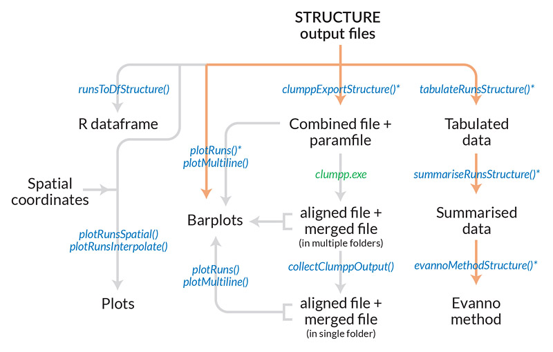
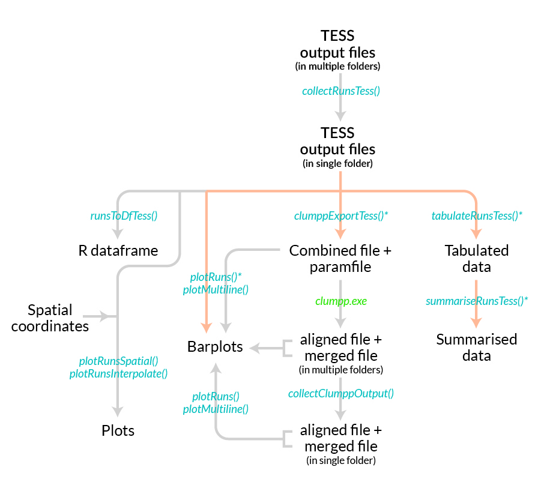
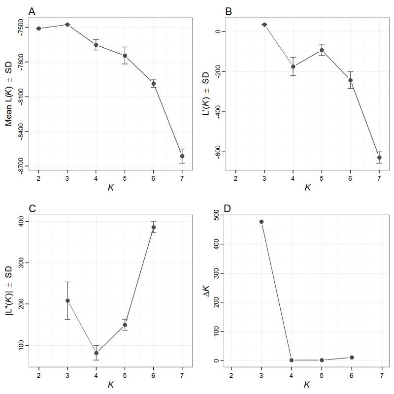
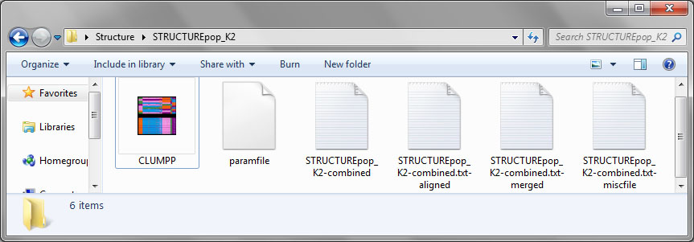
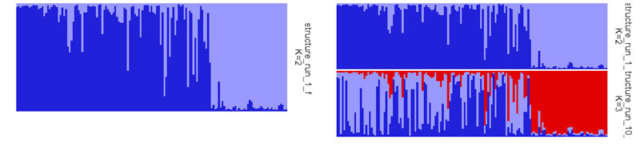
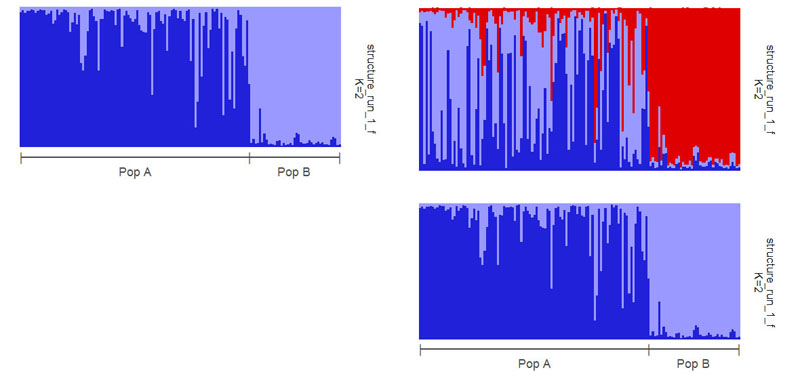
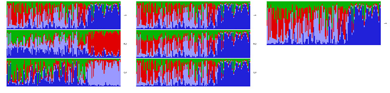
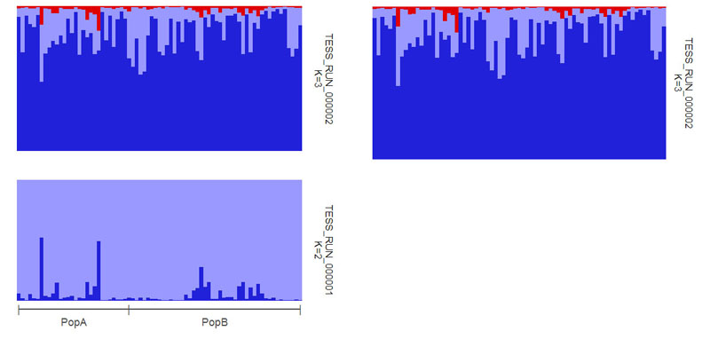

# pophelper 1.1.2

`pophelper` is an R package to help analyse output files generated from population analysis programs such as STRUCTURE and TESS. The `pophelper` package can be used to tabulate runs, summarise runs, estimate K using the Evanno method, export files for CLUMPP, generate barplot figures, spatial plots and interpolation using geographical coordinates. For a detailed demonstration on `pophelper v1.1.2`, refer the [vignette](https://dl.dropboxusercontent.com/u/78814791/sites/pophelpervignette/vignette_v112.html). Newer versions and updates are shown only on this GitHub page.

Also, try the short video demo based on`pophelper v1.0.0` [here](https://www.youtube.com/watch?v=iOqxXcQReJI). This is an old video and sorry for the bad quality.

## Installation  
You need to have R (> 3.1.0) statistical package installed on your system. R is open-source and freely available to download for Windows, Mac and other OS. Then, install the 'devtools' package. Then, you can install `pophelper` from `github` using the `devtools` package.

```coffee
install.packages('devtools',dep=T)
library(devtools)

#for the current stable version, use
install_github('royfrancis/pophelper')

#load library for use
library(pophelper)
```

__A note on old versions__  

The new version v1.1.2 is the new master branch. It might have new bugs and issues, and there is also backward incompatibility with some functions. If you have existing scripts that do not work with the new version v1.1.2, you need to update your scripts or stick to the older version. You can always go back to older version by just reinstalling from relevant branch.

Here is the page for the old stable version [v1.0.4](https://github.com/royfrancis/pophelper/tree/v104).  

```coffee
#to install the old stable version v1.0.4, use
install_github('royfrancis/pophelper',ref="v104")
```
__Web App__  
An online version of pophelper is now temporarily available [here](http://www.roymfrancis.com:3838/roy/structure/). The app is currently in beta testing. Please let me know if you run into issues.

## List of Functions  
  
For help on any function, use  
`?tabulateRunsStructure`  
`?evannoMethodStructure`  

For functions where one or more files need to be selected, the selection can be performed interactively. Windows users can use `choose.files(multi=T)`. Mac users can use `file.choose()` for single selection and `tk_choose.files()` from `tcltk` package for multiple selection.  


```coffee
tabulateRunsStructure()   # Get a tabulation of several STRUCTURE files
summariseRunsStructure()  # Summarise runs by repeats for each K
evannoMethodStructure()   # Perform the Evanno method on summarised data
runsToDfStructure()       # Convert STRUCTURE run files to R dataframe
clumppExportStructure()   # Export data file and parameter file for use with CLUMPP

collectRunsTess()         # Collect TESS output from multiple folders into one
tabulateRunsTess()        # Get a tabulation of several TESS files
summariseRunsTess()       # Summarise runs by repeats for each K
runsToDfTess()            # Convert TESS run files to R dataframe
clumppExportTess()        # Export data file and parameter file for use with CLUMPP

collectClumppOutput()     # Collect CLUMPP output into a common folder
plotRuns()                # Plot a barplot from STRUCTURE/TESS/table files
PlotMultiline()           # Plot a multi-line barplot from STRUCTURE/TESS/table file
plotRunsInterpolate()     # Spatially interpolate clusters from a STRUCTURE/TESS run file
plotRunsSpatial()         # Cluster by max assignment and plot points spatially

analyseRuns()             # A wrapper function to quickly tabulate, summarise, perform evanno method, 
                            clumpp output and generate barplots from STRUCTURE or TESS run files.
```  
A long demo script with usage of all functions, see [here](https://github.com/royfrancis/pophelper/blob/master/inst/files/PophelperDemo.R)  

## Functions and workflow 

  
__Fig 1.__ *Workflow for STRUCTURE files. Files/objects are indicated in black text and functions are indicated in blue. The analyseRuns() function is a wrapper function which can be used to run several functions together. This is indicated by the asterisk and the orange path. For clumpp results, the clumpp executable must be run to continue with the workflow.*

  
__Fig 2.__ *Workflow for TESS files. Files/objects are indicated in black text and functions are indicated in blue. The analyseRuns() function is a wrapper function which can be used to run several functions together. This is indicated by the asterisk and the orange path. For clumpp results, the clumpp executable must be run to continue with the workflow.*

  
__Fig 3.__ *Plots from Evanno Method.*

 
__Fig 4.__ *Folders created from CLUMPP export and the contents of each folder.*

  
__Fig 5.__ *Folder showing CLUMPP results: aligned file, merged file and misc file.*

 
__Fig 6.__ *An overview of the components of a plot from the function plotRuns() and the arguments used to modify them.*

  
__Fig 7.__ *Left: Single run plotted separately. Right: Two runs joined together in one image.*  

  
__Fig 8.__ *Left: Single run plotted separately with pop labels. Right: Two runs joined together in one image with pop labels.*

  
__Fig 9.__ *Left: Combined files (Three STRUCTURE runs for K=4). Middle: Aligned files (Three STRUCTURE runs for K=4 aligned using CLUMPP). Right: Merged file (Three runs for K=4 merged into one table/figure using CLUMPP).*  

  
__Fig 10.__ *Left: `plotMultiline` default output. Right: Modified output where samples per line and lines per page were defined manually.*

  

__Fig 11.__ *Multiline plots with (left) standard colours, (middle) `rich.colors()` from `gplots` package and (right) `brewer.pal(8,"Spectral")` from `RColorBrewer` package.*

  

__Fig 12.__ *Interpolated plot of one TESS run file containing 6 clusters (K=6). The default interpolation algorithm (method) used was kriging. In this particular case, it is known that K=2, therefore only cluster 2 has useful information.*

  

__Fig 13.__ *Interpolated plot of one cluster (Cluster 2) of one TESS run file containing 6 clusters (K=6) showing different interpolation methods. Row 1 from left: bilinear, bicubic and Inverse distance weighting. Row 2 from left: Nearest neighbour and Kriging.*

  

__Fig 14.__ *Interpolation plots showing some of the available colour palettes.*  

  

__Fig 15.__ *Some of the plots created using the function `plotRunsSpatial()`.*  

For detailed demonstration and description, refer the [vignette](https://dl.dropboxusercontent.com/u/78814791/sites/pophelpervignette/vignette_v111.html).

### Disclaimer

The `pophelper` R package is offered free and without warranty of any kind, either expressed or implied. I will not be held liable to you for any damage arising out of the use, modification or inability to use this program. `pophelper` R package can be used, redistributed and/or modified freely for non-commercial purposes subject to the original source being properly cited. Licensed under GPL-3.
Please make sure you verify all your results by eye atleast once per batch. Verify, verify and when you are done with that, reverify.

### Contact

If you have an issues, suggestions, new useful ideas or ways to improve this, feel free to contact me, or add a comment to the issues section here on github. Preferred email is roy.m.francis@outlook.com. My spam filter sometimes goes hyper and swallows emails. If you don't receive a reply from me in 48 hours, consider sending an email to roy.francis@ebc.uu.se as well.

2015 Roy M Francis | roy.m.francis@outlook.com
