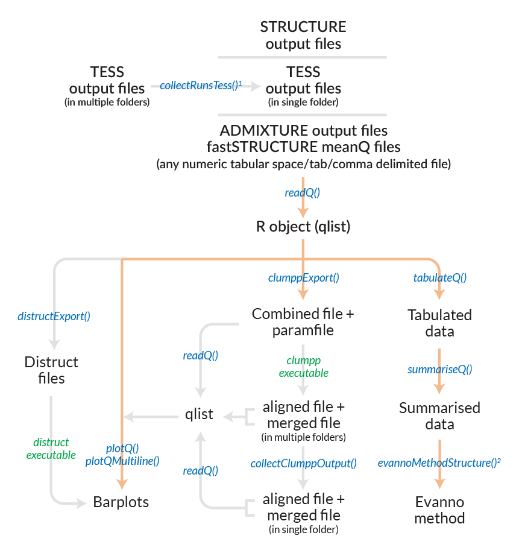
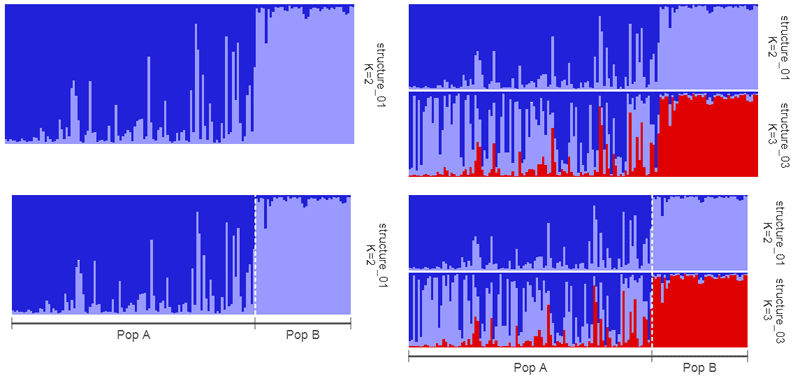
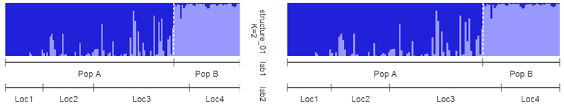
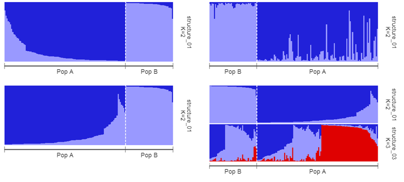
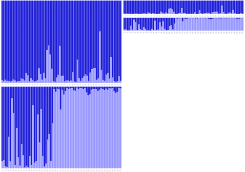

# pophelper 2.0.0

`pophelper` is an R package and web app to analyse and visualise population structure. `pophelper` curently supports output run files generated from population analysis programs such as STRUCTURE, TESS and numeric delimited formats such as ADMIXTURE or fastSTRUCTURE. The `pophelper` package can be used to tabulate runs, summarise runs, estimate *K* using the Evanno method, export files for CLUMPP, export files for DISTRUCT and generate barplot figures.  

For a detailed demonstration and walkthrough, refer the online [vignette](http://royfrancis.github.io/pophelper/). A quick intro video is available [here](https://www.youtube.com/watch?v=Jyo-88g9dDg). New versions and updates are shown only on this GitHub page.

## Installation  
You need to have R (> 3.3.0) statistical package installed on your system. [R](https://www.r-project.org/) is open-source and freely available to download for Windows, Mac and other OS. Then, install the `devtools` package. Then, you can install `pophelper` from `github` using the `devtools` package.  
__Note that functions, function names, workflow and arguments are significantly different in this version (2.0.0) compared to previous versions. This version is not back compatible with previous versions. ggplot2 version must be 2.2.0 or above.__

```coffee
# install devtools package from CRAN
install.packages('devtools',dependencies=T)
library(devtools)

# install pophelper package from GitHub
install_github('royfrancis/pophelper')

# load library for use
library(pophelper)
```

Note that `pophelper 1.2.0` and later includes binary executables for CLUMPP and DISTRUCT. This is experimental and may not work on all OS and versions.

`pophelper 2.0.0` has been tested on the following systems: 

+ Windows 10 64bit, R 3.3.2
+ Windows 10 64bit, R 3.3.1
+ Windows 7 64bit, R 3.3.2
+ Windows 7 64bit, R 3.3.0
+ Ubuntu Linux 16.04.1 LTS 64bit, R 3.3.2 (DISTRUCT executable does not work)
+ Scientific Linux 6.8 (Carbon) 64bit, R 3.3.1

## Web App   
An online interactive version of pophelper is available at [pophelper.com](http://www.pophelper.com). Not all features of the R package is supported in the online app.  

## List of Functions  

For help on any function, use  
`?tabulateQ`  
`?evannoMethodStructure`  

```coffee
readQ()                   # Convert q-matrix run files to qlist
tabulateQ()               # Tabulate a qlist
summariseQ()              # Summarise an output from tabulateQ()
clumppExport()            # Generate CLUMPP input/output files
collectClumppOutput()     # Collect CLUMPP output into a common directory
plotQ()                   # Create barplots from qlist
PlotQMultiline()          # Create multi-line barplots from qlist
distructExport()          # Export files for DISTRUCT from qlist

evannoMethodStructure()   # Perform the Evanno method for STRUCTURE data
collectRunsTess()         # Collect TESS output from multiple directories into one

analyseQ()                # A wrapper function to quickly tabulate, summarise, 
                          # perform evanno method, clumpp output and generate
                          # barplots from filenames/paths.
```

## Workflow 

  
__Fig. 1:__ *Workflow for all filetypes. Files/objects are indicated in black text and functions are indicated in blue. External executables are indicated in green. For CLUMPP and DISTRUCT results, the executables must be run manually or set argument `useexe=T`. The `analyseQ()` function is a wrapper function which can be used to run several functions together. This is indicated by the orange path. Functions indicated with superscripts 1 and 2 are only applicable to specific filetypes. `collectRunsTess()` is used to consolidate and rename TESS runs. evannoMethodStructure() is used to perform the Evanno method for STRUCTURE runs.*

  
__Fig. 2:__ *Plots from Evanno method.*

  
__Fig. 3:__ *Left: Single run plotted separately without group labels (top) and with group labels (bottom). Right: Two runs joined together in one image without group labels (top) and with group labels (bottom).*  

  
__Fig. 4:__ *(A) Left: Single run plotted with two sets of group labels. (B) Right: Two runs joined together along with two sets of group labels and strip panel turned off (`sp=F`).*  

  
__Fig. 5:__ *Left: Single run plotted separately with group labels sorted by one cluster (top) and sorted by all clusters (bottom). Right Top: Single run with group labels reordered. Pop B before Pop A. Right Bottom: Two runs joined together in one image with group labels reordered and individuals sorted by all clusters.*  

  
__Fig. 6:__ *Left: Combined files (Three STRUCTURE runs for K=4). Middle: Aligned files (Three STRUCTURE runs for K=4 aligned using CLUMPP). Right: Merged file (Three runs for K=4 merged into one table/figure using CLUMPP).*  

  
__Fig. 7:__ *Left: `plotQMultiline` default output. Middle Left: Modified output where samples per line and lines per page were defined manually. Middle Right: Individuals sorted by cluster 1. Right: Individuals sorted by all clusters.*  

  

__Fig. 8:__ *Multiline plots with (left) standard colours, (middle) `rich.colors()` from `gplots` package and (right) `brewer.pal(8,"Spectral")` from `RColorBrewer` package.*  

For detailed demonstration and description, refer the [vignette](http://royfrancis.github.io/pophelper/).

### Disclaimer

The `pophelper` R package is offered free and without warranty of any kind, either expressed or implied. I will not be held liable to you for any damage arising out of the use, modification or inability to use this program. `pophelper` R package can be used, redistributed and/or modified freely for non-commercial purposes subject to the original source being properly cited. Licensed under GPL-3. Please make sure you verify all your results.  

### Contact

If you have an comments, suggestions, corrections or ideas on ways to improve or extend this package, feel free to contact me. Submit a report on the [Github issues page](https://github.com/royfrancis/pophelper/issues).  

2016 Roy M Francis  
