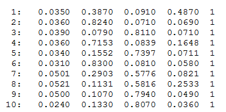
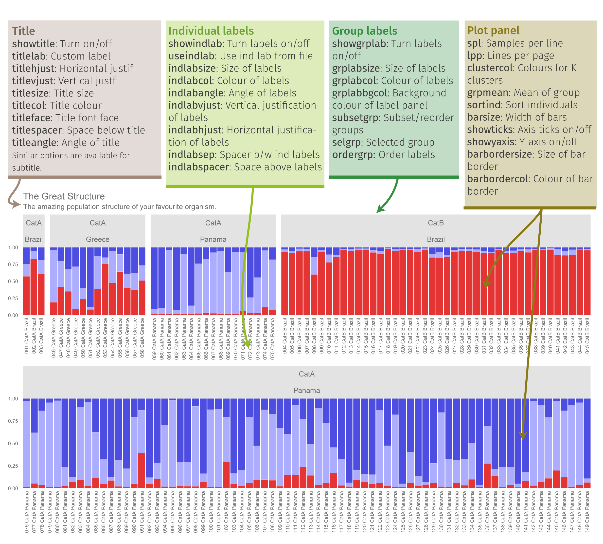

__Roy M Francis__ | `r format(Sys.time(),"%d-%b-%Y")`

```{r,include=FALSE}
options(rpubs.upload.method="internal")
knitr::opts_chunk$set(collapse=TRUE)
#source("D:/Data/Dropbox/Rwork/pophelperRpackage/pophelper/R/pophelper.R")
library(pophelper)
library(captioner)
library(gridExtra)
library(showtext)
library(ggpubr)

tc <- captioner::captioner(prefix="Tab. ")
fc <- captioner::captioner(prefix="Fig. ")
```

# Introduction  

This vignette/tutorial aims to demonstrate the use of R package `pophelper`. This package contains functions that are useful for processing output results from programs used in the analysis of population structure such as ADMIXTURE^1^, FASTSTRUCTURE^6^, STRUCTURE^5^, TESS^3^, BAPS^8^ and any q-matrix output as a numeric tabular delimited file.

These software are popular programs used to discriminate populations, to determine population structure and to reveal the genetic composition of individuals using molecular markers. These programs generally use allelic frequency information to assign individuals to a pre-defined number of populations (*K*). The assignment is usually run for a range of *K* such as from *K*=2 to *K*=10. Multiple repeats are also usually carried out for each *K*. Each output file for each repeat of *K* showing the assignment probabilities of all individuals is referred to as the run file, cluster file or q-matrix file. `pophelper` has a set of functions that include reading into R, tabulating, summarising and plotting these run files. 

This vignette covers the use of all important functions in the `pophelper` package. The demonstration is ordered in the manner of a typical workflow. Input and output codes are printed in a font different from body text like `this`.  

----

# Installation  

The first step is to install the `pophelper` library. The source code is available from [GitHub](https://github.com/royfrancis/pophelper). You need to have R (>= 3.5.0) installed on your system.  

It is best to first install the dependency packages.  

```{r,echo=TRUE,eval=FALSE,results='hide'}
install.packages(c("devtools","ggplot2","gridExtra","gtable","label.switching","tidyr"),dependencies=T)
```

Then, you can install `pophelper` from CRAN.

```{r,eval=FALSE}
# install pophelper package from CRAN
install.packages('pophelper')
```

Optionally, you can also install from `github` using the `devtools` package. 

```{r,eval=FALSE}
# install pophelper package from GitHub
devtools::install_github('royfrancis/pophelper')
```

Once the package is installed, the package is loaded as shown below.

```{r,echo=TRUE,eval=FALSE,results='hide'}
# load library
library(pophelper)

# check version
packageDescription("pophelper", fields="Version")
```

The next step is to set the working directory. The working directory is a folder that usually contains the run files of interest so as to allow R to access it. The working directory must have read-write-execute permissions. Functions may produce outputs such as text files or images which will be exported to the working directory. The working directory can be set by running the command below using a path or by selecting the folder interactively in the popup window.

```{r,echo=TRUE,eval=FALSE,results='hide'}
setwd("path")
setwd(choose.dir())
```

Standard help and documentation for all functions are obtained using `?`.

```{r,echo=TRUE,eval=FALSE,results='hide'}
?tabulateQ
?summariseQ
?collectRunsTess
# if using RStudio, press tab inside function to see arguments.
# readQ(<press tab>)
```

For functions where one or more files need to be selected, the selection can be performed interactively. Windows users can use `choose.files(multi=T)` for multi-selection or `file.choose()` for single selection. Mac users can use `file.choose()` for single selection and `tk_choose.files()` from `tcltk` package for multiple selection.

----

# Functions & Overview  
All user functions in the `pophelper` package are listed below.  
 
```{r, eval=FALSE,echo=TRUE}
# convert q-matrix run files (structure, tess 2.3, baps, basic, clumpp) 
# to R qlist object
readQ() 
# convert TESS3 R list object to qlist object
readQTess3()
# collate/tabulate a qlist
tabulateQ() 
# summarise an output from tabulateQ()  
summariseQ()  
# Align clusters  
alignK()  
# create single-line barplots from qlist
plotQ()  
# create multi-line barplots from qlist
PlotQMultiline()  
# export files for DISTRUCT from qlist
distructExport()  
# Run and plot the Evanno method for STRUCTURE data
evannoMethodStructure()  
# collect TESS output from multiple directories into one
collectRunsTess()  

# wrapper function to tabulate, summarise, perform evanno method and generate barplots from filenames/paths.
analyseQ()             
```

----

# Input files  
Generally speaking, there are five input file formats that can be defined. All are text formats. These are STRUCTURE run files, TESS 2.3 run files (-TR files in folders), BAPS, BASIC (simple delimited files) or a CLUMPP associated file. 

STRUCTURE, TESS 2.3 and BAPS run files have specific format as shown below in __Fig. 1__. BASIC files are numeric delimited tabular file like ADMIXTURE run files and FASTSTRUCTURE meanQ files. They can also be a generic numeric tabular tab, space or comma-delimited files without headers. CLUMPP associated files are COMBINED, ALIGNED or MERGED files for use with CLUMPP. The COMBINED file is generated using the function `clumppExport()`. The ALIGNED and MERGED files are generated by CLUMPP. A sample CLUMPP format is shown in __Fig. 2__.

  
`r fc(name="fc_inputfilepreview",caption="_A preview of the input files. STRUCTURE (Left), TESS 2.3 (middle left), BAPS (middle right) and BASIC file (right)._")`

  
`r fc(name="fc_clumppfilepreview",caption="_A preview of the CLUMPP format file._")`

Sample files for inspection can be downloaded here. [STRUCTURE 2.3.4](https://github.com/royfrancis/pophelper/tree/master/inst/files/structure), [STRUCTURE 2.3.4 with confidence interval](https://github.com/royfrancis/pophelper/tree/master/inst/files/structure-ci), [TESS 2.3](https://github.com/royfrancis/pophelper/tree/master/inst/files/tess), [BAPS ](https://github.com/royfrancis/pophelper/tree/master/inst/files/baps), [ADMIXTURE](https://github.com/royfrancis/pophelper/tree/master/inst/files/admixture), [fastSTRUCTURE](https://github.com/royfrancis/pophelper/tree/master/inst/files/faststructure), [TAB delimited](https://github.com/royfrancis/pophelper/tree/master/inst/files/basic/tab), [COMMA delimited](https://github.com/royfrancis/pophelper/tree/master/inst/files/basic/comma), [SPACE delimited](https://github.com/royfrancis/pophelper/tree/master/inst/files/basic/space), [COMBINED CLUMPP file](https://github.com/royfrancis/pophelper/blob/master/inst/files/STRUCTUREpop_K4-combined.txt), [ALIGNED CLUMPP file](https://github.com/royfrancis/pophelper/blob/master/inst/files/STRUCTUREpop_K4-combined-aligned.txt) and [MERGED CLUMPP file](https://github.com/royfrancis/pophelper/blob/master/inst/files/STRUCTUREpop_K4-combined-merged.txt).

The plotting functions `plotQ()` and `plotQMultiline()` require group labels as 'data.frame' datatype which can be read into R from a tab-delimited or csv file. 'data.frame' is used rather than a character data type because multiple label sets can be used. The labels for `distructExport()` must be character datatype. For a sample tab-delimited group labels file, [click here](https://github.com/royfrancis/pophelper/blob/master/inst/files/metadata.txt). 

Once the run files are read into R, it is stored internally as a 'qlist' object. For more information on 'qlist' objects and advanced operations on 'qlist', see section: 'Working with qlists'. Internal details of 'qlist' is not critical to working with this package.   

----

# Workflow  

In this section, we will look at how these functions are used, their syntax and typical order of workflow. The workflow is similar for all input filetypes. A few specific functions are specific to certain filetypes.

  
`r fc(name="fc_wokflow",caption="_Workflow for all filetypes. Files/objects are indicated in black text and functions are indicated in blue. The \x60analyseQ()\x60 function is a wrapper function which can be used to run several functions together. This is indicated by the orange path. Functions indicated with superscripts 1 and 2 are only applicable to specific filetypes. \x60collectRunsTess()\x60 is used to consolidate and rename TESS runs. \x60evannoMethodStructure()\x60 is used to perform the Evanno method for STRUCTURE runs._")`

The `pophelper` library must be loaded and a working directory must be set.

```{r,eval=FALSE,echo=TRUE}
library(pophelper)
setwd("path-to-wd")
```

## collectRunsTess

This function is applicable only to TESS 2.3 runs. Unlike STRUCTURE runs which are exported into a single directory, TESS output files are exported into separate directories by run. This means that one needs to go into individual folders to obtain the run file. The function `collectRunsTess()` collects TESS cluster files from individual run folders into one new folder and rename each runfile by the folder name. Set working directory first and run basic usage.

```{r,echo=FALSE,eval=FALSE,results='hide'}
# basic usage
collectRunsTess(runsdir="D://Data/Dropbox/Rwork/pophelperRpackage/tessoriginal")
```

```{r,echo=TRUE,eval=FALSE}
# basic usage
collectRunsTess(runsdir="path-to-tess-runs-root-dir")

# another usage
path <- "path-to-tess-runs-root-dir"
collectRunsTess(runsdir=path)

# another usage
collectRunsTess(runsdir=choose.dir())
```

Within each TESS run folder, the function searches for filename ending with 'TR.txt' as the cluster file. This file is copied to the new folder and renamed with the name of the respective run directory. Therefore, DO NOT manually rename original TESS run files or directories.

## readQ

All input filetypes (STRUCTURE, TESS 2.3, BASIC, CLUMPP) can be read into R and converted to a 'qlist' object using the function `readQ()`. The argument `filetype` is used to specify the input filetype. By default, `filetype` is set to 'auto' which automatically detects input filetype. If this does not work, `filetype` can also be manually set.

```{r,eval=FALSE,echo=TRUE}
readQ()                     # automatically detects input filetype
readQ(filetype="auto")      # automatically detects input filetype
readQ(filetype="structure") # Convert STRUCTURE run files to qlist
readQ(filetype="tess")      # Convert TESS2 run files to qlist
readQ(filetype="baps")      # Convert BAPS run files to qlist
readQ(filetype="basic")     # Convert delimited numeric text files to qlist
readQ(filetype="clumpp")    # Convert CLUMPP format files to qlist
```

You can also explicitly use filetype specific functions: `readQStructure()`,`readQTess()`,`readQBaps()`,`readQBasic()` or `readQClumpp()`. If TESS3 is run in R (tess3r), you get a TESS3 list object inside R. This list can be read into pophelper using `readQTess3()`.

When specifying location to a file locally, use one of below:

```{r,eval=FALSE,echo=TRUE}
# file is located in the current working directory. use full filename.
sfiles <- "file.structure"
sfiles <- "file.txt"
# file is located in a directory relative to the current working directory.
sfiles <- "./path/path/file.txt"
# absolute path.
sfiles <- "C:/path/path/path/file.txt"

readQ(files=sfiles)
```

For this tutorial, we will use the sample files accompanied with this package. Therefore we read file from within the R package. 

```{r,echo=TRUE,eval=TRUE,results='hide'}
# STRUCTURE files (do not use this command to read local files)
sfiles <- list.files(path=system.file("files/structure",package="pophelper"), full.names=T)
# basic usage
slist <- readQ(files=sfiles)
readQ(files=sfiles,filetype="structure")
# select files interactively
# readQ(files=choose.files(multi=TRUE))
# check class of ouput
class(slist)
# view head of first converted file
head(slist[[1]])

# TESS files (do not use this command to read local files)
tfiles <- list.files(path=system.file("files/tess",package="pophelper"), full.names=T)
tlist <- readQ(files=tfiles)
# select files interactively
# readQ(files=choose.files(multi=TRUE))

# use BAPS files (do not use this command to read local files)
bfiles<- list.files(path=system.file("files/baps",package="pophelper"), full.names=T)
blist <- readQ(files=bfiles)

# use ADMIXTURE files (do not use this command to read local files)
afiles<- list.files(path=system.file("files/admixture",package="pophelper"), full.names=T)
alist <- readQ(files=afiles)

# use FASTSTRUCTURE files (do not use this command to read local files)
ffiles <- list.files(path=system.file("files/faststructure",package="pophelper"), full.names=T)
flist <- readQ(files=ffiles)

# use space-delimited text files (do not use this command to read local files)
msfiles <- list.files(path=system.file("files/basic/space",package="pophelper"), full.names=T)
mslist <- readQ(files=msfiles)

# use tab-delimited text files (do not use this command to read local files)
mtfiles <- list.files(path=system.file("files/basic/tab",package="pophelper"), full.names=T)
mtlist <- readQ(files=mtfiles)

# use comma-separated text files (do not use this command to read local files)
mcfiles <- list.files(path=system.file("files/basic/comma",package="pophelper"), full.names=T)
mclist <- readQ(files=mcfiles)
```

TESS 3 when run within R produces a `tess3` object. This object can be converted to a pophelper qlist using the function `readQTess3()`. Runs are labelled sample1, sample2 etc.

```{r,echo=TRUE,eval=FALSE,results='hide'}
t3obj <- readRDS(system.file("files/tess3.rds",package="pophelper"))
t3list <- readQTess3(t3obj)
```

Each run is converted to dataframes of assignment probabilities of all individuals in *K* clusters denoted as Cluster1, Cluster 2 etc. The dataframes are placed in named lists. The names are obtained from filenames. Filename suffixes such as .txt, .csv, .tsv and .meanQ are dropped. In case filenames are missing or not available, lists are named sample1, sample2 etc.

Each 'data.frame' has some associated metadata, which is especially important for STRUCTURE runs. When reading in STRUCTURE runs using `readQ()`, metadata such as number of loci, number of burnins, reps, estimated log probability etc., which are required for the Evanno method are stored with each 'data.frame' as attributes. 

TESS 3 attributes ind, k, loci, gif, rmse, crossentropy and ploidy are retained.

The attributes of the run can be accessed as below.

```{r,echo=TRUE,eval=TRUE}
# qlist attributes
attributes(slist)
# dataframe attributes
attributes(slist[[1]])
# attributes of all runs
# lapply(slist,attributes)
```

STRUCTURE files which contain confidence intervals maybe read in by setting the argument `readci=TRUE`. The confidence intervals are added to each run data.frame as an attribute named **ci**.

```{r,echo=TRUE}
# read some structure files with confidence intervals
sfiles1 <- list.files(path=system.file("files/structure-ci",package="pophelper"),full.names=TRUE)
slist1 <- readQ(files=sfiles1, readci=TRUE)

# check names of attributes of the first file
names(attributes(slist1[[1]]))
```

The ci attribute itself is a dataframe with low and high values for each cluster and rows equal to number of samples.

```{r}
# preview ci data
head(attributes(slist1[[1]])$ci)
```

If individual labels are present in the STRUCTURE file, they can be imported as rownames by setting `indlabfromfile=T`. Space in labels may be replaced by underscore. Incorrect parsing with internal population flags may introduce underscores. If duplicate labels are found, the labels are not imported. This is applicable only for STRUCTURE files.

Below is a sample data when `indlabfromfile=F`.

```{r}
slist <- readQ(files=sfiles, indlabfromfile=F)
head(slist[[1]])
```

And below is sample data when `indlabfromfile=T`.

```{r,echo=TRUE,eval=FALSE,results='hide'}
# include individual names from STRUCTURE file as row names
slist <- readQ(files=sfiles, indlabfromfile=T)
head(slist[[1]])
```

CLUMPP files (COMBINED, ALIGNED and MERGED) files can also be converted to a 'qlist' using `readQ()`. We use some sample files from the package. To create CLUMPP files, see section on clumppExport.  

```{r,echo=TRUE,eval=FALSE,results='hide'}
co <- system.file("files/STRUCTUREpop_K4-combined.txt", package="pophelper")
al <- system.file("files/STRUCTUREpop_K4-combined-aligned.txt", package="pophelper")
me <- system.file("files/STRUCTUREpop_K4-combined-merged.txt", package="pophelper")

readQ(co)
readQ(al)
readQ(me)

readQ(co,filetype="clumpp")
```

For CLUMPP files containing multiple runs, each run name is suffixed by a -1, -2 etc. `names(readQ(co))`.

Any tabular data that can be read into R and converted to a data.frame can be easily converted to a qlist. For information on the 'qlist' object and advanced operations on 'qlist', see section 'Working with qlists'.   

## tabulateQ

The function `tabulateQ()` takes a 'qlist' and produces a table of runs with various parameters. The results can be pointed to a variable for further use.

```{r,echo=TRUE,eval=FALSE}
# basic usage
tr1 <- tabulateQ(qlist=slist)
tabulateQ(tlist)
tabulateQ(alist, writetable=TRUE)

# choose files
# files=choose.files(multi=TRUE)
tabulateQ(qlist=readQ(files))

?tabulateQ
tabulateQ(qlist=NULL, writetable=FALSE, sorttable=TRUE)
# To write results to working directory, set writetable=TRUE
# Result table is sorted by loci, ind and k. To see original order, set sorttable=FALSE
```

For all filetypes, the `tabulateQ()` function returns a table with three columns namely filename, *K* and number of individuals. Note that by default the table is sorted by ind and *K*.

`r tc(name="tc_tabulatedtess",caption="_A tabulated table of TESS runs._")`  

```{r,echo=TRUE,eval=TRUE}
head(tabulateQ(tlist))
```

To keep runs in the original order, use `sorttable=FALSE`.

`r tc(name="tc_tabulatedtess_notsorted",caption="_A tabulated table of TESS runs unsorted._")`  
```{r,echo=TRUE,eval=TRUE}
head(tabulateQ(tlist,sorttable=FALSE))
```

For STRUCTURE runs, the `tabulateQ()` function produces additional columns namely number of loci, number of burn-ins, number of replicates (reps), estimated ln probability of data (elpd), mean value of ln likelihood (mvll) and variance of ln likelihood (vll). The table is sorted by loci, ind and *K*. 

`r tc(name="tc_tabulatedstructure",caption="_A tabulated table of STRUCTURE runs._")` 

```{r,echo=TRUE,eval=TRUE}
head(tabulateQ(slist))
```

Missing values are given NA. The tabulated output can be written to the working directory as a text file by setting the argument `writetable=T`.

## summariseQ 

The table produced using `tabulateQ()` can be further collapsed by *K* based on the number of runs. The output table from `tabulateQ()` can be passed as input to `summariseQ()`. 

```{r,echo=TRUE,eval=FALSE}
# basic usage
sr1 <- summariseQ(tr1)
summariseQ(tr1, writetable=TRUE)

# another usage
# sr1 <- summariseQ(tabulateQ(qlist=choose.files()))
```

`r tc(name="tc_summarisedtess",caption="_A summarised table of TESS runs._")`  
```{r, echo=FALSE, eval=TRUE}
head(summariseQ(tabulateQ(tlist)))
```

For all filetypes the `summariseQ()` function returns 3 columns namely individuals, *K* and the number of runs.

For STRUCTURE runs, the `summariseQ()` function returns additional 5 columns namely loci, Mean estimated ln probability of data, standard deviation of estimated ln probability of data, estimated ln probability of data minus standard deviation and estimated ln probability of data plus standard deviation.

`r tc(name="tc_summarisedstructure",caption="_A summarised table of STRUCTURE runs._")`  

```{r,echo=TRUE,eval=TRUE}
head(summariseQ(tabulateQ(slist)))
```

The summarised runs can be written to the working directory as a text file by setting the argument `writetable=T`.

## evannoMethodStructure  

This function is only applicable to STRUCTURE runs.

The Evanno method^2^ is used to estimate the optimal number of *K*. The summarised runs table output from`summariseQ()` function can be input to `evannoMethodStructure()`. The `evannoMethodStructure()` function creates an Evanno derivative plot if suitable conditions are met. A resulting table is also returned. The plot can be written to file using argument `exportplot=T`. The table can be written to file using `writetable=T`.

```{r,echo=TRUE,eval=FALSE}

# basic usage
evannoMethodStructure(data=sr1)

# another usage
em <- evannoMethodStructure(summariseQ(tabulateQ(slist)))

# to export a plot
evannoMethodStructure(data=sr1,exportplot=T)

# do not compute plot, only return results as table
em <- evannoMethodStructure(data=sr1,exportplot=F,returnplot=F)

# to export plot and table
evannoMethodStructure(data=sr1,exportplot=T,writetable=T,na.rm=T)

# returns both data and plot
p <- evannoMethodStructure(data=sr1,exportplot=F,returnplot=T)

# to return only plot and save it
p <- evannoMethodStructure(data=sr1,exportplot=F,returnplot=T,returndata=F)
```

```{r,echo=TRUE,eval=TRUE,fig.height=5,fig.width=5}
sr1 <- summariseQ(tabulateQ(slist))
p <- evannoMethodStructure(data=sr1,exportplot=F,returnplot=T,returndata=F,basesize=12,linesize=0.7)
grid.arrange(p)
```

`r fc(name="fc_evannoplot",caption="_Plots produced from the Evanno method._")`  

The Evanno method results table has 15 columns namely number of loci (loci), number of individuals (ind), *K* value (k), number of runs (runs), Mean estimated ln probability of data (elpdmean), Standard deviation (elpdsd), Estimated ln probability of data minus standard deviation (elpdmin), Estimated ln probability of data plus standard deviation (elpdmax), First derivative (lnk1), Max error of first derivative (lnk1max), Min error of first derivative (lnk1min), Second derivative (lnk2), Max error of second derivative (lnk2max), Min error of second derivative (lnk2min) and deltaK.  

`r tc(name="tc_evannoresults",caption="_Results of the Evanno method._")`  

```{r,echo=FALSE,eval=TRUE}
evannoMethodStructure(summariseQ(tabulateQ(slist)))
```

The peak of deltaK is usually used to estimate the best value of *K*.  

The Evanno method can be computed only if these criteria are met: At least 3 values of *K* must be available, values of *K* must be sequential (ie; there must not be missing values of *K*), number of individuals and loci must be same in all runs. If number of repeats for any *K* is less than 2, then results may not be reliable. In case the Evanno method cannot be computed, a plot of ELPD over *K* is produced referred to as the kPlot.  

```{r,echo=TRUE,eval=TRUE,fig.height=3,fig.width=3}
p <- evannoMethodStructure(data=sr1[-3,],exportplot=F,returnplot=T,returndata=F,basesize=12,linesize=0.7)
grid.arrange(p)
```

`r fc(name="fc_evannoplot_kplot",caption="_K plot._")`  

## alignK

When multiple repeats are run for each *K*, the order of clusters may be jumbled for each run. Therefore, when plotting multiple runs within each *K*, the colours cannot be assigned correctly as shown in figure below. 

```{r,echo=TRUE,fig.height=2.5,fig.width=8}
sfiles <- list.files(path=system.file("files/structure",package="pophelper"), full.names=T)
slist <- readQ(sfiles)

p1 <- plotQ(slist[c(3,4,10)],imgoutput="join",returnplot=T,exportplot=F,quiet=T,basesize=11)
grid.arrange(p1$plot[[1]])
```

`r fc(name="fc_alignk_before",caption="_Three runs of K=3 with jumbled clusters._")`  

The function `alignK()` helps to overcome this issue by reordering the clusters suitably. Once the clusters have been aligned, the data can be plotted again.  

<div class="alert alert-warning" role="alert">
Note that all runs must have the same number of individuals to run this function.
</div>

```{r,echo=TRUE,fig.height=2.5,fig.width=8}
slist1 <- alignK(slist[c(3,4,10)])
p1 <- plotQ(slist1,imgoutput="join",returnplot=T,exportplot=F,quiet=T,basesize=11)
grid.arrange(p1$plot[[1]])
```

`r fc(name="fc_alignk_after",caption="_Three runs of K=3 with clusters aligned._")`  

The information remains the same, but the clusters have been switched so that colours match to the same clusters. This is what I refer to as *aligning within K*. The same idea also works across K. For example, consider the example below.

```{r,echo=TRUE,fig.height=2.5,fig.width=8}
p1 <- plotQ(slist[c(3,4,5)],imgoutput="join",returnplot=T,exportplot=F,quiet=T,basesize=11)
grid.arrange(p1$plot[[1]])
```

`r fc(name="fc_alignk_across_before",caption="_Three runs with K=3 and K=4 before alignment._")`  

The first two runs are *K=3* and the bottom run is *K=4*. It is clear that the light blue region on the right in *K=4* should be a red or a blue based on the first and second runs. If we run `alignK()` on this dataset, we get as below.

```{r,echo=TRUE,fig.height=2.5,fig.width=8}
p1 <- plotQ(alignK(slist[c(3,4,5)]),imgoutput="join",returnplot=T,exportplot=F,quiet=T,basesize=11)
grid.arrange(p1$plot[[1]])
```

`r fc(name="fc_alignk_across_after",caption="_Three runs with K=3 and K=4 after alignment._")`  

Now we see that red cluster is consistent within and across *K*. This is referred to as *aligning across K*. Although, this may be more and more unreliable as *K* increases.

We can look at one more example of before and after alignment.

```{r,echo=TRUE,fig.height=4,fig.width=8}
p1 <- plotQ(sortQ(slist)[1:9],imgoutput="join",returnplot=T,exportplot=F,quiet=T,basesize=11)
p2 <- plotQ(alignK(sortQ(slist)[1:9]),imgoutput="join",returnplot=T,exportplot=F,quiet=T,basesize=11)
grid.arrange(p1$plot[[1]],p2$plot[[1]],ncol=2,nrow=1)
```

`r fc(name="fc_alignk_across_large",caption="_Nine runs with K from 2 to 4 before and after alignment._")`  

`alignK()` first aligns all runs within each K and then progressively aligns pairs of K from lowest to the highest. Cluster align within K is performed using the **stephens** algorithm implemented in the R package [label.switching](https://cran.r-project.org/web/packages/label.switching/index.html). See references at bottom of this document for label.switching^9^. Aligning across K is carried out using the idea implemented in CLUMPAK^10^. If you wish to use the software CLUMPP for aligning clusters, see the section CLUMPP.

# Plotting  
## plotQ  

The function `plotQ()` is used to create stacked assignment barplots from a 'qlist'. All individuals are shown on a single row. A schematic of the plot parts is shown below.  

  
`r fc(name="fc_plotqoverview",caption="_An overview of the components of a \x60plotQ()\x60 figure and most of the arguments used to modify them._")`  

The full code used to create the above figure is shown below. Details are explained further on.

```{r,echo=TRUE,eval=FALSE}
sfiles <- list.files(path=system.file("files/structure",package="pophelper"), full.names=T)
slist <- readQ(files=sfiles,indlabfromfile=T)

threelabset <- read.delim(system.file("files/metadata.txt", package="pophelper"), header=T,stringsAsFactors=F)
twolabset <- threelabset[,2:3]

plotQ(slist[2:3],imgoutput="join",showindlab=T,grplab=twolabset,
      subsetgrp=c("Brazil","Greece"),selgrp="loc",ordergrp=T,showlegend=T,
      showtitle=T,showsubtitle=T,titlelab="The Great Structure",
      subtitlelab="The amazing population structure of your favourite organism.",
      height=1.6,indlabsize=2.3,indlabheight=0.08,indlabspacer=-1,
      barbordercolour="white",barbordersize=0,outputfilename="plotq",imgtype="png")
```

### Separate and Joined plots

The `imgoutput` argument is used to indicate if multiple runs must be plotted as separate plots or as a joined plot. When `imgoutput="sep"`, each run file is plotted and exported as separate figures. When `imgoutput="join"`, all selected run files are plotted as a single figure and exported. Default is set as `imgoutput="sep"`.

```{r,echo=TRUE,eval=FALSE}
# plot first run separately
plotQ(qlist=slist[1])

# plot multiple runs separately
plotQ(qlist=slist[1:3])
# same as above
plotQ(qlist=slist[1:3], imgoutput="sep")

# join files into one figure
plotQ(qlist=readQ(sfiles)[c(1,3)], imgoutput="join")
```

For the purpose of this document, we will use a short dataset with 29 individuals. The plot is designed for export, therefore, a few arguments need to be modified.

```{r,echo=TRUE,eval=TRUE,fig.height=2,fig.width=6}
# creating a short dataset
slist1 <- sapply(slist,function(x) x[c(1:5,20:25,50:55,100:105,130:135),])

# normal usage
# p <- plotQ(slist1[1])
# modified for this document
p <- plotQ(slist1[1],returnplot=T,exportplot=F,quiet=T,basesize=11)
print(p$plot[[1]])
```

`r fc(name="fc_plotqnolab_sep",caption="_Single run plotted separately._")` 

```{r,echo=TRUE,eval=TRUE,fig.height=3,fig.width=6}
p <- plotQ(slist1[c(1,3)],imgoutput="join",returnplot=T,exportplot=F,quiet=T,basesize=11)
print(p$plot[[1]])
```

`r fc(name="fc_plotqnolab_join",caption="_Two runs joined together in one image._")`  

The spacing between panels in a 'join' plot can be adjusted using `panelspacer`.

### Strip panel

The panel on the right side of the plot is the strip panel. The strip panel is displayed by default (`showsp=T`). The strip panel shows labels referred to as the strip labels or strip panel labels. The strip panel by default shows the filename and the *K* value. Strip panel label can be changed to show custom labels or the panel can be turned off altogether. If custom labels are provided, they must be equal to the number of runs.

```{r,echo=TRUE,eval=FALSE}
# turn off strip panel
plotQ(qlist=slist1[1], showsp=F)
# move strip panel to the left
plotQ(qlist=slist1[1], sppos="left")
plotQ(qlist=slist1[1:3], imgoutput="join", sppos="left")
# custom strip panel label showing filename only
plotQ(qlist=slist1[1], splab=names(slist1)[1])

# custom strip panel label showing k only
fn1 <- function(x) attr(x,"k")
spnames <- paste0("K=",sapply(slist1,fn1))
plotQ(qlist=slist1[1], splab=spnames[1])

# two-line strip panel label
plotQ(qlist=slist1[1:3], splab=paste0(names(slist1)[1:3],"\n",c("run1","run2","run3")))
plotQ(qlist=slist1[1:3], imgoutput="join",
      splab=paste0(names(slist1)[1:3],"\n",c("run1","run2","run3")))

# change colour of strip label on plot
plotQ(qlist=slist1[1], splabcol="blue")
# change size of strip label on plot
plotQ(qlist=slist1[1], splabsize=7)
# change font face of strip label on plot
plotQ(qlist=slist1[1], splabface="bold")
# hide strip label on plot
plotQ(qlist=slist1[1], splabcol="white")
# change strip panel background colour
plotQ(qlist=slist1[1], spbgcol="coral")
```

```{r,echo=TRUE,eval=TRUE,fig.height=2,fig.width=8}
# modified for this document
p1 <- plotQ(slist1[1],returnplot=T,exportplot=F,quiet=T,basesize=11,
           sppos="left",splabcol="red",spbgcol="grey")
p2 <- plotQ(slist1[1:2],imgoutput="join",returnplot=T,exportplot=F,quiet=T,basesize=11,
           sppos="left",splabcol="red",spbgcol="grey",splab=c("This one","That one"))

grid.arrange(p1$plot[[1]],p2$plot[[1]],ncol=2)
```

`r fc(name="fc_plotqstrippanel",caption="_Modifications to the strip panel shown on 'sep' plot (left) and 'join' plot (right)._")`  

### Cluster colours

Each cluster gets a distinct colour. Up to 12 clusters get colours assigned from a pre-defined palette which was creted for this package. I arbitrary call this the 'standard' colours. Clusters >12 get colours derived from the function `rich.colors()` from package `gplots`. The colours can also be manually supplied to `clustercol` as a character of R colours or hexadecimal values. The length of colours must be equal to the maximum *K* value in the runs provided.

Examples of how to provide custom colours.

```{r,echo=TRUE,eval=FALSE}
# change colour of clusters
plotQ(qlist=slist1[3:4], imgoutput="join", 
    clustercol=c("coral","steelblue","lightblue","purple","orange"))

plotQ(qlist=slist1[16:17], imgoutput="join", 
    clustercol=c("#A6CEE3", "#3F8EAA", "#79C360", "#E52829", "#FDB762","#ED8F47","#9471B4"))
```

Here are the default colours used.

```{r,echo=TRUE,eval=TRUE,fig.height=1,fig.width=8}
clist <- list(
"standard_12"=c("#2121D9","#9999FF","#DF0101","#04B404","#FFFB23","#FF9326","#A945FF","#0089B2","#B26314","#610B5E","#FE2E9A","#BFF217"),
"rich.colors"=pophelper:::getColours(13))

# add length of palettes
lengths <- sapply(clist,length)

par(mar=c(0.2,4.5,0.2,0))
par(mfrow=c(length(clist),1))

for(i in 1:length(clist))
{
  {barplot(rep(1,max(lengths)),col=c(clist[[i]],rep("white",max(lengths)-length(clist[[i]]))),axes=F,border=F)
  text(x=-0.1,y=0.5,adj=1,label=names(clist)[i],xpd=T)}
}
```

`r fc(name="fc_cols",caption="_(A) Top: Colour palette used when K<=12. (B) Bottom: Colour function used when K>12._")` 

Here are some more colours to play with.  

```{r,echo=TRUE,eval=TRUE,fig.height=5.5,fig.width=8}
clist <- list(
"shiny"=c("#1D72F5","#DF0101","#77CE61", "#FF9326","#A945FF","#0089B2","#FDF060","#FFA6B2","#BFF217","#60D5FD","#CC1577","#F2B950","#7FB21D","#EC496F","#326397","#B26314","#027368","#A4A4A4","#610B5E"),
"strong"=c("#11A4C8","#63C2C5","#1D4F9F","#0C516D","#2A2771","#396D35","#80C342","#725DA8","#B62025","#ED2224","#ED1943","#ED3995","#7E277C","#F7EC16","#F8941E","#8C2A1C","#808080"),
"oceanfive"=c("#00A0B0", "#6A4A3C", "#CC333F", "#EB6841", "#EDC951"),
"keeled"=c("#48B098", "#91CB62", "#FFEE3B", "#FB9013", "#FF3C28"),
"vintage"=c("#400F13", "#027368", "#A3BF3F", "#F2B950", "#D93A2B"),
"muted"=c("#46BDDD","#82DDCE","#F5F06A","#F5CC6A","#F57E6A"),
"teal"=c("#CFF09E","#A8DBA8","#79BD9A","#3B8686","#0B486B"),
"merry"=c("#5BC0EB","#FDE74C","#9BC53D","#E55934","#FA7921"),
"funky"=c("#A6CEE3", "#3F8EAA", "#79C360", "#E52829", "#FDB762","#ED8F47","#9471B4"),
"retro"=c("#01948E","#A9C4E2","#E23560","#01A7B3","#FDA963","#323665","#EC687D"),
"cb_paired"=c("#A6CEE3","#1F78B4","#B2DF8A","#33A02C","#FB9A99","#E31A1C","#FDBF6F","#FF7F00","#CAB2D6","#6A3D9A","#FFFF99","#B15928"),
"cb_set3"=c("#8DD3C7","#FFFFB3","#BEBADA","#FB8072","#80B1D3","#FDB462","#B3DE69","#FCCDE5","#D9D9D9","#BC80BD","#CCEBC5","#FFED6F"),
"morris"=c("#4D94CC","#34648A","#8B658A","#9ACD32","#CC95CC","#9ACD32","#8B3A39","#CD6601","#CC5C5B","#8A4500"),
"wong"=c("#000000","#E69F00","#56B4E9","#009E73","#F0E442","#006699","#D55E00","#CC79A7"),
"krzywinski"=c("#006E82","#8214A0","#005AC8","#00A0FA","#FA78FA","#14D2DC","#AA0A3C","#FA7850","#0AB45A","#F0F032","#A0FA82","#FAE6BE"))

# add length of palettes
lengths <- sapply(clist,length)
names(clist) <- paste0(names(clist),"_",lengths)

par(mar=c(0.2,6,0.2,0))
par(mfrow=c(length(clist),1))

for(i in 1:length(clist))
{
  {barplot(rep(1,max(lengths)),col=c(clist[[i]],rep("white",max(lengths)-length(clist[[i]]))),axes=F,border=F)
  text(x=-0.1,y=0.5,adj=1,label=names(clist)[i],xpd=T,cex=1.2)}
}
```

```{r,echo=TRUE,eval=TRUE,fig.height=1.2,fig.width=8}
kelly <- c("#F2F3F4","#222222","#F3C300","#875692","#F38400","#A1CAF1","#BE0032","#C2B280","#848482","#008856","#E68FAC","#0067A5","#F99379","#604E97","#F6A600","#B3446C","#DCD300","#882D17","#8DB600", "#654522","#E25822","#2B3D26")

par(mar=c(0.2,4.5,0.2,0))
par(mfrow=c(2,1))

{barplot(rep(1,11),col=kelly[1:11],axes=F,border=F)
text(x=-0.1,y=0.5,adj=1,label="kelly_22",xpd=T)
barplot(rep(1,11),col=kelly[12:22],axes=F,border=F)}
```

`r fc(name="fc_more_cols",caption="_Examples of a few custom colour palettes. Shows name and the number of colours in the palette._")`  

```{r,echo=TRUE,eval=TRUE,fig.height=4,fig.width=6}
# modified for this document
p1 <- plotQ(slist[c(1,4:8)],imgoutput="join",returnplot=T,exportplot=F,quiet=T,basesize=11,
           clustercol=clist$shiny,splab=paste0("K=",sapply(slist[c(1,4:8)],ncol)))

p1$plot[[1]]
```

`r fc(name="fc_customcol_shiny",caption="_Using 'shiny' custom colours._")` 

```{r,echo=TRUE,eval=TRUE,fig.height=4,fig.width=6}
# modified for this document
p1 <- plotQ(slist[c(1,4:8)],imgoutput="join",returnplot=T,exportplot=F,quiet=T,basesize=11,
           clustercol=clist$wong,splab=paste0("K=",sapply(slist[c(1,4:8)],ncol)))

p1$plot[[1]]
```

`r fc(name="fc_customcol_wong",caption="_Using 'wong' custom colours._")` 

```{r,echo=TRUE,eval=TRUE,fig.height=4,fig.width=6}
# modified for this document
p1 <- plotQ(slist[c(1,4:8)],imgoutput="join",returnplot=T,exportplot=F,quiet=T,basesize=11,
           clustercol=kelly,splab=paste0("K=",sapply(slist[c(1,4:8)],ncol)))

rm(clist,lengths,kelly)
p1$plot[[1]]
```

`r fc(name="fc_customcol_kelly",caption="_Using 'kelly' custom colours._")` 

Except for the 'standard' and 'shiny' colours, none of the palettes are created by myself. Please cite the relevant source if you use them.

`r tc(name="tc_colours",caption="_Colour palettes and sources._")`  

|Palette|Num of colours|Source|
|---|---|---|
|standard|12|This package|
|rich.colors|Any|[gplots](https://cran.r-project.org/web/packages/gplots/index.html)|
|shiny|19|This package|
|strong|17|Missing source|
|oceanfive|5|[colourlovers](http://www.colourlovers.com/palette/1473/Ocean_Five)|
|keeled|5|[colourlovers](http://www.colourlovers.com/palette/1162333/Keeled)|
|vintage|5|Missing source|
|muted|5|Missing source|
|teal|5|[colourlovers](http://www.colourlovers.com/palette/580974/Adrift_in_Dreams)|
|merry|5|Missing source|
|funky|7|Missing source|
|retro|7|Missing source|
|cb_paired|12|[Colorbrewer](http://colorbrewer2.org/#type=qualitative&scheme=Paired&n=12)|
|cb_set3|12|[Colorbrewer](http://colorbrewer2.org/#type=qualitative&scheme=Set3&n=12)|
|morris|10|[Morris et. al., 2012](http://www.pnas.org/content/110/2/453.full)|
|wong|8|[Wong, 2011](https://www.nature.com/articles/nmeth.1618?WT.ec_id=NMETH-201106)|
|krzywinski|12|[Martin Krywinski](http://mkweb.bcgsc.ca/colorblind/)|
|tatarize|64|[Tatarize](https://stackoverflow.com/questions/33295120/how-to-generate-gif-256-colors-palette)|

Check out [colourlovers](http://www.colourlovers.com/palettes), [coolors](https://coolors.co/), [Adobe colors](https://color.adobe.com/explore/), [Colorbrewer](http://colorbrewer2.org) etc for more colour palettes.

### Legend

A legend denoting colours and labels for clusters can be shown on the top of plots by setting `showlegend=T`.  

```{r,echo=TRUE,eval=FALSE}
# show legend
plotQ(qlist=slist1[3], showlegend=T)
# move to right side
plotQ(qlist=slist1[3], showlegend=T, legendpos="right")
# change legend key size
plotQ(qlist=slist1[3], showlegend=T, legendkeysize=5)
# change legend text size
plotQ(qlist=slist1[3], showlegend=T, legendtextsize=5)
```

The clusters in 'qlist' are by default named Cluster1, Cluster2 etc. The cluster names can be renamed by providing custom labels to argument `legendlab`. The length of `legendlab` must be equal to the max number of clusters in the selected runs. 

```{r,echo=TRUE,eval=TRUE}
# number of columns or K value in selected runs
sapply(slist1[c(1,3)],ncol)
# joined plot with custom legend labels
# plotQ(qlist=slist[c(1,3)], imgoutput="join", showlegend=T, legendlab=c("group1","group2","group3"))
```

```{r,echo=TRUE,eval=TRUE,fig.height=2.5,fig.width=8}
# modified for this document
p1 <- plotQ(slist1[1],returnplot=T,exportplot=F,quiet=T,basesize=11,
            showlegend=T, legendlab=c("group1","group2"),
            legendkeysize=10,legendtextsize=10,legendmargin=c(2,2,2,0),legendrow=1)

p2 <- plotQ(slist1[c(1,3)],imgoutput="join",returnplot=T,exportplot=F,quiet=T,basesize=11,
            showlegend=T, legendlab=c("group1","group2","group3"),
            legendkeysize=10,legendtextsize=10,legendmargin=c(2,2,2,0))

grid.arrange(p1$plot[[1]],p2$plot[[1]],ncol=2)
```

`r fc(name="fc_plotqlegend",caption="_(A) Left: Default legend when \x60showlegend=T\x60. (B) Right: Joined plot with custom legend labels using \x60legendlab=c('group1','group2','group3')\x60._")`  

### Y-axis

The y-axis is turned off by default. This can be displayed using `showyaxis`. The tick marks can be displayed using `showticks`. This turns on ticks for both x and y axes.

```{r,echo=TRUE,eval=FALSE}
# show y axis
plotQ(qlist=slist1[3], showyaxis=T)
# adjust size of y axis text
plotQ(qlist=slist1[3], showyaxis=T, indlabsize=6)
# show y axis and ticks on both axes
plotQ(qlist=slist1[3], showyaxis=T, showticks=T)
# adjust tick size and tick length
plotQ(qlist=slist1[3], showyaxis=T, showticks=T, ticksize=0.3, ticklength=0.2)
```

If y axis text overlap with a panel below, increase `panelspacer`.

```{r,echo=TRUE,eval=TRUE,fig.height=2,fig.width=8}
# modified for this document
p1 <- plotQ(slist1[1],returnplot=T,exportplot=F,quiet=T,basesize=11,
            showyaxis=T,showticks=T)

p2 <- plotQ(slist1[c(1,3)],imgoutput="join",returnplot=T,exportplot=F,quiet=T,basesize=11,
            showyaxis=T,showticks=T,panelspacer=0.4)

grid.arrange(p1$plot[[1]],p2$plot[[1]],ncol=2)
```

`r fc(name="fc_plotq_legend_yaxis",caption="_Displaying y-axis labels and ticks._")`  

### Individual labels  

Individual labels are row names of the 'qlist' dataframes. Individual labels although not displayed by default on the plots, are present in the underlying data. The final individual labels in the plotted data depends on the row labels of the input data, and argument `useindlab`.

The default `useindlab=F`, creates labels numerically in the original order of data but with zero padding. For example, if there are 10 individuals, labels are 01, 02 up to 10. if there are 100 individuals, then labels are 001, 002 up to 100. Zero padding to ensure optimal sorting. When `useindlab=T`, labels are used from the rownames of 'qlist' dataframes. They are usually labelled 1,2,3.. if read in using `readQ()`. 

```{r,echo=TRUE,eval=TRUE}
sfiles <- list.files(path=system.file("files/structure",package="pophelper"),full.names=T)
# without indlabfromfile
slist <- readQ(files=sfiles)
head(slist[[1]])
```

This is not optimal for sorting by labels `sortind="label"`. For STRUCTURE files with individual labels, they can be read in automatically using `readQ(indlabfromfile=T)`. `indlabfromfile` only works for STRUCTURE files and not for other run files.

```{r,echo=TRUE,eval=TRUE}
# with useindlabfromfile
slist <- readQ(files=sfiles, indlabfromfile=TRUE)
head(slist[[1]])
```

The rownames of 'qlist' can also be modified by the user by adding custom individual labels. 

```{r,echo=TRUE,eval=FALSE}
inds <- read.delim(system.file("files/structureindlabels.txt",package="pophelper"),header=FALSE,stringsAsFactors=F)
# add indlab to one run
rownames(slist[[1]]) <- inds$V1
# if all runs are equal length, add indlab to all runs
if(length(unique(sapply(slist,nrow)))==1) slist <- lapply(slist,"rownames<-",inds$V1)
# show row names of all runs and all samples
lapply(slist, rownames)
```

Individual labels can be shown on the plot using `showindlab=TRUE`.

```{r,echo=TRUE,eval=TRUE,fig.height=2,fig.width=8}
# modified for this document
p1 <- plotQ(slist1[1],returnplot=T,exportplot=F,quiet=T,basesize=11,
            showindlab=T)

p2 <- plotQ(slist1[c(1,3)],imgoutput="join",returnplot=T,exportplot=F,quiet=T,basesize=11,
            showindlab=T)

grid.arrange(p1$plot[[1]],p2$plot[[1]],ncol=2)
```

`r fc(name="fc_plotqindlab_default",caption="_Default individual labels displayed on 'sep' plot (left) and 'join' plot (right)._")`  

In the example below, individual labels from the qlist is used. 

```{r,echo=TRUE,eval=TRUE,fig.height=2.5,fig.width=8}
# modified for this document
p1 <- plotQ(slist1[1],returnplot=T,exportplot=F,quiet=T,basesize=11,
            showindlab=T,useindlab=T,showyaxis=T)

p2 <- plotQ(slist1[c(1,3)],imgoutput="join",returnplot=T,exportplot=F,quiet=T,basesize=11,
            showindlab=T,useindlab=T,showyaxis=T,panelspacer=0.3)

grid.arrange(p1$plot[[1]],p2$plot[[1]],ncol=2)
```

`r fc(name="fc_plotqindlab_useindlab",caption="_Individual labels displayed on 'sep' plot (left) and 'join' plot (right). Labels from the qlist are used._")`  

When using `imgoutput='join'`, a common individual label is displayed below all runs. This is because by default `sharedindlab=T`. Set `sharedindlab=F` for displaying labels under each panel. `sharedindlab` must be set to FALSE when sorting individuals. More details about this is explained below in 'Sort individuals'.

```{r,echo=TRUE,eval=TRUE,fig.height=3,fig.width=6}
# modified for this document
p2 <- plotQ(slist1[c(1,3)],imgoutput="join",returnplot=T,exportplot=F,quiet=T,basesize=11,
            showindlab=T,useindlab=T,sharedindlab=F,showyaxis=T,showticks=T,indlabcol="coral",
            indlabangle=45,indlabvjust=1)
p2$plot[[1]]
```

`r fc(name="fc_plotqindlab_ticks",caption="_Individual labels displayed under each panel of a 'join' plot. Y axis and ticks are also displayed. Some adjustments to the labels are also shown._")` 

The spacing between the panel and individual labels can be controlled using `indlabspacer`. The height of the individual label area is controlled by `indlabheight`. When group labels (`grplab`) are in use, they can be concatenated to the individual labels.  More details are explained below in 'Sort individuals' and 'Group labels'.

### Sort individuals  

Individuals in a plot are by default plotted in the order as in the input data. The individuals can be sorted based on the value of any one of the clusters ('Cluster1'), 'all' or 'label'. The 'all' option produces a sort similar to that in the software STRUCTURE. All clusters are taken into account to sort individuals. When using the name of a cluster, like 'Cluster1', 'Cluster2' etc, all individuals are sorted by value of the specified cluster.  

```{r,echo=TRUE,eval=FALSE}
# sorted by cluster 1
plotQ(slist1[c(1,3)], sortind="Cluster1")
# sorted by cluster 2
plotQ(slist1[1], sortind="Cluster2")
# sorted by all
plotQ(slist1[c(1,3)], sortind="all")

# sorted by cluster 3
plotQ(slist1[1], sortind="Cluster3") # gives error because this file contains only 2 clusters

# sorted by cluster 1, three files joined plot
plotQ(slist1[c(1,3)], sortind="Cluster1", imgoutput="join",sharedindlab=F)
plotQ(slist1[c(1,3)], sortind="all", imgoutput="join",sharedindlab=F)
```

```{r,echo=TRUE,eval=TRUE,fig.height=2,fig.width=8}
# modified for this document
p1 <- plotQ(slist1[1],returnplot=T,exportplot=F,quiet=T,basesize=11,
            sortind="Cluster1")

p2 <- plotQ(slist1[c(1,3)],imgoutput="join",returnplot=T,exportplot=F,quiet=T,basesize=11,
            sortind="Cluster1",sharedindlab=F)

grid.arrange(p1$plot[[1]],p2$plot[[1]],ncol=2)
```

`r fc(name="fc_plotq_sort_nolab",caption="_(A) Left: 'sep' plot sorted by 'Cluster1'. (B) Right: 'join' plot sorted by 'Cluster1'._")` 

```{r,echo=TRUE,eval=TRUE,fig.height=2.5,fig.width=8}
# modified for this document
p1 <- plotQ(slist1[1],returnplot=T,exportplot=F,quiet=T,basesize=11,
            sortind="all",showindlab=T,showyaxis=T,showticks=T)

p2 <- plotQ(slist1[c(1,3)],imgoutput="join",returnplot=T,exportplot=F,quiet=T,basesize=11,
            sortind="all",sharedindlab=F,showindlab=T,showyaxis=T,showticks=T)

grid.arrange(p1$plot[[1]],p2$plot[[1]],ncol=2)
```

`r fc(name="fc_plotq_sort_indlab",caption="_(A) Left: 'sep' plot sorted by 'all'. (B) Right: 'join' plot sorted by 'all'. Individual labels and y-axis is displayed._")` 

When using `sortind="label"`, individuals are sorted by individual labels. Individuals are labelled numerically padded with zeros when `useindlab=F`. Labels are taken from the qlist when `useindlab=T`. 

### Group labels

One or more sets of group labels can be added to the bottom of barplots by providing a 'data.frame' object. The number of rows of the 'data.frame' must be equal to the number of individuals. The header of the 'data.frame' is the group label set title.

```{r,echo=TRUE,eval=FALSE}
# group labels with one group label set
data.frame(lab1=c("A","A","A","B","B"))
# group labels with two group label sets
data.frame(type=c("A","A","A","B","B"),loc=c("Brazil","Brazil","Chile","Chile","Chile"))
```

In this demonstration, we will use group labels in the `pophelper` library. This is a 'data.frame' with three columns, ie; three group label sets.  

```{r,echo=TRUE,eval=TRUE}
slist1 <- sapply(slist,function(x) x[c(1:5,20:25,50:55,100:105,130:135),])

# read labels for STRUCTURE runs
threelabset <- read.delim(system.file("files/metadata.txt", package="pophelper"), header=T,stringsAsFactors=F)
head(threelabset)
# length of labels equal to number of individuals?
nrow(threelabset)
# check if labels are a character data type
sapply(threelabset, is.character)

# create short set to match slist1
onelabset <- threelabset[,2,drop=FALSE]
threelabset1 <- threelabset[c(1:5,20:25,50:55,100:105,130:135),]
twolabset1 <- threelabset1[,2:3]
```

Make sure that the labels are character datatype. When reading from a text file, use `stringsAsFactors=F` to ensure that each column in the dataframe is a character and not a factor. From the above label dataframe, we can choose to use one label set or multiple.

For now we use a single label set. Note the use of `drop=FALSE` to preserve the single label set as a 'data.frame'.

```{r,echo=TRUE,eval=TRUE}
onelabset1 <- threelabset1[,2,drop=FALSE]
head(onelabset1)
#plotQ(qlist=slist[1], grplab=threelabset, outputfilename="structure-single-grplab")
```

The group labels panel has the text labels, horizontal lines called marker lines and marker line divisions called marker points. Many aspects of these can be adjusted. For marker lines, the line position, line thickness, line type and line colour can be adjusted. For marker points, the point position, point type, point size and point colour can be adjusted.

```{r,echo=TRUE,eval=TRUE,fig.height=4,fig.width=6}
# modified for this document
p1 <- plotQ(slist1[1],returnplot=T,exportplot=F,quiet=T,basesize=11,
            grplab=onelabset1,grplabsize=4,linesize=0.8,pointsize=4)

p2 <- plotQ(slist1[c(1,3)],imgoutput="join",returnplot=T,exportplot=F,quiet=T,basesize=11,
            grplab=onelabset1,grplabsize=4,linesize=0.8,pointsize=4)

grid.arrange(p1$plot[[1]],p2$plot[[1]],nrow=2)
```

`r fc(name="fc_plotq_grplab_default",caption="_Barplot with one group label set. 'sep' plot (top) and 'join' plot (bottom)._")`  

The group label set title or the header of the group label 'data.frame' is shown on the right strip panel. Individual labels can be displayed along with group labels.

```{r,echo=TRUE,eval=TRUE,fig.height=2,fig.width=8}
# modified for this document
p1 <- plotQ(slist1[1],returnplot=T,exportplot=F,quiet=T,basesize=11,
            grplab=onelabset1,grplabsize=3.5,linesize=0.8,pointsize=3,
            showindlab=T,grplabface="italic")

p2 <- plotQ(slist1[c(1,3)],imgoutput="join",returnplot=T,exportplot=F,quiet=T,
            basesize=11,grplab=onelabset1,grplabsize=3.5,linesize=0.8,pointsize=3,
            showindlab=T)

grid.arrange(p1$plot[[1]],p2$plot[[1]],ncol=2)
```

`r fc(name="fc_plotq_grplab_indlab",caption="_Barplot with one group label set. 'sep' plot (left) and 'join' plot (right). Individual labels are also displayed_")`

When group labels are in use (`grplab`), they can be concatenated to the individual labels in both cases `useindlab=T` and `useindlab=F`, separated by `indlabsep`.  Default `indlabsep=" "` adds a space between individual label and grplab. For example, group labels 'popA', 'popA'... will be '01 popA', '02 popA'... when `useindlab=F` and usually '1 popA', '2 popA'... when `useindlab=T`. When multiple group labels are in use, the are similarly concatenated one after the other to individual names in the order in which the group labels were provided. 

Group labels can be concatenated to the individual labels using the argument `indlabwithgrplab=T`. The absolute height of the group label panel is controlled with `grplabheight`. The ratio of the plot panels and group label panel is controlled with `panelratio`. The default `panelratio` is 3:1. 
 
```{r,echo=TRUE,eval=TRUE,fig.height=3,fig.width=8}
# modified for this document
p1 <- plotQ(slist1[1],returnplot=T,exportplot=F,quiet=T,basesize=11,
            grplab=onelabset1,grplabsize=3.5,linesize=0.8,pointsize=3,
            showindlab=T,indlabwithgrplab=T)

p2 <- plotQ(slist1[c(1,3)],imgoutput="join",returnplot=T,exportplot=F,quiet=T,basesize=11,
            grplab=onelabset1,grplabsize=3.5,linesize=0.8,pointsize=3,
            showindlab=T,indlabwithgrplab=T)

grid.arrange(p1$plot[[1]],p2$plot[[1]],ncol=2)
```

`r fc(name="fc_plotq_grplab_indlab_badpanel",caption="_Barplot with one group label set. Group labels are concatenated to the individual labels. 'sep' plot (left) and 'join' plot (right). _")`  

The individual labels take up most of the plot area. The group labels take up a lot of space on the top plot. The total plot height can be increased and the panel ratio needs to be adjusted.

```{r,echo=TRUE,eval=TRUE,fig.height=3,fig.width=8}
# modified for this document
p1 <- plotQ(slist1[1],returnplot=T,exportplot=F,quiet=T,basesize=11,
            grplab=onelabset1,grplabsize=3.5,linesize=0.8,pointsize=3,
            showindlab=T,indlabwithgrplab=T,panelratio=c(7,1))

p2 <- plotQ(slist1[c(1,3)],imgoutput="join",returnplot=T,exportplot=F,quiet=T,basesize=11,
            grplab=onelabset1,grplabsize=3.5,linesize=0.8,pointsize=3,
            showindlab=T,indlabwithgrplab=T,panelratio=c(5,1))

grid.arrange(p1$plot[[1]],p2$plot[[1]],ncol=2)
```

`r fc(name="fc_plotq_grplab_indlab_goodpanel",caption="_Barplot with one group label set and concatenated individual labels as well as corrected panel ratio. 'sep' plot (left) and 'join' plot (right)._")` 

The group labels can be hidden by setting `showgrplab=F`.

```{r,echo=TRUE,eval=TRUE,fig.height=2,fig.width=8}
# modified for this document
p1 <- plotQ(slist1[1],returnplot=T,exportplot=F,quiet=T,basesize=11,
            grplab=onelabset1,panelratio=c(5,1),showgrplab=F)
plot(p1$plot[[1]])
```

`r fc(name="fc_plotq_grplab_hidden",caption="_Group labels are used but not displayed._")` 

### Sorting with group labels

When individuals can be sorted while using group labels, they are sorted within their groups.

```{r,echo=TRUE,eval=TRUE,fig.height=2,fig.width=8}
# modified for this document
p1 <- plotQ(slist1[1],returnplot=T,exportplot=F,quiet=T,basesize=11,
            grplab=onelabset1,grplabsize=3.5,linesize=0.8,pointsize=3,
            sortind="Cluster1",panelratio=c(5,1))

p2 <- plotQ(slist1[c(1,3)],imgoutput="join",returnplot=T,exportplot=F,quiet=T,basesize=11,
            grplab=onelabset1,grplabsize=3.5,linesize=0.8,pointsize=3,
            sharedindlab=F,sortind="all")

grid.arrange(p1$plot[[1]],p2$plot[[1]],ncol=2)
```

`r fc(name="fc_plotq_grplab_sort",caption="_Sorting of individuals with group labels. Note that sorting happens within the selected group label set. 'sep' plot (left) showing sorting by 'Cluster1' and 'join' plot (right) showing sorting by 'all'._")` 

Turning on individual labels help to identify individuals. Shown for 'join' plot below.

```{r,echo=TRUE,eval=TRUE,fig.height=3,fig.width=6}
# modified for this document
p1 <- plotQ(slist1[c(1,3)],imgoutput="join",returnplot=T,exportplot=F,quiet=T,basesize=11,
            grplab=onelabset1,grplabsize=4,linesize=0.8,pointsize=3,
            sharedindlab=F,sortind="all",showindlab=T)
grid.arrange(p1$plot[[1]])
```

`r fc(name="fc_plotq_grplab_sort_indlab",caption="_Sorting of individuals with group labels in a 'join' plot. Individual labels are displayed under each subplot. The individual label reflects how samples were sorted from their original order._")` 

Sorting by `label` sorts all individuals by the individual label. Since this is same across all runs and K, a shared individual label is possible when `imgoutput="join"`. If group labels are concatenated to the individual labels, the full concatenated string will determine the final sort order of the individuals. See previous section 'Individual labels' and 'Sort individuals' for more information. 

```{r,echo=TRUE,eval=TRUE,fig.height=2.5,fig.width=8}
# modified for this document
p1 <- plotQ(slist1[c(1,3)],imgoutput="join",returnplot=T,exportplot=F,quiet=T,basesize=11,
            grplab=onelabset1,grplabsize=3.5,linesize=0.8,pointsize=3,
            sharedindlab=T,sortind="label",showindlab=T,useindlab=F)

p2 <- plotQ(slist1[c(1,3)],imgoutput="join",returnplot=T,exportplot=F,quiet=T,basesize=11,
            grplab=onelabset1,grplabsize=3.5,linesize=0.8,pointsize=3,
            sharedindlab=T,sortind="label",showindlab=T,useindlab=T)

grid.arrange(p1$plot[[1]],p2$plot[[1]],ncol=2)
```

`r fc(name="fc_plotq_grplab_sort_indlab_useindlab",caption="_Sorting of individuals with group labels in a 'join' plot. Both plots are sorted by 'label' Left plot uses default individual labels (\x60useindlab=F\x60) while the right plot uses individual labels from the qlist (\x60useindlab=T\x60). Note the difference in sorting order._")` 

Shared labelling between runs is possible only when unsorted or sorting by 'label'. When sorting by 'all' or a cluster, each run may have a different sort order and a shared common label is not possible.

### Subset/reorder groups

When using group labels, the plot can be subsetted or reordered based on group labels. Below are examples using group labels with single group label set.

```{r,echo=TRUE,eval=FALSE}
# subsetting groups
plotQ(slist[1], grplab=onelabset, subsetgrp="CatB")
# change order of groups
plotQ(slist[1], grplab=onelabset, subsetgrp=c("CatB","CatA"))

# subsetting group and sorting individuals
plotQ(slist[1], grplab=onelabset, subsetgrp="CatB",sortind="Cluster1")
plotQ(slist[1], grplab=onelabset, subsetgrp="CatA",sortind="all")

# change order of groups and sorting individuals
plotQ(slist[1], grplab=onelabset, subsetgrp=c("CatB","CatA"), sortind="Cluster1")
plotQ(slist[c(1,3)], grplab=onelabset, subsetgrp=c("CatB","CatA"), 
      sharedindlab=F, sortind="all", imgoutput="join")
```

```{r,echo=TRUE,eval=TRUE,fig.height=2,fig.width=10}
# modified for this document
p1 <- plotQ(slist1[c(1,3)],imgoutput="join",returnplot=T,exportplot=F,quiet=T,basesize=11,
            grplab=onelabset1,grplabsize=3.5,linesize=0.8,pointsize=3,showindlab=T)

p2 <- plotQ(slist1[c(1,3)],imgoutput="join",returnplot=T,exportplot=F,quiet=T,basesize=11,
            grplab=onelabset1,grplabsize=3.5,linesize=0.8,pointsize=3,showindlab=T,
            subsetgrp="CatB")

p3 <- plotQ(slist1[c(1,3)],imgoutput="join",returnplot=T,exportplot=F,quiet=T,basesize=11,
            grplab=onelabset1,grplabsize=3.5,linesize=0.8,pointsize=3,showindlab=T,
            subsetgrp=c("CatB","CatA"))

grid.arrange(p1$plot[[1]],p2$plot[[1]],p3$plot[[1]],ncol=3)
```
`r fc(name="fc_plotq_grplab_subsetreorder",caption="_'join' plots showing subsetting and reordering using group labels. Left shows a 'join' plot with one group label set. Middle shows subset on 'CatB'. Right shows reordering 'CatB' and 'CatA'. Individual labels are displayed to show change in positions._")`  

We can also sort along with subset and reordering.

```{r,echo=TRUE,eval=TRUE,fig.height=4,fig.width=10}
# modified for this document
p1 <- plotQ(slist1[c(1,3)],imgoutput="join",returnplot=T,exportplot=F,quiet=T,basesize=11,
            grplab=onelabset1,grplabsize=3.5,linesize=0.8,pointsize=3,showindlab=T)

p2 <- plotQ(slist1[c(1,3)],imgoutput="join",returnplot=T,exportplot=F,quiet=T,basesize=11,
            grplab=onelabset1,grplabsize=3.5,linesize=0.8,pointsize=3,showindlab=T,
            subsetgrp="CatA",sortind="Cluster1",sharedindlab=F)

p3 <- plotQ(slist1[c(1,3)],imgoutput="join",returnplot=T,exportplot=F,quiet=T,basesize=11,
            grplab=onelabset1,grplabsize=3.5,linesize=0.8,pointsize=3,showindlab=T,
            subsetgrp=c("CatB","CatA"),sortind="Cluster1",sharedindlab=F)

p4 <- plotQ(slist1[c(1,3)],imgoutput="join",returnplot=T,exportplot=F,quiet=T,basesize=11,
            grplab=onelabset1,grplabsize=3.5,linesize=0.8,pointsize=3,showindlab=T,
            subsetgrp="CatA",sortind="all",sharedindlab=F)

p5 <- plotQ(slist1[c(1,3)],imgoutput="join",returnplot=T,exportplot=F,quiet=T,basesize=11,
            grplab=onelabset1,grplabsize=3.5,linesize=0.8,pointsize=3,showindlab=T,
            subsetgrp=c("CatB","CatA"),sortind="all",sharedindlab=F)

grid.arrange(p1$plot[[1]],p2$plot[[1]],p3$plot[[1]],p4$plot[[1]],p5$plot[[1]],
             layout_matrix=matrix(c(1,2,3,1,4,5),ncol=3,byrow=T))
```
`r fc(name="fc_plotq_grplab_subsetreorder_sort",caption="_'join' plots showing subsetting and reordering using group labels and sorting. Left shows a 'join' plot with one group label set. Middle top shows subset on 'CatA' and sorted by 'Cluster1'. Middle bottom shows subset on 'CatA' and sorted by 'all'. Right top shows reorder to 'CatB,CatA' and sorted by 'Cluster1'. Right bottom shows reorder to 'CatB,CatA' and sorted by 'all'. Individual labels are displayed to show change in positions._")`  

All of the above can be extended to group labels with more than one set. For more details for group labels with more than one label set, see 'Multiple label sets' further below.

### Group mean  

An additional feature is the ability to plot mean values (`grpmean=T`) by group when group labels are in use.

```{r,echo=TRUE,eval=FALSE}
# group mean
plotQ(slist[4], grplab=onelabset, grpmean=T)
plotQ(readQ(al), imgoutput="join", grplab=onelabset, grpmean=T)
```

```{r,echo=TRUE,eval=TRUE,fig.height=3,fig.width=10}
# modified for this document
p1 <- plotQ(slist1[1],returnplot=T,exportplot=F,quiet=T,basesize=11,
            grplab=onelabset1,grplabsize=3.5,linesize=0.8,pointsize=3,showindlab=T,
            grpmean=T)

p2 <- plotQ(slist1[c(1,3,5)],imgoutput="join",returnplot=T,exportplot=F,quiet=T,basesize=11,
            grplab=onelabset1,grplabsize=3.5,linesize=0.8,pointsize=3,showindlab=T,
            grpmean=T)

grid.arrange(p1$plot[[1]],p2$plot[[1]],ncol=2)
```

`r fc(name="fc_plotq_grplab_grpmean",caption="_'sep' and 'join' plots showing mean values by group (grpmean)._")`  

### Order groups  

In the example group label so far, the labels were already in contiguous blocks. But, if labels are not in contiguous blocks, ie; there are duplicated non-contiguous blocks of labels, many of the options such as sorting, subsetting etc cannot be used. Below illustrates this concept.

```{r,echo=TRUE, eval=FALSE}
Contiguous block: A,A,A,A,B,B,C,C,C
Non-contiguous block: A,A,A,B,B,A,A,C,C
```

Here we use a single group label set which is in non-contiguous blocks. And we plot the data.

```{r,echo=TRUE,eval=TRUE,fig.height=2,fig.width=6}
onelabsetrep <- threelabset1[,1,drop=FALSE]

# multiple blocks of duplicate labels
rle(onelabsetrep$type)$values

# modified for this document
p1 <- plotQ(slist1[1],returnplot=T,exportplot=F,quiet=T,basesize=11,
            grplab=onelabsetrep,grplabsize=3.5,linesize=0.8,pointsize=3,showindlab=T)

grid.arrange(p1$plot[[1]])
```

`r fc(name="fc_plotq_grplab_ordergrp_bad",caption="_Non-contiguous labels._")` 

As seen above, Temperate appears twice and Tropical appears three times. Options such as `subsetgrp` do not work with non-contiguous blocks of labels.

```
plotQ(qlist=slist1[1], grplab=onelabsetrep, subsetgrp="Tropical") #gives error

Error in pophelper:::grpLabels(dframe = df1, grplab = grplabloop, selgrp = selgrp, : grpLabels: Duplicated contiguous block of labels in 'selgrp'. Change grplab, selgrp or use 'ordergrp=TRUE'.
```

Non-contiguous labels can be grouped into contiguous blocks using `ordergrp=TRUE`. When using this, the labels are sorted alphabetically along with the data. The individuals are no longer in the original order as input.

```{r,echo=TRUE,eval=TRUE,fig.height=2,fig.width=6}
# modified for this document
p1 <- plotQ(slist1[1],returnplot=T,exportplot=F,quiet=T,basesize=11,
            grplab=onelabsetrep,grplabsize=3.5,linesize=0.8,pointsize=3,showindlab=T,
            ordergrp=T)

grid.arrange(p1$plot[[1]])
```

`r fc(name="fc_plotq_grplab_ordergrp",caption="_Non-contiguous labels ordered to contiguous blocks._")`   

Ordered group labels can now be sorted, subsetted or reordered.

```{r,echo=TRUE,eval=TRUE,fig.height=2,fig.width=10}
# modified for this document
p1 <- plotQ(slist1[1],returnplot=T,exportplot=F,quiet=T,basesize=11,
            grplab=onelabsetrep,grplabsize=3.5,linesize=0.8,pointsize=3,showindlab=T,
            ordergrp=T,sortind="all")

p2 <- plotQ(slist1[1],returnplot=T,exportplot=F,quiet=T,basesize=11,
            grplab=onelabsetrep,grplabsize=3.5,linesize=0.8,pointsize=3,showindlab=T,
            ordergrp=T,subset="Tropical")

p3 <- plotQ(slist1[1],returnplot=T,exportplot=F,quiet=T,basesize=11,
            grplab=onelabsetrep,grplabsize=3.5,linesize=0.8,pointsize=3,showindlab=T,
            ordergrp=T,subset=c("Tropical","Temperate"))


grid.arrange(p1$plot[[1]],p2$plot[[1]],p3$plot[[1]],ncol=3)
```

`r fc(name="fc_plotq_grplab_ordergrp_final",caption="_Ordered grplabs used for sorting, subsetting and reordering._")`   

### Multiple label sets

More than one set of group label sets can be be added to the plot simply by providing more columns in the `grplab` 'data.frame'. Here is an example.

```{r, echo=TRUE, eval=TRUE}
threelabset1
```

```{r,echo=TRUE,eval=TRUE,fig.height=2.5,fig.width=8}
# modified for this document
p1 <- plotQ(slist1[1],returnplot=T,exportplot=F,quiet=T,basesize=11,
            grplab=threelabset1,grplabsize=3.5,linesize=0.8,pointsize=3)
p2 <- plotQ(slist1[c(1,3)],imgoutput="join",returnplot=T,exportplot=F,quiet=T,basesize=11,
            grplab=threelabset1,grplabsize=3.5,linesize=0.8,pointsize=3)
grid.arrange(p1$plot[[1]],p2$plot[[1]],ncol=2)
```

`r fc(name="fc_plotq_grplab_three",caption="_Barplot with three group label sets. 'sep' plot (left) and 'join' plot (right)._")` 

When plotting with mutiple group label sets, one group label set is defined as the selected group. This is declared using the argument `selgrp`. The value in `selgrp` must be one the group label set titles (headers in the grplab 'data.frame'). If `selgrp` is not explicitly specified, the first group label set is taken as `selgrp`. If only one group label set is used, then `selgrp` is automatically the title of that set. `selgrp` denotes which label set is used for `subsetgrp`, `ordergrp` and `grpmean`. 

When sorting by 'label', 'all' or a cluster, sorting occurs within group labels. `ordergrp=T` must be set when sorting in a 'joined' plot with multiple group labels. This orders all group labels starting with `selgrp`.

To illustrate this further, imagine three label sets 'type', 'cat' and 'loc'. `selgrp` is set as `selgrp="cat"`. When sorting by 'Cluster1' (`sortind="Cluster1"`), the table is ordered by 'cat','type','loc' and 'Cluster1' in that order.

```{r,echo=TRUE,eval=TRUE,fig.height=2.5,fig.width=8}
# modified for this document
p1 <- plotQ(slist1[1],returnplot=T,exportplot=F,quiet=T,basesize=11,
            grplab=threelabset1,grplabsize=3.5,linesize=0.8,pointsize=3,panelratio=c(5,1),
            selgrp="cat",sortind="Cluster1")

p2 <- plotQ(slist1[c(1,3)],imgoutput="join",returnplot=T,exportplot=F,quiet=T,basesize=11,
            grplab=threelabset1,grplabsize=3.5,linesize=0.8,pointsize=3,sharedindlab=F,
            selgrp="cat",sortind="all",ordergrp=TRUE)

grid.arrange(p1$plot[[1]],p2$plot[[1]],ncol=2)
```

`r fc(name="fc_plotq_grplab_mlsort",caption="_Sorting when using multiple group label sets._")`   

```{r,echo=TRUE,eval=TRUE,fig.height=2.5,fig.width=8}
# modified for this document
p1 <- plotQ(slist1[c(1,3)],imgoutput="join",returnplot=T,exportplot=F,quiet=T,basesize=11,
            grplab=threelabset1,grplabsize=3.5,linesize=0.8,pointsize=3,sharedindlab=F,
            selgrp="cat",sortind="all",ordergrp=TRUE)

p2 <- plotQ(slist1[c(1,3)],imgoutput="join",returnplot=T,exportplot=F,quiet=T,basesize=11,
            grplab=threelabset1,grplabsize=3.5,linesize=0.8,pointsize=3,sharedindlab=F,
            selgrp="loc",sortind="all",ordergrp=TRUE)

grid.arrange(p1$plot[[1]],p2$plot[[1]],ncol=2)
```

`r fc(name="fc_plotq_grplab_mlsort_selgrp",caption="_Changing the selected group when sorting individuals. Left by cat and right, by loc. Both plots are sorted by 'all'._")` 

Subsetting and reordering works similarly when using multiple label sets.

```{r,echo=TRUE,eval=TRUE,fig.height=3,fig.width=10}
# modified for this document
p1 <- plotQ(slist1[c(1,3)],imgoutput="join",returnplot=T,exportplot=F,quiet=T,basesize=11,
            grplab=threelabset1,grplabsize=3.5,linesize=0.8,pointsize=3,showindlab=T)

p2 <- plotQ(slist1[c(1,3)],imgoutput="join",returnplot=T,exportplot=F,quiet=T,basesize=11,
            grplab=threelabset1,grplabsize=3.5,linesize=0.8,pointsize=3,showindlab=T,
            subsetgrp="CatB",selgrp="cat")

p3 <- plotQ(slist1[c(1,3)],imgoutput="join",returnplot=T,exportplot=F,quiet=T,basesize=11,
            grplab=threelabset1,grplabsize=3.5,linesize=0.8,pointsize=3,showindlab=T,
            subsetgrp=c("CatB","CatA"),selgrp="cat")

grid.arrange(p1$plot[[1]],p2$plot[[1]],p3$plot[[1]],ncol=3)
```

`r fc(name="fc_plotq_grplab_subsetreorder_multipleset",caption="_Joined plots showing subsetting and reordering using group labels with three label sets. Left shows a joined plot with one group label set. Middle shows subset on 'CatB'. Right shows reordering 'CatB' and 'CatA'. Individual labels are displayed to show change in positions._")`  

When using multiple label sets containing non-contiguous labels, `ordergrp` orders all group label sets into contiguous blocks starting with `selgrp`. This is shown in previous figures.  

```{r,echo=TRUE,eval=TRUE,fig.height=3,fig.width=10}
# modified for this document
p1 <- plotQ(slist1[c(1,3)],imgoutput="join",returnplot=T,exportplot=F,quiet=T,basesize=11,
            grplab=threelabset1,grplabsize=3.5,linesize=0.8,pointsize=3,showindlab=T)

p2 <- plotQ(slist1[c(1,3)],imgoutput="join",returnplot=T,exportplot=F,quiet=T,basesize=11,
            grplab=threelabset1,grplabsize=3.5,linesize=0.8,pointsize=3,showindlab=T,
            selgrp="type",ordergrp=T)

p3 <- plotQ(slist1[c(1,3)],imgoutput="join",returnplot=T,exportplot=F,quiet=T,basesize=11,
            grplab=threelabset1,grplabsize=3.5,linesize=0.8,pointsize=3,showindlab=T,
            selgrp="type",ordergrp=T,subsetgrp="Temperate")

grid.arrange(p1$plot[[1]],p2$plot[[1]],p3$plot[[1]],ncol=3)
```

`r fc(name="fc_plotq_grplab_subsetreorder_multipleset_ordergrp",caption="_Joined plots showing ordergrp using group labels with three label sets. Left shows a joined plot with three group label sets. Group label set 'type' has non-contiguous labels. Middle shows the data ordered using \x60selgrp='type'\x60. Right shows subsetting 'Temperate' from group label set 'type'._")`  

### Divider line

The white dotted line dividing the groups on the plot panels when using group labels is called the divider line. By default, the divider line is drawn between groups in the first group label set (See figures above). This can be changed by providing titles of group labels to the argument `divgrp`. `divgrp` can also take more than one label set, which means divider lines can be drawn for multiple group label sets simultaneously. Divider lines can be turned off using `showdiv=FALSE`.

```{r,echo=TRUE,eval=TRUE,fig.height=3,fig.width=8}
# modified for this document
p1 <- plotQ(slist1[c(1,3)],imgoutput="join",returnplot=T,exportplot=F,quiet=T,basesize=11,
            grplab=threelabset1,grplabsize=3.5,linesize=0.8,pointsize=3,showindlab=T,ordergrp=T)

p2 <- plotQ(slist1[c(1,3)],imgoutput="join",returnplot=T,exportplot=F,quiet=T,basesize=11,
            grplab=threelabset1,grplabsize=3.5,linesize=0.8,pointsize=3,showindlab=T,ordergrp=T,
            divgrp=c("type","cat"))

grid.arrange(p1$plot[[1]],p2$plot[[1]],ncol=2)
```

`r fc(name="fc_plotq_divgrp",caption="_(A) Left: Default divider lines for 'type'. (B) Right: Divider lines for both group label sets 'type' and 'cat'._")`   

```{r,echo=TRUE,eval=TRUE,fig.height=3,fig.width=8}
# modified for this document
p1 <- plotQ(slist1[c(1,3)],imgoutput="join",returnplot=T,exportplot=F,quiet=T,basesize=11,
            grplab=threelabset1,grplabsize=3.5,linesize=0.8,pointsize=3,showindlab=T,
            ordergrp=T,sortind="all",sharedindlab=F)

p2 <- plotQ(slist1[c(1,3)],imgoutput="join",returnplot=T,exportplot=F,quiet=T,basesize=11,
            grplab=threelabset1,grplabsize=3.5,linesize=0.8,pointsize=3,showindlab=T,ordergrp=T,
            divgrp=c("type","cat"),sortind="Cluster1",sharedindlab=F)

grid.arrange(p1$plot[[1]],p2$plot[[1]],ncol=2)
```

`r fc(name="fc_plotq_divgrp",caption="_(A) Left: Default divider lines for 'type'. (B) Right: Divider lines for both group label sets 'type' and 'cat'._")`  

The divider liness can also be modified and adjusted.

```{r,echo=TRUE,eval=FALSE}
# change div colour, type and thickness
plotQ(slist[1], grplab=threelabset, divcol="coral", divtype=1, divsize=0.8, divalpha=0.5)
```

```{r,echo=TRUE,eval=TRUE,fig.height=3,fig.width=6}
# modified for this document
p1 <- plotQ(slist1[c(1,3)],imgoutput="join",returnplot=T,exportplot=F,quiet=T,basesize=11,
            grplab=threelabset1,grplabsize=3.5,linesize=0.8,pointsize=3,showindlab=T,ordergrp=T,
            divgrp="loc",divcol="green",divtype=4,divsize=1)

grid.arrange(p1$plot[[1]])
```

`r fc(name="fc_plotq_divgrp_mod",caption="_Adjustments to the divider line._")`

### Title and subtitle  

Title and/or subtitle can be added to separate or joined plots. Title and subtitle are displayed using `showtitle=T` and `showsubtitle=T` respectively. The file name is displayed by default. Custom label can be provided using `titlelab` or `subtitlelab`. If multiple plots are exported, then a character vector of labels equal to number of plots must be provided.

```{r,echo=TRUE,eval=TRUE,fig.height=3,fig.width=10}
# modified for this document
p1 <- plotQ(slist1[1],returnplot=T,exportplot=F,quiet=T,basesize=11,
            showtitle=T,showsubtitle=T)

p2 <- plotQ(slist1[c(1,3)],imgoutput="join",returnplot=T,exportplot=F,quiet=T,basesize=11,
            showtitle=T,showsubtitle=T)

p3 <- plotQ(slist1[c(1,3)],imgoutput="join",returnplot=T,exportplot=F,quiet=T,basesize=11,
            showtitle=T,showsubtitle=T,titlelab="Structure plot",
            subtitlelab="Population structure of some organism.")

grid.arrange(p1$plot[[1]],p2$plot[[1]],p3$plot[[1]],layout_matrix=matrix(c(1,2,3,NA,2,3),ncol=3,byrow=T))
```

`r fc(name="fc_plotq_title",caption="_(A) Left: Default title and subtitle for a 'sep' plot. (B) Middle: Default title and subtitle for a 'join' plot. (C) Right: Custom title and subtitle in a 'join' plot._")`   

### Other options  

__Plot visual adjustments__

Examples of some of plot options that can be modified.  

```{r,echo=TRUE,eval=FALSE}
# adjust label angle and justification
plotQ(slist1[1], grplab=threelabset1, grplabangle=-90, grplabjust=0.5)

# adjust grplabheight to fit labels
plotQ(slist1[1], grplab=threelabset1, grplabangle=-90, grplabjust=0.4, grplabheight=3)

# when grplabheight is high enough, use grplabpos to move labels vertically
plotQ(slist1[1], grplab=threelabset1, grplabheight=3, grplabpos=0.5)
plotQ(slist1[1], grplab=threelabset1, grplabheight=3, grplabpos=0.3)

# adjust grplabel colour
plotQ(slist1[1] ,grplab=threelabset1, grplabcol="green")

# adjust marker points
plotQ(slist1[1], grplab=threelabset1, pointtype=21, pointsize=0.4, pointcol="steelblue", pointbgcol="red")
plotQ(slist1[1], grplab=threelabset1, pointtype="$", pointcol="green", pointsize=2)

# adjust marker line
plotQ(slist1[1], grplab=threelabset1, linesize=0.5, linecol="steelblue")
plotQ(slist1[1], grplab=threelabset1, linecol="steelblue", linetype=3, linesize=0.2)
```

Multiple plot argument adjustments to obtain a new label style.

```{r,echo=TRUE,eval=TRUE,fig.height=2,fig.width=6}
# modified for this document
p1 <- plotQ(slist1[1],returnplot=T,exportplot=F,quiet=T,basesize=11,
            grplab=onelabset1,grplabsize=3.5,pointsize=6,linesize=7,linealpha=0.2,
            pointcol="white",grplabpos=0.5,linepos=0.5,grplabheight=0.75)

grid.arrange(p1$plot[[1]])
```

`r fc(name="fc_plotqnewlook",caption="_Group labels in a different style._")` 

The argument `basesize` can be used to change text size of most text objects. This can be helpful to increase or decrease the size of all text. The default basesize is 5. Some of the elements not affected by `basesize` adjustment are `grplabsize` and `legendtextsize`.

__Exporting and returning__

By default, when plotting, an image is exported into the working directory. This is the intended behaviour and the plot element sizes is tuned for export. A location other than the current working directory can be specified using `exportpath`. Exporting can be turned off by `exportplot=FALSE`. By setting `returnplot=TRUE`, the plot object can be returned and saved as a variable for plotting later or further customisation. By setting `returndata=TRUE`, the internally processed data (qlist and grplab) can be returned to be saved to a variable. The returned object is a list and has the following structure:

```
$list
+--$plot
+--$data
   +--$qlist
   +--$grplab
```

The plot slot consists of a list of one or more plots. If the plot was plotted without group labels, a ggplot2 object is returned. If the plot was plotted with group labels, a gtable (result of gridExtra::arrangeGrob()) is returned. The plot slot is NA if `returnplot=FALSE`. The data slot has a list of qlist and grplab. The data slot is populated only if `returndata=TRUE`. And the grplab slot is populated only if group labels were used.

```{r,echo=TRUE,eval=TRUE,fig.height=2,fig.width=6}
# return plot only
p1 <- plotQ(slist1[1],returnplot=T,exportplot=F)
print(p1)
```

Note that p1 has a ggplot2 plot object and the other slots are empty.

```{r,echo=TRUE,eval=TRUE}
# return plot and data (withgrplab)
p1 <- plotQ(slist1[1],returnplot=T,exportplot=F,returndata=T,grplab=onelabset1)
print(p1)
```

Note that p1 has a gtable plot object and data slot with qlist and grplab. The qlist accessed using `p1$data$qlist` and grplab data.frame accessed using `p1$data$grplab[[1]]` can used as input to `plotQ()` or `plotQMultiline()`.

__Using RMarkdown__

As explained in the prvious section, plots can be returned and saved. This can be handy when creating a report using RMarkdown. The returned plot(s) can be drawn using `gridExtra::grid.arrange()`.

```{r,echo=TRUE,eval=TRUE,fig.height=2,fig.width=6}
library(gridExtra)

# return plot and data (withgrplab)
p1 <- plotQ(slist1[1],returnplot=T,exportplot=F,grplab=onelabset1,
            grplabsize=3.5,linesize=0.8,pointsize=3)
grid.arrange(p1$plot[[1]])
```

R package `ggpubr` has a useful function `ggarrange()` for plotting a list of ggplot objects.

```{r,echo=TRUE,eval=TRUE,fig.height=2,fig.width=6}
library(ggpubr)

# return plot and data (withgrplab)
p1 <- plotQ(slist1[1:2],returnplot=T,exportplot=F,grplab=onelabset1,
            grplabsize=3.5,linesize=0.8,pointsize=3,basesize=8)
ggarrange(plotlist=p1$plot,nrow=2,ncol=1)
```

`r fc(name="fc_ggpubr_sep",caption="_Two separate plots with group labels plotted together using ggarrange()._")` 

```{r,echo=TRUE,eval=TRUE,fig.height=2,fig.width=6}
# return plot and data (withgrplab)
p1 <- plotQ(slist1[1:2],returnplot=T,exportplot=F,grplab=onelabset1,
            grplabsize=3.5,linesize=0.8,pointsize=3,basesize=8,
            imgoutput="join")
ggarrange(plotlist=p1$plot)
```

`r fc(name="fc_ggpubr_join",caption="_A joined plot with group labels plotted using ggarrange()._")` 

__Export dimensions and resolution__

The height, width, resolution and figure format can be changed as shown below. The `height` specifies the height of one panel if the plot is joined. The function multiplies the height values by the number of panels. Similarly, the `grplabheight` specifies the height of the group label panel with one group label set. Multiple label sets are multipled. The width of the plot is automatically calculated based on the number of individuals. This ranges from 5cm to 30cm.

```{r,echo=TRUE,eval=FALSE}
slist <- readQ(sfiles)

# change height and width of figure
plotQ(qlist=slist1[1], imgoutput="sep", height=1.5, width=8)
plotQ(qlist=slist1[1:3], imgoutput="join", height=1.5, width=8)

# change resolution
plotQ(qlist=slist1[1], dpi=600)
# change export figure format
plotQ(qlist=slist1[1], imgtype="tiff")
plotQ(qlist=slist1[1], imgtype="pdf")
```

__Export filename__

The output file name is automatically generated. When `imgoutput="sep"`, the names of the 'qlist' are used to create output labels. When `imgoutput="join"`, one output label is created for all input files in this format: `JoinedNFiles-YYYYMMDDHHMMSS`, where N stands for number of runs joined, and the ending stands for current system date and time. 

A custom output file name can be provided using `outputfilename`. When using `imgoutput="sep"`, `outputfilename` must be a character vector equal to length of input runs. When `imgoutput="join"`, `outputfilename` must be a character of length one. File extensions like .png etc must not be provided.  

__Custom font__

Custom fonts can be used for the text in the plot using package `extrafont`. Fonts are rendered well only by pdf imagetype. I have only tried this on Windows OS. Refer to the `extrafont` package for more information.

```{r,echo=TRUE,eval=TRUE,fig.height=2,fig.width=6,fig.showtext=TRUE}
#library(extrafont)
#font_import(pattern="Gidole",prompt=F)
#loadfonts()
#fonts()

library(showtext)
font_add_google("Patrick Hand","patrick")
showtext_auto()

plotQ(slist1[1],returnplot=T,exportplot=F,basesize=11,
           grplabsize=3.5,linesize=0.8,pointsize=3,
           grplab=onelabset1,font="patrick")
```

`r fc(name="fc_plotq_font",caption="_Plot with custom font._")` 

`plotQ()` function has numerous arguments to tweak the plot as required. See `?plotQ` for more arguments and descriptions.

__Plotting CLUMPP output__

In similar manner, the `plotQ` function can be used to plot from COMBINED, ALIGNED or MERGED files.

```{r,echo=TRUE,eval=TRUE,fig.height=3,fig.width=10}
# select files from package
co <- system.file("files/STRUCTUREpop_K4-combined.txt",package="pophelper")
al <- system.file("files/STRUCTUREpop_K4-combined-aligned.txt",package="pophelper")
me <- system.file("files/STRUCTUREpop_K4-combined-merged.txt",package="pophelper")

# all runs within the file are plotted
# combined
p1 <- plotQ(readQ(co),imgoutput="join",returnplot=T,exportplot=F,basesize=11)
# aligned
p2 <- plotQ(readQ(al),imgoutput="join",returnplot=T,exportplot=F,basesize=11)
# merged only one run
p3 <- plotQ(readQ(me),returnplot=T,exportplot=F,basesize=11)

grid.arrange(p1$plot[[1]],p2$plot[[1]],p3$plot[[1]],
             layout_matrix=matrix(c(1,2,NA,1,2,3,1,2,NA),ncol=3,byrow=T))
```

`r fc(name="fc_plotqclumppnolab",caption="_(A) Left: Combined file (Three STRUCTURE runs for K=4). (B) Middle: Aligned file (Three STRUCTURE runs for K=4 aligned using CLUMPP). (C) Right: Merged file (Three runs for K=4 merged into one table/figure using CLUMPP)._")`  

## plotQMultiline  

The `plotQMultiline` function is also used to plot barplots from a 'qlist'. The barplots can be plotted in multiple rows with individual labels to enable easier identification of individuals. The figure is produced as A4 size by default. The number of samples per line `spl` and the number of lines per page `lpp` is automatically calculated but it can also be specified manually. A schematic of the plot parts is shown below.  

   
`r fc(name="fc_plotqmultilineoverview",caption="_An overview of the components of a \x60plotQMultiline()\x60 figure and some of the arguments used to modify them._")`  

It is recommended to read through the `plotQ` section first because many of the arguments are same and better explanied there.  

`plotQMultiline()` plots one run per page. And multiple pages are exported for multiple runs. The output filename is the 'qlist' name followed by a number. Eg: filename-1.png. In case the number of individuals do not fit on a page, extra pages are exported per run. Then extra pages are named filename-2, filename-3 etc. But, the number of samples on a page can be manually controlled using `spl` and `lpp`.

### Basic usage

```{r,echo=TRUE,eval=TRUE}
#do not use this command to read local files
sfiles <- list.files(path=system.file("files/structure",package="pophelper"), full.names=T)
slist <- readQ(files=sfiles,indlabfromfile=T)
```

```{r,echo=TRUE,eval=TRUE,fig.height=4,fig.width=8}
#normal usage
#plotQMultiline(slist[1])

#modified for this document
p <- plotQMultiline(slist[1],exportplot=F,returnplot=T)
grid.arrange(p$plot[[1]][[1]])
```

`r fc(name="fc_pqm_basic",caption="_Basic \x60plotQMultiline()\x60 plot. One run is spread across the whole page._")`  

The number of individuals per line (samples per line `spl`) and the number of lines per page `lpp` can be controlled separately or together.

```{r,echo=TRUE,eval=TRUE,fig.height=4,fig.width=8}
#normal usage
#plotQMultiline(slist[1],spl=60)

#modified for this document
p <- plotQMultiline(slist[1],exportplot=F,returnplot=T,spl=60)
grid.arrange(p$plot[[1]][[1]])
```

`r fc(name="fc_pqm_spl",caption="_Basic \x60plotQMultiline()\x60 plot. One run is spread across the whole page._")`  

When `spl` is fixed to 60, a new line created to accomodate the rest of the samples.

```{r,echo=TRUE,eval=TRUE,fig.height=4,fig.width=8}
#normal usage
#plotQMultiline(slist[1],lpp=4)

#modified for this document
p <- plotQMultiline(slist[1],exportplot=F,returnplot=T,lpp=4)
grid.arrange(p$plot[[1]][[1]])
```

`r fc(name="fc_pqm_lpp",caption="_Adjustment of lines per page._")`  

`lpp` can be increased to control aspect ratio of the plot. Decreasing `lpp` such that all samples cannot fit on one page or sometimes fixing `lpp` without adjusting `spl` forces creation of a new page.

More examples of adjustments.

```{r,echo=TRUE,eval=FALSE}
# basic usage
plotQMultiline(slist[1])
plotQMultiline(slist[1:3])

# manually modifying samples per line and lines per page
plotQMultiline(slist[1], lpp=10)
plotQMultiline(slist[1], spl=75, lpp=9)
plotQMultiline(slist[1], spl=149, lpp=9)

# works with combined, aligned or merged files
co <- system.file("files/STRUCTUREpop_K4-combined.txt", package="pophelper")
plotQMultiline(readQ(co),spl=75, lpp=10)

# change bar width and turn off labels
al <- system.file("files/STRUCTUREpop_K4-combined-aligned.txt", package="pophelper")
plotQMultiline(readQ(al), barsize=1, showindlab=F)
# yaxis labels and ticks and modified height and width
plotQMultiline(readQ(al), spl=75, lpp=2, showindlab=T, showyaxis=T, showticks=T, height=5, width=20)
# modified spl
me <- system.file("files/STRUCTUREpop_K4-combined-merged.txt", package="pophelper")
plotQMultiline(readQ(me), spl=38, height=8, width=14)
```

### Individual labels

`plotMultiline()` labels individuals numerically with padded zeros (01,02,03..). The number of padded zeros depend on the total number of individuals. Less than 100 individuals start with 01, 02... while hundreds of individuals start with 001, 002.. etc. Labels with padded zeros are better suited for sorting. This is default behaviour `useindlab=F`. Instead of automatically creating the labels, predefined labels can be used from the rownames of input data by specifying `useindlab=T`. Custom labels can be manually added as rownames anytime.

```{r,echo=TRUE,eval=FALSE}
# get a qlist
list1 <- slist[1]
# show rownames
rownames(list1[[1]])

# default labels
plotQMultiline(list1, useindlab=F)

# read some individual labels
inds <- read.delim(system.file("files/structureindlabels.txt",package="pophelper"),
                   header=FALSE, stringsAsFactors=FALSE)

# add labels as rownames to qlist
rownames(list1[[1]]) <- inds$V1

# show custom labels.
plotQMultiline(list1,useindlab=T)

# long ind name
longlabs <- paste0("this_is_a_real_long_label_",inds$V1)
rownames(list1[[1]]) <- longlabs
plotQMultiline(list1, useindlab=T)
plotQMultiline(list1, useindlab=T, spl=75, lpp=4)
plotQMultiline(list1, useindlab=T, spl=75, lpp=4)

# if all runs are equal length, add indlab to all runs
if(length(unique(sapply(slist,nrow)))==1) slist <- lapply(slist,"rownames<-",inds$V1)
# show row names of all runs and all samples
lapply(slist,rownames)
```

Note that runs read in using `readQ()` have rownames 1,2,3.. etc which may not be optimal for sorting by individual labels. For STRUCTURE files with individual labels in them, using `readQ(indlabfromfile=T)` will read them in as rownames. See section `readQ()`.

Individual labels are displayed on the plot by default when `showindlab=T`. They can be turned off by `showindlab=F`. Note that this only controls the display of individual labels on the plot. The labels are still present in the underlying data and are still in use for sorting etc.

```{r,echo=TRUE,eval=TRUE,fig.height=4,fig.width=8}
#modified for this document
p1 <- plotQMultiline(slist[1],exportplot=F,returnplot=T,barsize=1)
p2 <- plotQMultiline(slist[1],exportplot=F,returnplot=T,barsize=1,useindlab=T)
grid.arrange(p1$plot[[1]][[1]],p2$plot[[1]][[1]],nrow=2)
```

`r fc(name="fc_pqm_useindlab",caption="_Top shows default ind labs and bottom shows ind labs from file._")`  

### Sort individuals

Similar to `plotQ()`, the individuals can be sorted based on the value of any one of the clusters ('Cluster1'), 'all' or 'label'. The 'all' option produces a sort similar to that in the software STRUCTURE. All clusters are taken into account to sort individuals. When using the name of a cluster, like 'Cluster1', 'Cluster2' etc, all individuals are sorted by value of the specified cluster.  

Using `sortind="label"` sorts individuals by individual labels. The default `useindlab=F`, creates labels numerically in the original order of data but with zero padding. For example, if there are 10 individuals, labels are 01, 02 up to 10. if there are 100 individuals, then labels are 001, 002 up to 100. Zero padding to ensure optimal sorting. When `useindlab=T`, labels are used from rownames of 'qlist' dataframes. They are usually labelled 1,2,3.. if read in using `readQ()`. This can be an issue with sorting by labels `sortind="label"`. For STRUCTURE files with individual labels, they can be read in automatically using `readQ(indlabfromfile=T)`. The rownames of 'qlist' dataframes can also be modified by the user. 

```{r,echo=TRUE,eval=TRUE,fig.height=4,fig.width=8}
#modified for this document
p1 <- plotQMultiline(slist[1],exportplot=F,returnplot=T,lpp=1,barsize=1,useindlab=T)
p2 <- plotQMultiline(slist[1],exportplot=F,returnplot=T,lpp=1,barsize=1,useindlab=T,sortind="Cluster1")
p3 <- plotQMultiline(slist[1],exportplot=F,returnplot=T,lpp=1,barsize=1,useindlab=T,sortind="all")
p4 <- plotQMultiline(slist[1],exportplot=F,returnplot=T,lpp=1,barsize=1,useindlab=T,sortind="label")
grid.arrange(p1$plot[[1]][[1]],p2$plot[[1]][[1]],p3$plot[[1]][[1]],p4$plot[[1]][[1]],nrow=4)
```

`r fc(name="fc_pqm_sort",caption="_Various sorting options. Original order, ordered by Cluster1, ordered by all clusters and ordered by individual labels._")`  

### Group labels

One or more sets of group labels can be added to the bottom of barplots by providing a 'data.frame' object. The number of rows of the 'data.frame' must be equal to the number of individuals. The header of the 'data.frame' is the group label set title. See section 'Group labels' under 'plotQ' for more information about group labels.  

```{r,echo=TRUE,eval=TRUE}
#do not use this command to read local files
threelabset <- read.delim(system.file("files/metadata.txt", package="pophelper"), header=T,stringsAsFactors=F)
twolabset <- threelabset[,2:3]
onelabset <- threelabset[,2,drop=F]
```

```{r,echo=TRUE,eval=TRUE,fig.height=3,fig.width=8}
#modified for this document
p1 <- plotQMultiline(slist[1],exportplot=F,returnplot=T,barsize=1,grplab=onelabset)
grid.arrange(p1$plot[[1]][[1]])
```

`r fc(name="fc_pqm_grplab_one",caption="_Using group labels with one label set._")`  

Group labels are displayed on the top of the plot as strip panels by default. A gap is added between individuals of different label groups. By setting `indlabwithgrplab=T`, group labels can be concatenated to the individual labels using separator `indlabsep`. The default label separator is space. For example, individuals 1 and 2 with group labels popA and popB produces labels '1 popA' and '2 popB'. Top strip panels can be turned off using `showgrplab=FALSE`.

```{r,echo=TRUE,eval=TRUE,fig.height=3,fig.width=8}
#modified for this document
p1 <- plotQMultiline(slist[1],exportplot=F,returnplot=T,barsize=1,grplab=onelabset,indlabwithgrplab=T)
grid.arrange(p1$plot[[1]][[1]])
```

`r fc(name="fc_pqm_grplab_one_con",caption="_Using group labels with group labels concatenated to individual labels._")`  

Multiple group label sets can be added. When using multiple group label sets, argument `selgrp` is used to declare which is the selected/active group. `selgrp` is used for `subsetgrp`, `grpmean` and `ordergrp`. `sortind` will sort within `selgrp`. If labels are in non-contiguous blocks, set `ordergrp=T` to order all labels into contiguous blocks starting with `selgrp`.  

```{r,echo=TRUE,eval=TRUE,fig.height=3,fig.width=8}
#modified for this document
p1 <- plotQMultiline(slist[1],exportplot=F,returnplot=T,barsize=1,grplab=threelabset,ordergrp=T)
grid.arrange(p1$plot[[1]][[1]])
```

`r fc(name="fc_pqm_grplab_multiple",caption="_Using group labels with three label set._")`  

### Subset/reorder groups

When using group labels, the plot can be subsetted or reordered based on group labels. When sorting individuals, all individuals are sorted by full individual names when using `sortind="labels"`. But when using `sortind="Cluster1"` or `sortind="all"`, individuals are sorted within groups.

```{r,echo=TRUE,eval=TRUE,fig.height=3,fig.width=8}
#modified for this document
p1 <- plotQMultiline(slist[1],exportplot=F,returnplot=T,barsize=1,grplab=threelabset,ordergrp=T,subsetgrp="Tropical")
grid.arrange(p1$plot[[1]][[1]])
```

`r fc(name="fc_pqm_grplab_subset",caption="_Using group labels with subsetting._")`  

```{r,echo=TRUE,eval=TRUE,fig.height=3,fig.width=8}
#modified for this document
p1 <- plotQMultiline(slist[1],exportplot=F,returnplot=T,barsize=1,grplab=threelabset,ordergrp=T,selgrp="loc",subsetgrp=c("Greece","Brazil"))
grid.arrange(p1$plot[[1]][[1]])
```

`r fc(name="fc_pqm_grplab_reorder",caption="_Using group labels where selected group lab set 'loc' was reordered 'Greece,Brazil'._")`  

More examples of sorting, subsetting and reordering.

```{r,echo=TRUE,eval=FALSE}
# subsetting groups
plotQMultiline(list1, grplab=threelabset, ordergrp=T, subsetgrp="Tropical")
# change order of groups
plotQMultiline(list1, grplab=threelabset, ordergrp=T, subsetgrp=c("Tropical","Temperate"))

# subsetting group and sorting individuals
plotQMultiline(list1, grplab=threelabset, ordergrp=T, subsetgrp="Tropical", sortind="Cluster1")
plotQMultiline(list1, grplab=threelabset, ordergrp=T, subsetgrp="Tropical", sortind="all")

# change order of groups and sorting individuals
plotQMultiline(list1, grplab=threelabset, ordergrp=T, subsetgrp=c("Tropical","Temperate"), sortind="Cluster1")

# use second group label set for subsetting and sorting
plotQMultiline(list1, grplab=threelabset, selgrp="cat", subsetgrp=c("CatA","CatB"), sortind="all")
```

### Title and subtitle  

Title and/or subtitle can be displayed using `showtitle=T` and `showsubtitle=T` respectively. The file name is displayed by default. Custom label can be provided using `titlelab` or `subtitlelab`. If multiple plots are exported, then a character vector of labels equal to number of plots must be provided. Title/subtitle is only displayed in the topmost panel on the first page (in case of multiple pages).  

```{r,echo=TRUE,eval=TRUE,fig.height=3,fig.width=8}
#modified for this document
p1 <- plotQMultiline(slist[1],exportplot=F,returnplot=T,barsize=1,grplab=threelabset,ordergrp=T,
                     showtitle=T,showsubtitle=T,titlelab="Structure plot",
                     subtitlelab="Population structure of my organism.")
grid.arrange(p1$plot[[1]][[1]])
```

`r fc(name="fc_pqm_title",caption="_Displaying titles and subtitles._")`  

### Legend  

Legend can be displayed using `showlegend=T`. The file name is displayed by default. The clusters in 'qlist' are by default named Cluster1, Cluster2 etc. The cluster names can be renamed by providing custom labels to argument `legendlab`. The length of `legendlab` must be equal to the max number of clusters in the selected runs. Legend is only displayed in the topmost panel on the first page (in case of multiple pages).  

```{r,echo=TRUE,eval=TRUE,fig.height=3,fig.width=8}
#modified for this document
p1 <- plotQMultiline(slist[1],exportplot=F,returnplot=T,barsize=1,grplab=threelabset,ordergrp=T,
                     showlegend=T,legendkeysize=8,legendtextsize=10,legendlab=c("group1","group2"))
grid.arrange(p1$plot[[1]][[1]])
```

`r fc(name="fc_pqm_legend",caption="_Displaying Legend._")`  

### Other options

The cluster colours can be changed by passing a vector of colours to the argument `clustercol`. For examples of colour palettes, see section under `plotQ()`, 'Cluster colours'.

```{r,echo=TRUE,eval=FALSE}
# change cluster colours
plotQMultiline(list1, useindlab=T, clustercol=c("steelblue","coral","darkorchid3"))

# customise grplabels and indlabels
plotQMultiline(list1, grplab=onelabset, grplabcol="steelblue", grplabbgcol="slategray1",
               indlabcol="darkgreen", indlabangle=45, indlabvjust=1, indlabhjust=1,
               height=12, mar=c(0,0,0,0.5))

# create plot similar to plotQ
plotQMultiline(list1, useindlab=T, barsize=1, spl=149, lpp=1, height=5)
```

  
`r fc(name="fc_plotqmultilinecolours",caption="_Multiline plots with (left) standard colours, (middle) \x60rich.colors()\x60 from \x60gplots\x60 package and (right) \x60brewer.pal(8,'Spectral')\x60 from \x60RColorBrewer\x60 package._")`  

Output file names are created automatically by default using the input 'qlist' names.  When number of individuals exceed one page and extra pages are created, incremental numbers are added to the run name like so: -1, -2 etc. Custom file name can be provided to \code{outputfilename}. The number of labels must be equal to the number of input runs. Incremental numbers are still added if extra pages are created.

The plot can be returned and saved as done in this document.

```{r,echo=TRUE,eval=TRUE,fig.height=3,fig.width=8}
#modified for this document
p <- plotQMultiline(slist[1],exportplot=F,returnplot=T)
print(p)
```

The returned object is a list with slots: plot and data. The plot slot contains a gtable plot object (result from gridExtra::arrangeGrob()) and the data slot contains two slots: qlist and grplab. The qlist contains the processed qlist and the grplab contains processed group labels. In the above example, only the plot slot is filled because only `returnplot=T` was used. The data is also returned if `returndata=T` is used. When exporting the image, a location other than the current working directory can be specified using `exportpath`.

Note that this function can be slow and takes several minutes to run depending on number of individuals and number of files selected.

# analyseQ  

This is a wrapper function for easily performing several `pophelper` functions in one function. Input files can be STRUCTURE, TESS or BASIC run files. The `analyseQ()` function performs a tabulation of runs, summarising of runs, perform Evanno method (for STRUCTURE runs only) and generates barplots.

```{r,echo=TRUE,eval=FALSE}
# basic usage
analyseQ(choose.files())

sfiles <- list.files(path=system.file("files/structure",package="pophelper"),full.names=T)
analyseQ(files=sfiles)
tfiles <- list.files(path=system.file("files/tess",package="pophelper"),full.names=T)
analyseQ(files=tlist)
sfiles <- list.files(path=system.file("files/structure",package="pophelper"),full.names=T)
analyseQ(files=alist)
```

----

# Working code

Here is a list of all functions in a order typical of workflow. The steps are applicable to all run types unless indicated.

```{r,echo=TRUE,eval=FALSE}

# collect runs (only for TESS 2.3 output)
collectRunsTess(runsdir=choose.dir())

# choose runs
files <- choose.files(multi=TRUE)
qlist <- readQ(files)

# convert TESS 3 object to qlist (only for TESS 3)
tlist <- readQTess3(tess3object)

# tabulate runs
df1 <- tabulateQ(qlist)
# summarise runs
df2 <- summariseQ(df1)

# Evanno method (only for STRUCTURE runs)
evannoMethodStructure(df2, exportplot=T)

# clumpp export
clumppExport(qlist)
# collect clumpp output
collectClumppOutput(prefix="pop", filetype="aligned")
# plot runs
plotQ(qlist)
plotQ(qlist,imgoutput="join")
# plot multiline
plotQMultiline(qlist[1])
plotQMultiline(qlist[1], spl=70, lpp=10)

# or all together
analyseQ(qfiles)
```

----

# Working with qlists  

The `readQ()` function in `pophelper` is used to read in these different input file types and convert them into an R list object. This list is referred to as a 'qlist'. For those familiar with R, a 'qlist' is just a regular list datatype in R. Each table/file is converted to a 'data.frame' object which is stored in a list. Multiple runs would be a list of lists.

A schematic data structure of a two run 'qlist' would look like below:

```{r,eval=FALSE}
$list
+--$list
|  +--$data.frame
+--$list
   +--$data.frame
```

An example is shown below

```{r,eval=FALSE,echo=TRUE}
sfiles <- list.files(path=system.file("files/structure",package="pophelper"),full.names=T)
sf <- readQ(files=sfiles[1:2])
str(sf)
```

The function `is.qlist()` can be used to verify if a 'qlist' meets the basic structure to work with `pophelper` functions. `is.qlist()` returns `TRUE` if yes else `FALSE` with warnings. 

```{r,eval=FALSE,echo=TRUE}
is.qlist(sf)
```

A 'qlist' can also be create manually or generated in R just like any other list without using the `readQ()` function in `pophelper`. But, note that `evannoMethodStructure()` needs the attributes associated with the 'data.frame'. Other functions currently do not use the attributes.

Here is a toy 'qlist' object

```{r,eval=TRUE,echo=TRUE}
# create two data frames
df1 <- data.frame(A=c(0.2,0.4,0.6,0.2), B=c(0.8,0.6,0.4,0.8))
df2 <- data.frame(A=c(0.3,0.1,0.5,0.6), B=c(0.7,0.9,0.5,0.4))

# one-element qlist
q1 <- list(df1)
str(q1)
q2 <- list("sample1"=df1, "sample2"=df2)
str(q2)
```

## is.qlist

The function `is.qlist()` can be used to check if this is a valid qlist object.

```{r,eval=FALSE}
is.qlist(q1)
```

```
Error in is.qlist(q1) : 
  is.qlist: List elements are not named. Add names or run as.qlist().
```

There is an error about list elements not being named.

```{r}
is.qlist(q2)
```

There are warnings about columnname formatting and missing attributes. All of these issues can be fixed using `as.qlist()`.

## as.qlist

The function `as.qlist()` is used to fix formatting issues with qlist or qlist-like objects. This function can be used to fix missing names of list elements, non-standard column names and missing attributes 'ind' and 'k'.

```{r}
# continued from previous section
q1 <- as.qlist(q1)
q2 <- as.qlist(q2)
is.qlist(q1)
is.qlist(q2)
```

## joinQ

qlists can be joined together to create one qlist using `joinQ()`.

```{r}
# create two data frames
df1 <- data.frame(Cluster1=c(0.2,0.4,0.6,0.2), Cluster2=c(0.8,0.6,0.4,0.8))
df2 <- data.frame(Cluster1=c(0.3,0.1,0.5,0.6), Cluster2=c(0.7,0.9,0.5,0.4))
df3 <- data.frame(Cluster1=c(0.3,0.1,0.5,0.6), Cluster2=c(0.5,0.8,0.2,0.1),cluster3=c(0.2,0.1,0.3,0.3))
df4 <- data.frame(Cluster1=c(0.1,0.1,0.5,0.6), Cluster2=c(0.7,0.8,0.4,0.2),cluster3=c(0.2,0.1,0.1,0.2))

q1 <- list("sample1"=df1, "sample2"=df2)
q2 <- list("sample3"=df3, "sample4"=df4)
```

```{r}
# join two qlists
q3 <- joinQ(q1,q2)
length(q1)
length(q2)
length(q3)
```

## sortQ

The function `sortQ()` is used to order the runs in a qlist based on an attribute. For example, ordering the run by *K* or by number of individuals.

```{r}
# create two data frames
df1 <- data.frame(Cluster1=c(0.2,0.4,0.6,0.2), Cluster2=c(0.8,0.6,0.4,0.8))
df2 <- data.frame(Cluster1=c(0.3,0.1,0.5,0.6), Cluster2=c(0.7,0.9,0.5,0.4))
df3 <- data.frame(Cluster1=c(0.3,0.1,0.5,0.6), Cluster2=c(0.5,0.8,0.2,0.1),cluster3=c(0.2,0.1,0.3,0.3))
df4 <- data.frame(Cluster1=c(0.1,0.1,0.5,0.6), Cluster2=c(0.7,0.8,0.4,0.2),cluster3=c(0.2,0.1,0.1,0.2))

q1 <- list("sample1"=df3, "sample2"=df2,"sample3"=df1, "sample4"=df4)
```

```{r,fig.height=3}
q2 <- sortQ(as.qlist(q1))
p1 <- plotQ(q1,exportplot=F,returnplot=T,imgoutput="join",basesize=11,
            splab=paste0("K=",sapply(q1,ncol)))
p2 <- plotQ(q2,exportplot=F,returnplot=T,imgoutput="join",basesize=11,
            splab=paste0("K=",sapply(q2,ncol)))
gridExtra::grid.arrange(p1$plot[[1]],p2$plot[[1]],ncol=2,nrow=1)
```

`r fc(name="fc_sortq",caption="_Plot showing action of sortQ(). Left shows order of runs before sorting and right shows order of runs after sorting._")`

`sortQ()` by default sorts by *K*. This can be changed using the `by` argument. Runs can be sorted by number of individuals for example by setting `sortQ(q1,by="ind")`. More than one variable can be used for sorting for example; `sortQ(q1,by=c("ind","k"))`. The variable provided in `by` must be one of attributes in the data. This can be checked using

```{r}
sapply(q2,attributes)
```

where the rownames on the left denote attributes. Any attribute except **names**, **class** or **row.names** can be used as variables to sort.

## mergeQ

Runs of the same K can be merged together using the mean values. 

<div class="alert alert-warning" role="alert">
It is important that the cluster are aligned first before merging.
</div>

```{r}
sfiles <- list.files(path=system.file("files/structure",package="pophelper"), full.names=T)
slist <- sortQ(readQ(sfiles))[1:6]
slist_1 <- alignK(slist)
slist_2 <- mergeQ(slist_1)
```

```{r,fig.height=6,fig.width=6}
p1 <- plotQ(slist,exportplot=F,returnplot=T,imgoutput="join")
p2 <- plotQ(slist_1,exportplot=F,returnplot=T,imgoutput="join")
p3 <- plotQ(slist_2,exportplot=F,returnplot=T,imgoutput="join")

gridExtra::grid.arrange(p1$plot[[1]],p2$plot[[1]],p3$plot[[1]],
                        ncol=1,nrow=3,heights=c(2,2,1))
```

`r fc(name="fc_mergeq",caption="_Plot showing the action of function \x60mergeQ()\x60. Top plot shows six runs (3xK=2 & 3xK=3). Second plot shows the same runs after cluster alignment. And in the last panel, the replicates runs are merged by averaging the assignment proportions._")` 

## splitQ

A qlist can be split into sublists based on an attribute.

```{r}
sfiles <- list.files(path=system.file("files/structure",package="pophelper"), full.names=T)
slist <- readQ(sfiles)
summariseQ(tabulateQ(slist))
```

We can see that there are 6 *K* groups. We can now split the qlist by *K*.

```{r}
# splits by K by default
xlist <- splitQ(slist)
str(xlist,max.level=1)
```

This creates a list of qlists. In this example, there are 6 list items each containing around 3 runs. Similarily the qlist can be split by other attributes, for example `splitQ(slist,by="ind")`. The variable provided in `by` must be one of attributes in the data. This can be checked using `sapply(slist,attributes)` where the rownames on the left denote attributes. Any attribute except **names**, **class** or **row.names** can be used as variables to split.

## Other

Below are some useful R routines that can be used to subset and filter a 'qlist'. Since 'qlist' is a regular R list, all the below scripts are regular R scripts and nothing specific to this package or this object.

```{r,echo=TRUE,eval=FALSE}
# Read some STRUCTURE files (do not use this command to read local files)
sfiles <- list.files(path=system.file("files/structure",package="pophelper"), full.names=T)
slist <- readQ(sfiles)

#Subsetting and filtering on an qlist (R list of dataframes).

# get number of runs
length(slist)
# get names of runs
names(slist)
# get number of clusters in each run
sapply(slist,ncol)
# get number of individuals in each run
sapply(slist,nrow)

# Filtering runs
# get runs by position
slist[1:2]
slist[c(3,6,7)]
# get a specific run by name
slist[grep("structure_15",names(slist))]
# get a run based on run name starting with a certain string
slist[grep("^structure",names(slist))]
# get a run based on run name ending with a certain string
slist[grep("12$",names(slist))]
# get runs with more than 2 clusters
slist[sapply(slist,function(x) ncol(x)>2)]
# get runs where any individual has probabilities greater than 0.5 in the first cluster 
slist[sapply(slist,function(x) any(x[,1]>0.5))]

# Filtering clusters
# get the first cluster from all runs
lapply(slist,"[",1)
# get clusters by position from all runs. 
# Can't use 1:3 because first run contain only 2 clusters.
lapply(slist,"[",1:2)

# Filtering individuals
# get individuals by row position from all runs
sapply(slist,function(x) x[2:30,])
# get an individual by name from all runs
sapply(slist,function(x) x[match("I13379",rownames(x)),])
# get multiple individuals by name from all runs
sapply(slist,function(x) x[match(c("I13379","I12616"),rownames(x)),])
# or
labs <- c("I13379","I12616")
sapply(slist,function(x) x[match(labs,rownames(x)),])
# get individuals that start with a certain string from all runs
sapply(slist,function(x) x[grep("^I133",rownames(x)),])
# get individuals that end with a certain string from all runs
sapply(slist,function(x) x[grep("3$",rownames(x)),])
# get individuals that contain a certain string from all runs
sapply(slist,function(x) x[grep("388",rownames(x)),])
# get individuals with probabilities greater than 0.2 
# in the first cluster from all runs
sapply(slist,function(x) x[x[,1]>0.2,])
```

---

# Legacy

Old functions that do not need to be used. But is included here optionally.

## CLUMPP

The software CLUMPP is commonly used to fix label switching between clusters. If you prefer to use CLUMPP, there is a helper function to generate the files required to run CLUMPP.

The function `clumppExport()` takes a 'qlist', combines runs by *K* and generates a combined data file and a paramfile in separate directories. The combined file contains the tabular cluster data from all the repeats and runs. The paramfile contains information for the CLUMPP executable. The name for the folder can be changed optionally using the argument `prefix="something"`. 

  
`r fc(name="fc_clumppfolder",caption="_Directories created from clumpp export (left) and the contents of each folder (right)._")`  

```{r,echo=TRUE,eval=FALSE}
?clumppExport
clumppExport(qlist=NULL, prefix=NA, parammode=NA, paramrep=NA, useexe=T)
# export folders are prefixed as pop by default, to change, use prefix="foo"
# To change clumpp algorithm, set parammode=1, parammode=2 or parammode=3. 
# If clumpp is slow, increase parammode
# To change number of clumpp repeats, set paramrep=200, paramrep=500 etc.

# optionally change folder name
clumppExport(qlist=slist, prefix="Set1", useexe=T)
```

<div class="alert alert-warning" role="alert">
This function does not execute CLUMPP. CLUMPP must be downloaded and run manually. This function only generates the input files required to run CLUMPP.
</div>

The CLUMPP executable can be copied and pasted into each of these directories and executed by running it. The CLUMPP executable uses the combined file and the param file to generate three output files: aligned file, merged file and misc file. 

  
`r fc(name="fc_clumppoutput",caption="_Directory showing CLUMPP results: aligned file, merged file and misc file._")`  

The aligned file contains all the runs as in the combined file after realignment of clusters. In contrast, the merged file contains only one table which merges all the aligned runs to create a consensus run. The merged file makes sense only if all the aligned runs have similar assignments. The merged file is not recommended for downstream use unless you know what you are doing. The miscfile contains run parameters and other details.  

We run our example samples.  

```{r,echo=TRUE,eval=FALSE}
# generate clumpp files, run clumpp and produce aligned files
clumppExport(slist[c(3,4,10)],useexe=T)
```

```
Folder created: pop_K3
pop_K3-combined.txt exported.
paramfile exported.


-----------------------------------------------------------------
-----------------------------------------------------------------
CLUMPP by M. Jakobsson and N. A. Rosenberg (2007)
              Code by M. Jakobsson
           Version 1.1.2 (May 2009)
-----------------------------------------------------------------
-----------------------------------------------------------------


Parameter settings 
----------------------- Main parameters -------------------------
DATATYPE = 1
INDFILE = 
POPFILE = pop_K3-combined.txt
OUTFILE = pop_K3-combined-merged.txt
MISCFILE = pop_K3-combined-miscfile.txt
K = 3
C = 149
R = 3
M = 2
W = 0
S = 2
- Additional options for the Greedy and LargeKGreedy algorithms -
GREEDY_OPTION = 2
REPEATS = 20
PERMUTATIONFILE = 
----------------------- Optional outputs ------------------------
PRINT_PERMUTED_DATA = 1
PERMUTED_DATAFILE = pop_K3-combined-aligned.txt
PRINT_EVERY_PERM = 0
EVERY_PERMFILE = 
PRINT_RANDOM_INPUTORDERFILE = 0
RANDOM_INPUTORDERFILE = 
----------------------- Advanced options ------------------------
OVERRIDE_WARNINGS = 0
ORDER_BY_RUN = 0


In total, 20 configurations of runs and clusters will be tested.

Running... 
----------------------------------
Best estimate of H'  Repeat number (of 20)
0.995447938961547    1


Results 
----------------------------------
The highest value of H' is: 0.995447938961547

The list of permutation of the clusters that produces that
H' value is (each run is on a separate row)
3 2 1 
1 2 3 
3 2 1 

The program finished in (days:hours:minutes:seconds)
0:0:0:0

Press Return to exit...
-----------------------
Run completed.
```

The aligned file can be read in and plotted.  

```{r,echo=TRUE,eval=FALSE}
# read aligned file
aligned <- readQ("./pop_K3/pop_K3-combined-aligned.txt")

#plot
plotQ(aligned,imgoutput="join")
```

To read more about CLUMPP^4^, see references. Note that CLUMPP can only be used to align clusters with a given *K*. Clusters cannot be aligned across multiple *K*. For details on aligning clusters across multiple *K*, see [CLUMPAK](http://clumpak.tau.ac.il/)^10^.  

The CLUMPP output files are now distributed in multiple folders. The aligned, merged or both files can be copied from multiple folders into a single folder for further analyses using the function `collectClumppOutput()`. The working directory is set suitably before running this function. This function need a `prefix` argument which denotes the prefix used in the previous function or the text before the underscore. For ex. a directory named `pop_K2` has the prefix `pop`.  

```{r,echo=TRUE,eval=FALSE}
# set working directory
setwd(choose.dir())
# collect aligned files. Default prefix is pop
collectClumppOutput()

# working directory can also be set using runsdir argument
collectClumppOutput(runsdir=choose.dir())

# collect both aligned and merged files
collectClumppOutput(filetype="both")

?collectClumppOutput
collectClumppOutput(prefix="pop", filetype="aligned", runsdir=NA, 
+ newdir=NA, quiet=FALSE)

# to change which files are copied, set filetype="aligned", filetype="both" or 
# filetype="merged"
# to change name of new directory, set newdir="somename"

?collectClumppOutput()
```

Collecting the aligned and merged files into a single folder can be helpful in plotting these files. From the command above, both aligned and merged files are copied into a new directory `pop-aligned` within the working directory.  

## distructExport

DISTRUCT^7^ is one of the original programs written to generate assignment barplots from a q-matrix. This function generates all output files necessary to run DISTRUCT from a 'qlist'. A directory labelled 'filename-distruct' is created for each input file. Each directory contains the 'filename-indq.txt', 'filename-grpq.txt', 'filename-colours.txt' and 'drawparams'. If grplab is in use, then 'filename-grplabbottom.txt' and/or 'filename-grplabtop.txt' are also created. The DISTRUCT executable can be run in this directory to create a 'filename.ps' postcript vector file. The 'filename.ps' file can be imported into a vector image editing software or seen using a viewer.

<div class="alert alert-warning" role="alert">
This function does not execute DISTRUCT. DISTRUCT must be downloaded and run manually. This function only generates the input files required to run DISTRUCT.
</div>

```{r,echo=TRUE,eval=FALSE}
# basic usage
distructExport(slist[1])
distructExport(slist[1], quiet=T)
# with bottom labels
distructExport(qlist=slist[1], grplabbottom=grp1$V1)
# with group mean
distructExport(slist[1], grpmean=T)
# grayscale colours
distructExport(slist[1], grayscale=T)
# automatically run distruct executable
distructExport(slist[1], useexe=T)

# TESS files
distructExport(tlist[2])
# ADMIXTURE files, adjust if plot does not fit on canvas
distructExport(alist[3], indwidth=0.36, xorigin=15)
# CLUMPP files
distructExport(readQ(co))
distructExport(readQ(al))
distructExport(readQ(me))
```

  
`r fc(name="fc_destruct",caption="_Left: DISTRUCT plot with \x60grpmean=F\x60. Middle: DISTRUCT plot with \x60grpmean=T\x60. Right: DISTRUCT plot with \x60grayscale=T\x60_")`  

# Web app

Many of the functionalities in this package have been implemented in the online tool [Pophelper web app](https://www.pophelper.com). For those who prefer a graphical web interface, this may be useful.  

----

# References

1. [Alexander D.H., Novembre, J. and Lange K. (2009). Fast model-based estimation of ancestry in unrelated individuals. Genome Research, 19:1655-1664](http://genome.cshlp.org/content/19/9/1655.long)  

2. [Evanno G., Regnaut S., and Goudet J. (2005). Detecting the number of clusters of individuals using the software STRUCTURE: a simulation study. Molecular ecology, 14(8), 2611-2620](http://onlinelibrary.wiley.com/doi/10.1111/j.1365-294X.2005.02553.x/abstract) 

3. [Francois O., and Durand E. (2010). Spatially explicit Bayesian clustering models in population genetics. Molecular Ecology Resources, 10(5), 773-784](http://onlinelibrary.wiley.com/doi/10.1111/j.1755-0998.2010.02868.x/abstract)  

4. [Jakobsson M., and Rosenberg N. A. (2007). CLUMPP: a cluster matching and permutation program for dealing with label switching and multimodality in analysis of population structure. Bioinformatics, 23(14), 1801-1806](http://bioinformatics.oxfordjournals.org/content/23/14/1801.short)  

5. [Pritchard J. K., Stephens M., & Donnelly P. (2000). Inference of population structure using multilocus genotype data. Genetics, 155(2), 945-959](http://www.genetics.org/content/155/2/945.short)  

6. [Raj A., Stephens M., Pritchard J.K. (2014). fastSTRUCTURE: variational inference of population structure in large SNP data sets. Genetics 197, 573-589](http://www.genetics.org/content/early/2014/04/14/genetics.114.164350)  

7. [Rosenberg, Noah A. "DISTRUCT: a program for the graphical display of population structure." Molecular Ecology Notes 4.1 (2004): 137-138.](http://onlinelibrary.wiley.com/doi/10.1046/j.1471-8286.2003.00566.x/abstract)  

8. [Corander, J., Waldmann, P., Marttinen, P., & Sillanpaa, M. J. (2004). BAPS 2: enhanced possibilities for the analysis of genetic population structure. Bioinformatics, 20(15), 2363-2369.](https://academic.oup.com/bioinformatics/article/20/15/2363/233009/BAPS-2-enhanced-possibilities-for-the-analysis-of)  

9. [Panagiotis Papastamoulis (2016). label.switching: An R Package for Dealing with the Label Switching Problem in MCMC Outputs. Journal of Statistical Software, 69(1), 1-24.](https://www.jstatsoft.org/article/view/v069c01)  

10. [Kopelman, N. M., Mayzel, J., Jakobsson, M., Rosenberg, N. A., & Mayrose, I. (2015). Clumpak: a program for identifying clustering modes and packaging population structure inferences across K. Molecular ecology resources, 15(5), 1179-1191.](https://onlinelibrary.wiley.com/doi/full/10.1111/1755-0998.12387)  

----

# Useful Links

* [STRUCTURE program](http://web.stanford.edu/group/pritchardlab/structure.html)  
* [TESS program](http://membres-timc.imag.fr/Olivier.Francois/tess.html)  
* [BAPS program](http://www.helsinki.fi/bsg/software/BAPS/)  
* [ADMIXTURE program](https://www.genetics.ucla.edu/software/admixture/)  
* [fastSTRUCTURE program](https://rajanil.github.io/fastStructure/)  
* [CLUMPP program](http://www.stanford.edu/group/rosenberglab/clumpp.html)  
* [Structure Harvester](http://taylor0.biology.ucla.edu/structureHarvester)  
* [Adegenet R package](http://adegenet.r-forge.r-project.org/)  
* [Distruct program](https://web.stanford.edu/group/rosenberglab/distruct.html)  
* [CLUMPAK](http://clumpak.tau.ac.il/)  

---

# Session Info

```{r}
sessionInfo()
```


# Disclaimer

The `pophelper` R package is offered free and without warranty of any kind, either expressed or implied. I will not be held liable to you for any damage arising out of the use, modification or inability to use this program. `pophelper` R package can be used, redistributed and/or modified freely for non-commercial purposes subject to the original source being properly cited. Licensed under GPL-3. Please make sure you verify all your results.  

----

# Contact

If you have any comments, suggestions or issues, report on the [Github issues page](https://github.com/royfrancis/pophelper/issues).  

```{r,eval=FALSE,include=FALSE}
rmarkdown::render("vignette.Rmd")
```

