__Roy M Francis__ | `r format(Sys.time(),"%d-%b-%Y")`

```{r,echo=FALSE,message=FALSE,results='hide',warning=FALSE,eval=TRUE}
options(rpubs.upload.method="internal")
knitr::opts_chunk$set(collapse=TRUE)
#source("D:/Data/Dropbox/Rwork/pophelperRpackage/pophelper/R/pophelper.R")
library(pophelper)
library(captioner)

tc <- captioner::captioner(prefix="Tab. ",style="bi",style_prefix=TRUE)
fc <- captioner::captioner(prefix="Fig. ",style="bi",style_prefix=TRUE)
```

# Introduction  

This vignette/tutorial aims to demonstrate the use of R package `pophelper`. This package contains functions that are useful for processing output results from programs used in the analysis of population structure such as ADMIXTURE^1^, FASTSTRUCTURE^6^, STRUCTURE^5^, TESS^3^ and any q-matrix output as a numeric tabular delimited file.

Softwares such as ADMIXTURE, FASTSTRUCTURE, STRUCTURE and TESS are popular programs used to discriminate populations, to determine population structure and to reveal the genetic composition of individuals using molecular markers. These programs generally use allelic frequency information to assign individuals to a pre-defined number of populations (*K*). The assignment is usually run for a range of *K* such as from *K*=2 to *K*=10. Multiple repeats are also usually carried out for each *K*. Each output file for each repeat of *K* showing the assignment probabilities of all individuals is referred to as the run file, cluster file or q-matrix file. `pophelper` has a set of functions that include reading into R, tabulating, summarising and plotting these run files. 

This vignette covers the use of all important functions in the `pophelper` package. The demonstration is ordered in the manner of a typical workflow. Input and output codes are printed in a font different from body text like `this`.  

----

# Installation  

The first step is to install the `pophelper` library. The source code is available from [GitHub](https://github.com/royfrancis/pophelper). You need to have R (>= 3.3.0) installed on your system.  

It is best to first install the dependency packages.  

```{r,echo=TRUE,eval=FALSE,results='hide'}
install.packages(c("Cairo","devtools","ggplot2","gridExtra","gtable","tidyr"),dependencies=T)
```

Then, install `pophelper` package from `github` using the function `install_github()` from `devtools` package.  

```{r,echo=TRUE,eval=FALSE,results='hide'}
# Install the current version of pophelper
devtools::install_github('royfrancis/pophelper')
```

Note that `ggplot2` version must be 2.2.0 or higher. Once the package is installed, the package is loaded as shown below.

```{r,echo=TRUE,eval=FALSE,results='hide'}
# load library
library(pophelper)

# check version
packageDescription("pophelper", fields="Version")
```

The next step is to set the working directory. The working directory is a folder that usually contains the run files of interest so as to allow R to access it. The working directory must have read-write-execute permissions. Functions may produce outputs such as text files or images which will be exported to the working directory. The working directory can be set by running the command below using a path or by selecting the folder interactively in the popup window.

```{r,echo=TRUE,eval=FALSE,results='hide'}
setwd("path")
setwd(choose.dir())
```

Standard help and documentation for all functions are obtained using `?`.

```{r,echo=TRUE,eval=FALSE,results='hide'}
?tabulateQ
?summariseQ
?collectRunsTess
# if using RStudio, press tab inside function to see arguments.
# readQ(<press tab>)
```

For functions where one or more files need to be selected, the selection can be performed interactively. Windows users can use `choose.files(multi=T)` for multi-selection or `file.choose()` for single selection. Mac users can use `file.choose()` for single selection and `tk_choose.files()` from `tcltk` package for multiple selection.

----

# Functions & Overview  
All user functions in the `pophelper` package are listed below.  
 
```{r, eval=FALSE,echo=TRUE}
# convert q-matrix run files (structure, tess etc) to R qlist object
readQ() 
# tabulate a qlist
tabulateQ() 
# summarise an output from tabulateQ()  
summariseQ()  
# generate CLUMPP input/output files  
clumppExport()  
# collect CLUMPP output into a common directory  
collectClumppOutput()   
# create single-line barplots from qlist
plotQ()  
# create multi-line barplots from qlist
PlotQMultiline()  
# export files for DISTRUCT from qlist
distructExport()          
# Run and plot the Evanno method for STRUCTURE data
evannoMethodStructure()  
# collect TESS output from multiple directories into one
collectRunsTess()  

# wrapper function to tabulate, summarise, perform evanno method, clumpp output and generate barplots from filenames/paths.
analyseQ()                
```

----

# Input files  
Generally speaking, there are four input file formats that can be defined. All are text formats. These are STRUCTURE run files, TESS run files (-TR files in folders), BASIC (simple delimited files) or a CLUMPP associated file. 

STRUCTURE and TESS run files have specific format as shown below in __Fig. 1__. BASIC files are numeric delimited tabular file like ADMIXTURE run files and FASTSTRUCTURE meanQ files. They can also be a generic numeric tabular tab, space or comma-delimited files without headers. CLUMPP associated files are COMBINED, ALIGNED or MERGED files for use with CLUMPP. The COMBINED file is generated using the function `clumppExport()`. The ALIGNED and MERGED files are generated by CLUMPP. A sample CLUMPP format is shown in __Fig. 2__.

  
`r fc(name="fc_inputfilepreview",caption="_A preview of the input files. STRUCTURE file (Left), TESS file (centre) and BASIC file (right)._")`

  
`r fc(name="fc_clumppfilepreview",caption="_A preview of the CLUMPP format file._")`

Sample files for inspection can be downloaded here. [STRUCTURE](https://github.com/royfrancis/pophelper/tree/master/inst/files/structure), [TESS](https://github.com/royfrancis/pophelper/tree/master/inst/files/tess), [ADMIXTURE](https://github.com/royfrancis/pophelper/tree/master/inst/files/admixture), [fastSTRUCTURE](https://github.com/royfrancis/pophelper/tree/master/inst/files/faststructure), [TAB delimited](https://github.com/royfrancis/pophelper/tree/master/inst/files/basic/tab), [COMMA delimited](https://github.com/royfrancis/pophelper/tree/master/inst/files/basic/comma), [SPACE delimited](https://github.com/royfrancis/pophelper/tree/master/inst/files/basic/space), [COMBINED CLUMPP file](https://github.com/royfrancis/pophelper/blob/master/inst/files/STRUCTUREpop_K4-combined.txt), [ALIGNED CLUMPP file](https://github.com/royfrancis/pophelper/blob/master/inst/files/STRUCTUREpop_K4-combined-aligned.txt) and [MERGED CLUMPP file](https://github.com/royfrancis/pophelper/blob/master/inst/files/STRUCTUREpop_K4-combined-merged.txt).

The plotting functions `plotQ()` and `plotQMultiline()` require group labels as 'data.frame' datatype which can be read into R from a tab-delimited or csv file. 'data.frame' is used rather than a character data type because multiple label sets can be used. The labels for `distructExport()` must be character datatype. For a sample tab-delimited group labels file, [click here](https://github.com/royfrancis/pophelper/blob/master/inst/files/metadata.txt). 

Once the run files are read into R, it is stored internally as a 'qlist' object. For more information on 'qlist' objects and advanced operations on 'qlist', see section: 'Working with qlists'. Internal details of 'qlist' is not critical to working with this package.   

----

# Workflow  

In this section, we will look at how these functions are used, their syntax and typical order of workflow. The workflow is similar for all input filetypes. A few specific functions are specific to certain filetypes.

  
`r fc(name="fc_wokflow",caption="_Workflow for all filetypes. Files/objects are indicated in black text and functions are indicated in blue. External executables are indicated in green. For CLUMPP and DISTRUCT results, the executables must be run manually or set argument \x60useexe=T\x60 for automatic execution. The \x60analyseQ()\x60 function is a wrapper function which can be used to run several functions together. This is indicated by the orange path. Functions indicated with superscripts 1 and 2 are only applicable to specific filetypes. \x60collectRunsTess()\x60 is used to consolidate and rename TESS runs. \x60evannoMethodStructure()\x60 is used to perform the Evanno method for STRUCTURE runs._")`

The `pophelper` library must be loaded and a working directory must be set.

```{r, eval=FALSE,echo=TRUE}
library(pophelper)
setwd("path-to-wd")
```

## collectRunsTess  

This function is applicable only to TESS runs. Unlike STRUCTURE runs which are exported into a single directory, TESS output files are exported into separate directories by run. This means that one needs to go into individual folders to obtain the run file. The function `collectRunsTess()` collects TESS cluster files from individual run folders into one new folder and rename each runfile by the folder name. Set working directory first and run basic usage.

```{r,echo=FALSE, eval=FALSE, results='hide'}
# basic usage
collectRunsTess(runsdir="D://Data/Dropbox/Rwork/pophelperRpackage/tessoriginal")
```

```{r,echo=TRUE, eval=FALSE}
# basic usage
collectRunsTess(runsdir="path-to-tess-runs-root-dir")

# another usage
path <- "path-to-tess-runs-root-dir"
collectRunsTess(runsdir=path)

# another usage
collectRunsTess(runsdir=choose.dir())
```

Within each TESS run folder, the function searches for filename ending with 'TR.txt' as the cluster file. This file is copied to the new folder and renamed with the name of the respective run directory. Therefore, DO NOT manually rename original TESS run files or directories.

## readQ 

All input filetypes (STRUCTURE, TESS, BASIC, CLUMPP) can be read into R and converted to a 'qlist' object using the function `readQ()`. The argument `filetype` is used to specify the input filetype. By default, `filetype` is set to 'auto' which automatically detects input filetype. If this does not work, `filetype` can also be manually set.

```{r, eval=FALSE,echo=TRUE}
readQ(filetype="auto")      # automatically detects input filetype
readQ(filetype="structure") # Convert STRUCTURE run files to qlist
readQ(filetype="tess")      # Convert TESS run files to qlist
readQ(filetype="basic")     # Convert delimited numeric text files to qlist
readQ(filetype="clumpp")    # Convert CLUMPP format files to qlist
```

When specifying location to a file locally, use one of below:

```{r, eval=FALSE,echo=TRUE}
# file is located in the current working directory. use full filename.
sfiles <- "file.structure"
sfiles <- "file.txt"
# file is located in a directory relative to the current working directory.
sfiles <- "./path/path/file.txt"
# absolute path.
sfiles <- "C:/path/path/path/file.txt"
```

For this tutorial, we will use the sample files accompanied with this package. Therefore we read file from within the R package. 

```{r, echo=TRUE, eval=TRUE, results='hide'}
# STRUCTURE files (do not use this command to read local files)
sfiles <- list.files(path=system.file("files/structure",package="pophelper"), full.names=T)
# basic usage
slist <- readQ(files=sfiles)
readQ(files=sfiles,filetype="structure")
# select files interactively
# readQ(files=choose.files(multi=TRUE))
# check class of ouput
class(slist)
# view head of first converted file
head(slist[[1]])

# TESS files (do not use this command to read local files)
tfiles <- list.files(path=system.file("files/tess",package="pophelper"), full.names=T)
tlist <- readQ(files=tfiles)
# select files interactively
# readQ(files=choose.files(multi=TRUE))

# use ADMIXTURE files (do not use this command to read local files)
afiles<- list.files(path=system.file("files/admixture",package="pophelper"), full.names=T)
alist <- readQ(files=afiles)

# use FASTSTRUCTURE files (do not use this command to read local files)
ffiles <- list.files(path=system.file("files/faststructure",package="pophelper"), full.names=T)
flist <- readQ(files=ffiles)

# use space-delimited text files (do not use this command to read local files)
msfiles <- list.files(path=system.file("files/basic/space",package="pophelper"), full.names=T)
mslist <- readQ(files=msfiles)

# use tab-delimited text files (do not use this command to read local files)
mtfiles <- list.files(path=system.file("files/basic/tab",package="pophelper"), full.names=T)
mtlist <- readQ(files=mtfiles)

# use comma-separated text files (do not use this command to read local files)
mcfiles <- list.files(path=system.file("files/basic/comma",package="pophelper"), full.names=T)
mclist <- readQ(files=mcfiles)
```

Each run is converted to dataframes of assignment probabilities of all individuals in *K* clusters denoted as Cluster1, Cluster 2 etc. The dataframes are placed in named lists. The names are obtained from filenames. Filename suffixes such as .txt, .csv, .tsv and .meanQ are dropped. In case filenames are missing or not available, lists are named sample1, sample2 etc.

Each 'data.frame' has some associated metadata, which is especially important for STRUCTURE runs. When reading in STRUCTURE runs using `readQ()`, metadata such as number of loci, number of burnins, reps, estimated log probability etc., which are required for the Evanno method are stored with each 'data.frame' as attributes. The attributes of the run can be accessed as below.

```{r,echo=TRUE, eval=FALSE, results='hide'}
# qlist attributes
attributes(slist)
# dataframe attributes
attributes(slist[[1]])
```

If individual labels are present in the STRUCTURE file, they can be imported as rownames by setting `indlabfromfile=T`. Space in labels may be replaced by underscore. Incorrect parsing with internal population flags may introduce underscores. If duplicate labels are found, the labels are not imported. This is applicable only for STRUCTURE files.

```{r,echo=TRUE, eval=FALSE, results='hide'}
# include individual names from STRUCTURE file as row names
slist <- readQ(files=sfiles, indlabfromfile=T)

# read only one file
readQ(files=sfiles[1], indlabfromfile=T)
```

CLUMPP files (COMBINED, ALIGNED and MERGED) files can also be converted to a 'qlist' using `readQ()`. We use some sample files from the package. To create CLUMPP files, see section on clumppExport.  

```{r,echo=TRUE, eval=FALSE, results='hide'}
co <- system.file("files/STRUCTUREpop_K4-combined.txt", package="pophelper")
al <- system.file("files/STRUCTUREpop_K4-combined-aligned.txt", package="pophelper")
me <- system.file("files/STRUCTUREpop_K4-combined-merged.txt", package="pophelper")

readQ(co)
readQ(al)
readQ(me)

readQ(co,filetype="clumpp")
```

For CLUMPP files containing multiple runs, each run name is suffixed by a -1, -2 etc. `names(readQ(co))`.

For information on the 'qlist' object and advanced operations on 'qlist', see section 'Working with qlists'.   

## tabulateQ 
The function `tabulateQ()` takes a 'qlist' and produces a table of runs with various parameters. The results can be pointed to a variable for further use.

```{r,echo=TRUE, eval=FALSE, results='hide'}
# basic usage
tr1 <- tabulateQ(qlist=slist)
tabulateQ(tlist)
tabulateQ(alist, writetable=TRUE)

# choose files
# files=choose.files(multi=TRUE)
tabulateQ(qlist=readQ(files))

?tabulateQ
tabulateQ(qlist=NULL, writetable=FALSE, sorttable=TRUE)
# To write results to working directory, set writetable=TRUE
# Result table is sorted by loci, ind and k. To see original order, set sorttable=FALSE
```

For all filetypes, the `tabulateQ()` function returns a table with three columns namely filename, *K* and number of individuals. Note that by default the table is sorted by ind and *K*.

`r tc(name="tc_tabulatedtess",caption="_A tabulated table of TESS runs._")`  
```{r, echo=TRUE, eval=TRUE}
head(tabulateQ(tlist))
```

To keep runs in the original order, use `sorttable=FALSE`.

`r tc(name="tc_tabulatedtess_notsorted",caption="_A tabulated table of TESS runs unsorted._")`  
```{r, echo=TRUE, eval=TRUE}
head(tabulateQ(tlist,sorttable=FALSE))
```

For STRUCTURE runs, the `tabulateQ()` function produces additional columns namely number of loci, number of burn-ins, number of replicates (reps), estimated ln probability of data (elpd), mean value of ln likelihood (mvll) and variance of ln likelihood (vll). The table is sorted by loci, ind and *K*. 

`r tc(name="tc_tabulatedstructure",caption="_A tabulated table of STRUCTURE runs._")`  
```{r, echo=TRUE, eval=TRUE}
head(tabulateQ(slist))
```

Missing values are given NA. The tabulated output can be written to the working directory as a text file by setting the argument `writetable=T`.

## summariseQ 

The table produced using `tabulateQ()` can be further collapsed by *K* based on the number of runs. The output table from `tabulateQ()` can be passed as input to `summariseQ()`. 

```{r, echo=TRUE, eval=FALSE}
# basic usage
sr1 <- summariseQ(tr1)
summariseQ(tr1, writetable=TRUE)

# another usage
# sr1 <- summariseQ(tabulateQ(qlist=choose.files()))
```

`r tc(name="tc_summarisedtess",caption="_A summarised table of TESS runs._")`  
```{r, echo=FALSE, eval=TRUE}
head(summariseQ(tabulateQ(tlist)))
```

For all filetypes the `summariseQ()` function returns 3 columns namely individuals, *K* and the number of runs.

For STRUCTURE runs, the `summariseQ()` function returns additional 5 columns namely loci, Mean estimated ln probability of data, standard deviation of estimated ln probability of data, estimated ln probability of data minus standard deviation and estimated ln probability of data plus standard deviation.

`r tc(name="tc_summarisedstructure",caption="_A summarised table of STRUCTURE runs._")`  
```{r, echo=TRUE, eval=TRUE}
head(summariseQ(tabulateQ(slist)))
```

The summarised runs can be written to the working directory as a text file by setting the argument `writetable=T`.

## evannoMethodStructure  

This function is only applicable to STRUCTURE runs.

The Evanno method^2^ is used to estimate the optimal number of *K*. The summarised runs table output from`summariseQ()` function can be input to `evannoMethodStructure()`. The `evannoMethodStructure()` function creates an Evanno derivative plot if suitable conditions are met. A resulting table is also returned. The plot can be written to file using argument `exportplot=T`. The table can be written to file using `writetable=T`.

```{r,echo=TRUE, eval=FALSE, results='hide'}
# basic usage
evannoMethodStructure(data=sr1)

# another usage
em <- evannoMethodStructure(summariseQ(tabulateQ(slist)))

?evannoMethodStructure
evannoMethodStructure(data=NULL, writetable=FALSE, 
exportplot=FALSE, na.rm=TRUE, imgtype="png", height=NA, width=NA, 
res=NA, units=NA)
# to write result to working directory, set writetable=TRUE
# to export the plots to the working directory, set exportplot=TRUE
# to change export image format, set imgtype="png" or imgtype="jpeg" or imgtype="pdf"
# figure arguments can be changed if required such as height, width, res and dimension units

# to export a plot
evannoMethodStructure(data=sr1,exportplot=T)

# do not calculate plot, only return results as table
em <- evannoMethodStructure(data=sr1,exportplot=F)

# to export plot and table
evannoMethodStructure(data=sr1,exportplot=T,writetable=T,na.rm=T)
```

  
`r fc(name="fc_evannoplot",caption="_Plots produced from the Evanno method._")`  

The Evanno method results table has 15 columns namely number of loci (loci), number of individuals (ind), *K* value (k), number of runs (runs), Mean estimated ln probability of data (elpdmean), Standard deviation (elpdsd), Estimated ln probability of data minus standard deviation (elpdmin), Estimated ln probability of data plus standard deviation (elpdmax), First derivative (lnk1), Max error of first derivative (lnk1max), Min error of first derivative (lnk1min), Second derivative (lnk2), Max error of second derivative (lnk2max), Min error of second derivative (lnk2min) and deltaK.  

`r tc(name="tc_evannoresults",caption="_Results of the Evanno method._")`  
```{r, echo=FALSE, eval=TRUE}
evannoMethodStructure(summariseQ(tabulateQ(slist)))
```

The Evanno method can be computed only if these criteria are met: At least 3 values of *K* must be available, values of *K* must be sequential (ie; there must not be missing values of *K*), number of individuals and loci must be same in all runs. If number of repeats for any *K* is less than 2, then results may not be reliable. In case the Evanno method cannot be computed, a plot of ELPD over *K* is produced referred to as the kPlot.  

From the command above, a png file and text file is exported to the working directory. The peak of deltaK __Fig. 4D__ is usually used to estimate the best value of *K*.  

## clumppExport 

When multiple repeats are run for each *K*, the order of clusters may be jumbled for each run. Therefore, when plotting multiple runs within each *K*, the colours cannot be assigned correctly as shown in figure below. 

```{r,echo=TRUE, eval=FALSE}
sfiles <- list.files(path=system.file("files/structure",package="pophelper"), full.names=T)
slist <- readQ(sfiles)

plotQ(slist[c(3,4,10)],imgoutput="join")
```

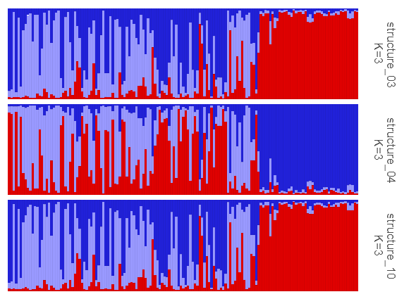  
`r fc(name="fc_clumppunaligned",caption="_Three runs of K=3 with jumbled clusters._")`  

The software CLUMPP helps to overcome this issue by reordering the clusters correctly. To read more about CLUMPP^4^, see references.  

  
`r fc(name="fc_clumppfolder",caption="_Directories created from clumpp export (left) and the contents of each folder (right)._")`  

The function `clumppExport()` takes a 'qlist', combines runs by *K* and generates a combined data file and a paramfile in separate directories. The combined file contains the tabular cluster data from all the repeats and runs. The paramfile contains information for the CLUMPP executable. The name for the folder can be changed optionally using the argument `prefix="something"`. When the argument `useexe=T` is used, the CLUMPP executable (included with `pophelper`) will be run automatically. This may not work on all OS and versions. Remember to cite CLUMPP^4^ if this option is used. 

```{r,echo=TRUE, eval=FALSE}
# basic usage
clumppExport(qlist=slist, useexe=T)

# select files interactively
# clumppExport(qlist=choose.files(multi=TRUE), useexe=T)

?clumppExport
clumppExport(qlist=NULL, prefix=NA, parammode=NA, paramrep=NA, useexe=T)
# export folders are prefixed as pop by default, to change, use prefix="foo"
# To change clumpp algorithm, set parammode=1, parammode=2 or parammode=3. 
# If clumpp is slow, increase parammode
# To change number of clumpp repeats, set paramrep=200, paramrep=500 etc.

# optionally change folder name
clumppExport(qlist=slist, prefix="Set1", useexe=T)
```

If CLUMPP does not run automatically using `useexe=T`, the CLUMPP executable can be copied and pasted into each of these directories and executed by running it.  

The CLUMPP executable uses the combined file and the param file to generate three output files: aligned file, merged file and misc file. 

  
`r fc(name="fc_clumppoutput",caption="_Directory showing CLUMPP results: aligned file, merged file and misc file._")`  

The aligned file contains all the runs as in the combined file after realignment of clusters. In contrast, the merged file contains only one table which merges all the aligned runs to create a consensus run. The merged file makes sense only if all the aligned runs have similar assignments. The merged file is not recommended for downstream use unless you know what you are doing. The miscfile contains run parameters and other details.  

We run our example samples.  

```{r, echo=TRUE, eval=FALSE}
# generate clumpp files, run clumpp and produce aligned files
clumppExport(slist[c(3,4,10)],useexe=T)
```

```
Folder created: pop_K3
pop_K3-combined.txt exported.
paramfile exported.


-----------------------------------------------------------------
-----------------------------------------------------------------
CLUMPP by M. Jakobsson and N. A. Rosenberg (2007)
              Code by M. Jakobsson
           Version 1.1.2 (May 2009)
-----------------------------------------------------------------
-----------------------------------------------------------------


Parameter settings 
----------------------- Main parameters -------------------------
DATATYPE = 1
INDFILE = 
POPFILE = pop_K3-combined.txt
OUTFILE = pop_K3-combined-merged.txt
MISCFILE = pop_K3-combined-miscfile.txt
K = 3
C = 149
R = 3
M = 2
W = 0
S = 2
- Additional options for the Greedy and LargeKGreedy algorithms -
GREEDY_OPTION = 2
REPEATS = 20
PERMUTATIONFILE = 
----------------------- Optional outputs ------------------------
PRINT_PERMUTED_DATA = 1
PERMUTED_DATAFILE = pop_K3-combined-aligned.txt
PRINT_EVERY_PERM = 0
EVERY_PERMFILE = 
PRINT_RANDOM_INPUTORDERFILE = 0
RANDOM_INPUTORDERFILE = 
----------------------- Advanced options ------------------------
OVERRIDE_WARNINGS = 0
ORDER_BY_RUN = 0


In total, 20 configurations of runs and clusters will be tested.

Running... 
----------------------------------
Best estimate of H'  Repeat number (of 20)
0.995447938961547    1


Results 
----------------------------------
The highest value of H' is: 0.995447938961547

The list of permutation of the clusters that produces that
H' value is (each run is on a separate row)
3 2 1 
1 2 3 
3 2 1 

The program finished in (days:hours:minutes:seconds)
0:0:0:0

Press Return to exit...
-----------------------
Run completed.
```

The aligned file can be read in and plotted.  

```{r, echo=TRUE,eval=FALSE}
# read aligned file
aligned <- readQ("./pop_K3/pop_K3-combined-aligned.txt")

#plot
plotQ(aligned,imgoutput="join")
```

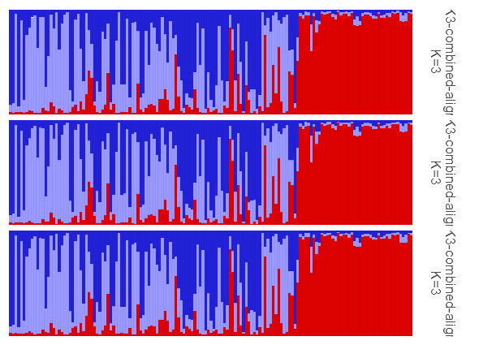  
`r fc(name="fc_clumppunaligned",caption="_Three runs of K=3 with clusters aligned using CLUMPP._")`  

Note that CLUMPP can only be used to align clusters with a given *K*. Clusters cannot be aligned across multiple *K*. To align clusters across multiple *K*, see [CLUMPAK](http://clumpak.tau.ac.il/).  

## collectClumppOutput  

The CLUMPP output files are now distributed in multiple folders. The aligned, merged or both files can be copied from multiple folders into a single folder for further analyses using the function `collectClumppOutput()`. The working directory is set suitably before running this function. This function need a `prefix` argument which denotes the prefix used in the previous function or the text before the underscore. For ex. a directory named `pop_K2` has the prefix `pop`.  

```{r,echo=TRUE, eval=FALSE}
# set working directory
setwd(choose.dir())
# collect aligned files. Default prefix is pop
collectClumppOutput()

# working directory can also be set using runsdir argument
collectClumppOutput(runsdir=choose.dir())

# collect both aligned and merged files
collectClumppOutput(filetype="both")

?collectClumppOutput
collectClumppOutput(prefix="pop", filetype="aligned", runsdir=NA, 
+ newdir=NA, quiet=FALSE)

# to change which files are copied, set filetype="aligned", filetype="both" or 
# filetype="merged"
# to change name of new directory, set newdir="somename"

?collectClumppOutput()
```

Collecting the aligned and merged files into a single folder can be helpful in plotting these files. From the command above, both aligned and merged files are copied into a new directory `pop-aligned` within the working directory.  

## analyseQ  

This is a wrapper function for easily performing several `pophelper` functions in one function. Input files can be STRUCTURE, TESS or BASIC run files. The `analyseQ()` function performs a tabulation of runs, summarising of runs, perform Evanno method (for STRUCTURE runs only), exports clumpp output and generates barplots.

```{r,echo=TRUE, eval=FALSE}
# basic usage
analyseQ(choose.files())

sfiles <- list.files(path=system.file("files/structure",package="pophelper"),full.names=T)
analyseQ(files=sfiles)
tfiles <- list.files(path=system.file("files/tess",package="pophelper"),full.names=T)
analyseQ(files=tlist)
sfiles <- list.files(path=system.file("files/structure",package="pophelper"),full.names=T)
analyseQ(files=alist)
```

# Plotting  
## plotQ  

The function `plotQ()` is used to create stacked assignment barplots from a 'qlist'. All individuals are shown on a single row. A schematic of the plot parts is shown below.  

  
`r fc(name="fc_plotqoverview",caption="_An overview of the components of a \x60plotQ()\x60 figure and most of the arguments used to modify them._")`  

The full code used to create the above figure is shown below. Details are explained further on.

```{r,echo=TRUE, eval=FALSE}
sfiles <- list.files(path=system.file("files/structure",package="pophelper"), full.names=T)
slist <- readQ(files=sfiles,indlabfromfile=T)

threelabset <- read.delim(system.file("files/metadata.txt", package="pophelper"), header=T,stringsAsFactors=F)
twolabset <- threelabset[,2:3]

plotQ(slist[2:3],imgoutput="join",showindlab=T,grplab=twolabset,
      subsetgrp=c("Brazil","Greece"),selgrp="loc",ordergrp=T,showlegend=T,
      showtitle=T,showsubtitle=T,titlelab="The Great Structure",
      subtitlelab="The amazing population structure of your favourite organism.",
      height=1.6,indlabsize=2.3,indlabheight=0.08,indlabspacer=-1,
      barbordercolour="white",barbordersize=0,outputfilename="plotq",imgtype="png")
```

### Separate and Joined plots

The `imgoutput` argument is used to indicate if multiple runs must be plotted as separate plots or as a joined plot. When `imgoutput="sep"`, each run file is plotted and exported as separate figures. When `imgoutput="join"`, all selected run files are plotted as a single figure and exported. Default is set as `imgoutput="sep"`.

```{r,echo=TRUE, eval=FALSE}
# plot first run separately
plotQ(qlist=slist[1])

# plot multiple runs separately
plotQ(qlist=slist[1:3])
# same as above
plotQ(qlist=slist[1:3], imgoutput="sep")

# TESS files
plotQ(qlist=readQ(tfiles)[1:3], imgoutput="sep")
# ADMIXTURE files
plotQ(qlist=readQ(afiles)[1:3], imgoutput="sep")
# FASTSTRUCTURE files
plotQ(qlist=readQ(ffiles)[1:3], imgoutput="sep")
# comma-delimited files
plotQ(qlist=readQ(mcfiles)[1:3], imgoutput="sep")
# space-delimited files
plotQ(qlist=readQ(msfiles)[1:3], imgoutput="sep")
# tab-delimited files
plotQ(qlist=readQ(mtfiles)[1:3], imgoutput="sep")

# join files into one figure
plotQ(qlist=readQ(sfiles)[c(1,3)], imgoutput="join")
plotQ(qlist=readQ(tfiles)[1:3], imgoutput="join")
plotQ(qlist=readQ(afiles)[1:3], imgoutput="join")
plotQ(qlist=readQ(ffiles)[1:3], imgoutput="join")
plotQ(qlist=readQ(mcfiles)[1:3], imgoutput="join")
plotQ(qlist=readQ(msfiles)[1:3], imgoutput="join")
plotQ(qlist=readQ(mtfiles)[1:3], imgoutput="join")
```

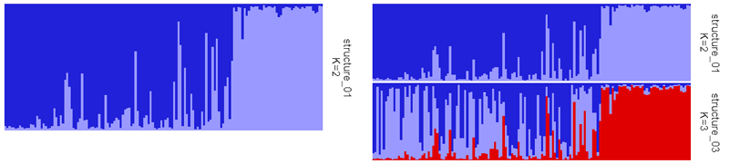  
`r fc(name="fc_plotqnolab",caption="_(A) Left: Single run plotted separately. (B) Right: Two runs joined together in one image._")`  

### Strip panel

The panel on the right side of the plot is the strip panel (`showsp`). The strip panel shows labels referred to as the strip labels or strip panel labels. The strip panel by default shows the filename and the *K* value. Strip panel label can be changed to show custom labels or the panel can be turned off altogether. If custom labels are provided, they must be equal to the number of runs.

```{r,echo=TRUE, eval=FALSE}
# turn off strip panel
plotQ(qlist=slist[1], showsp=F)
# move strip panel to the left
plotQ(qlist=slist[1], sppos="left")
plotQ(qlist=slist[1:3], imgoutput="join", sppos="left")
# custom strip panel label showing filename only
plotQ(qlist=slist[1], splab=names(slist)[1])

# custom strip panel label showing k only
fn1 <- function(x) attr(x,"k")
spnames <- paste0("K=",sapply(slist,fn1))
plotQ(qlist=slist[1], splab=spnames[1])

# two-line strip panel label
plotQ(qlist=slist[1:3], splab=paste0(names(slist)[1:3],"\n",c("run1","run2","run3")))
plotQ(qlist=slist[1:3], imgoutput="join",
      splab=paste0(names(slist)[1:3],"\n",c("run1","run2","run3")))

# change colour of strip label on plot
plotQ(qlist=slist[1], splabcol="blue")
# change size of strip label on plot
plotQ(qlist=slist[1], splabsize=7)
# change font face of strip label on plot
plotQ(qlist=slist[1], splabface="bold")
# hide strip label on plot
plotQ(qlist=slist[1], splabcol="white")
# change strip panel background colour
plotQ(qlist=slist[1], spbgcol="coral")
```

### Cluster colours

Each cluster gets a distinct colour. Up to 12 clusters get colours assigned from a pre-defined palette. Clusters >12 get colours derived from the function `rich.colors()`. The colours can also be manually supplied to `clustercol` as a character of R colours or hexadecimal values. The length of colours must be equal to the maximum *K* value in the runs provided.

  
`r fc(name="fc_cols",caption="_(A) Top: Colour palette used when K<=12. (B) Bottom: Colour function used when K>12._")`  

```{r,echo=TRUE, eval=FALSE}
# change colour of clusters
plotQ(qlist=slist[3:4], imgoutput="join", 
    clustercol=c("coral","steelblue","lightblue","purple","orange"))

plotQ(qlist=slist[16:17], imgoutput="join", 
    clustercol=c("#A6CEE3", "#3F8EAA", "#79C360", "#E52829", "#FDB762","#ED8F47","#9471B4"))

plotQ(qlist=slist[16:17], imgoutput="join", clustercol=col1)
```

Here are some more colours to play with.  

```{r,echo=TRUE, eval=FALSE}
clist <- list()
clist[[1]] <- c("#11A4C8","#63C2C5","#1D4F9F",
            "#0C516D","#2A2771","#396D35",
            "#80C342","#725DA8","#B62025",
            "#ED2224","#ED1943","#ED3995",
            "#7E277C","#F7EC16","#F8941E",
            "#8C2A1C","#808080")
clist[[2]]  <- c("#1D72F5","#DF0101","#77CE61", 
            "#FF9326","#A945FF","#0089B2",
            "#FDF060","#FFA6B2","#BFF217",
            "#60D5FD","#CC1577","#F2B950",
            "#7FB21D","#EC496F","#326397",
            "#B26314","#027368","#A4A4A4",
            "#610B5E")
clist[[3]]  <- c("#00A0B0", "#6A4A3C", "#CC333F", "#EB6841", "#EDC951")
clist[[4]]  <- c("#48B098", "#91CB62", "#FFEE3B", "#FB9013", "#FF3C28")
clist[[5]]  <- c("#400F13", "#027368", "#A3BF3F", "#F2B950", "#D93A2B")
clist[[6]]  <- c("#46BDDD","#82DDCE","#F5F06A","#F5CC6A","#F57E6A")
clist[[7]]  <- c("#CFF09E","#A8DBA8","#79BD9A","#3B8686","#0B486B")
clist[[8]]  <- c("#5BC0EB","#FDE74C","#9BC53D","#E55934","#FA7921")
clist[[9]] <- c("#A6CEE3", "#3F8EAA", "#79C360", "#E52829", "#FDB762","#ED8F47","#9471B4")
clist[[10]]  <- c("#01948e","#a9c4e2","#e23560","#01a7b3","#fda963","#323665","#ec687d")

names(clist) <- c("strong","shiny","oceanfive","keeled","vintage","muted","teal","merry","funky","retro")

par(mar=c(0.2,3,0.2,0))
par(mfrow=c(10,1))

for(i in 1:length(clist))
{
  barplot(rep(1,19),col=c(clist[[i]],rep("white",19-length(clist[[i]]))),axes=F,border=F)
  text(x=-0.1,y=0.5,adj=1,label=names(clist)[i],xpd=T)
}
```

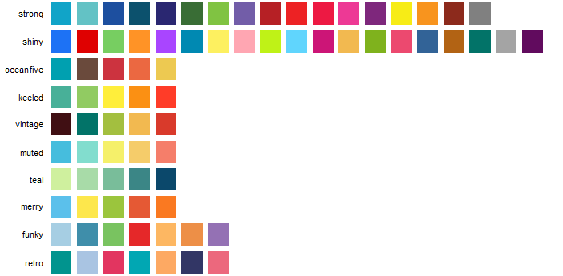  
`r fc(name="fc_more_cols",caption="_More colour palettes._")`  

### Legend

A legend denoting colours and labels for clusters can be shown on the top of plots by setting `showlegend=T`.  

```{r,echo=TRUE, eval=FALSE}
# show legend
plotQ(qlist=slist[3], showlegend=T)
# move to right side
plotQ(qlist=slist[3], showlegend=T, legendpos="right")
# change legend key size
plotQ(qlist=slist[3], showlegend=T, legendkeysize=5)
# change legend text size
plotQ(qlist=slist[3], showlegend=T, legendtextsize=5)
```

 The clusters in 'qlist' are by default named Cluster1, Cluster2 etc. The cluster names can be renamed by providing custom labels to argument `legendlab`. The length of `legendlab` must be equal to the max number of clusters in the selected runs. 

```{r,echo=TRUE, eval=FALSE}
# number of columns or K value in selected runs
sapply(slist[c(1,3)],ncol)
# joined plot with custom legend labels
plotQ(qlist=slist[c(1,3)], imgoutput="join", showlegend=T, legendlab=c("group1","group2","group3"))
```

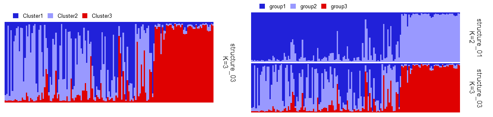  
`r fc(name="fc_plotqlegend",caption="_(A) Left: Default legend when \x60showlegend=T\x60. (B) Right: Joined plot with custom legend labels using \x60legendlab=c('group1','group2','group3')\x60._")`  

### Individual labels  

Individual labels are row names of the 'qlist' dataframes. Individual labels although not displayed by default on the plots, are present in the underlying data. The final ndividual labels in the plotted data depends on the row labels of the input data, and on arguments `useindlab` and `grplab`.  

The default `useindlab=F`, creates labels numerically in the original order of data but with zero padding. For example, if there are 10 individuals, labels are 01, 02 up to 10. if there are 100 individuals, then labels are 001, 002 up to 100. Zero padding to ensure optimal sorting. When `useindlab=T`, labels are used from the rownames of 'qlist' dataframes. They are usually labelled 1,2,3.. if read in using `readQ()`. 

```{r,echo=TRUE, eval=TRUE}
sfiles <- list.files(path=system.file("files/structure",package="pophelper"),full.names=T)
# without indlabfromfile
slist <- readQ(files=sfiles)
head(slist[[1]])
```

This is not optimal for sorting by labels `sortind="label"`. For STRUCTURE files with individual labels, they can be read in automatically using `readQ(indlabfromfile=T)`. `indlabfromfile` only works for STRUCTURE files and not for other run files.

```{r,echo=TRUE, eval=TRUE}
# with useindlabfromfile
slist <- readQ(files=sfiles, indlabfromfile=TRUE)
head(slist[[1]])
```

The rownames of 'qlist' can also be modified by the user by adding custom individual labels. 

```{r,echo=TRUE, eval=FALSE}
inds <- read.delim(system.file("files/structureindlabels.txt",package="pophelper"),header=FALSE,stringsAsFactors=F)
# add indlab to one run
rownames(slist[[1]]) <- inds$V1
# if all runs are equal length, add indlab to all runs
if(length(unique(sapply(slist,nrow)))==1) slist <- lapply(slist,"rownames<-",inds$V1)
# show row names of all runs and all samples
lapply(slist, rownames)
```

Individual labels are not recommended for `plotQ()` since all sample are in a single row. Individual labels are better suited for `plotQMultiline()`. Individual labels can be shown on the plot using `showindlabel=TRUE`.

```{r,echo=TRUE, eval=FALSE}
# increased width to reduce overlapping
plotQ(slist[1], showindlab=TRUE, width=16, outputfilename="structure-indlab")
# options to modify
plotQ(slist[1], showindlab=TRUE, width=16, indlabsize=3, indlabangle=45, indlabvjust=1, indlabhjust=1, indlabcol="darkgreen")
```
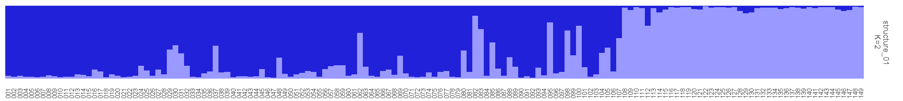  
`r fc(name="fc_plotqindlab",caption="_Barplot with individual labels._")`  

### Sort individuals  

Individuals in a plot are by default plotted in the order as in the input data. The individuals can be sorted based on the value of any one of the clusters ('Cluster1'), 'all' or 'label'. The 'all' option produces a sort similar to that in the software STRUCTURE. All clusters are taken into account to sort individuals. When using the name of a cluster, like 'Cluster1', 'Cluster2' etc, all individuals are sorted by value of the specified cluster.  

```{r,echo=TRUE, eval=FALSE}
# sorted by cluster 1
plotQ(slist[c(1,3)], sortind="Cluster1")
# sorted by cluster 2
plotQ(slist[1], sortind="Cluster2")
# sorted by all
plotQ(slist[c(1,3)], sortind="all")

# sorted by cluster 3
plotQ(tlist[1], sortind="Cluster3") # gives error because this file contains only 2 clusters

# sorted by cluster 1, three files joined plot
plotQ(slist[c(1,3)], sortind="Cluster1", imgoutput="join")
plotQ(slist[c(1,3)], sortind="all", imgoutput="join")
```

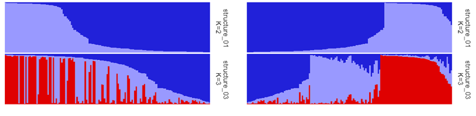  
`r fc(name="fc_plotqnolabsort",caption="_(A) Left: Joined plot sorted by cluster 1. (B) Right: Joined plot sorted by 'all'._")`  

When using `sortind="label"`, individuals are sorted by individual labels. The final individual labels in plotted data depends on the row labels of the input data, and on arguments `useindlab` and `grplab`. When group labels are in use (`grplab`), they are concatenated to the individual labels in both cases `useindlab=T` and `useindlab=F`, separated by `indlabsep`.  Default `indlabsep=" "` adds a space between individual label and grplab. For example, group labels 'popA', 'popA'... will be '01 popA', '02 popA'... when `useindlab=F` and usually '1 popA', '2 popA'... when `useindlab=T`. When multiple group labels are in use, the are similarly concatenated one after the other to individual names in the order in which the group labels were provided. The full concatenated string will determine the final sort order of the individuals. See previous section 'Individual labels' for more information on individual labels. 

### Group labels

One or more sets of group labels can be added to the bottom of barplots by providing a 'data.frame' object. The number of rows of the 'data.frame' must be equal to the number of individuals. The header of the 'data.frame' is the group label set title.

```{r, echo=TRUE, eval=FALSE}
# group labels with one group label set
data.frame(lab1=c("A","A","A","B","B"))
# group labels with two group label sets
data.frame(type=c("A","A","A","B","B"),loc=c("Brazil","Brazil","Chile","Chile","Chile"))
```

In this demonstration, we will use group labels in the `pophelper` library. This is a 'data.frame' with three columns, ie; three group label sets.  

```{r, echo=TRUE, eval=FALSE}
# read labels for STRUCTURE runs
threelabset <- read.delim(system.file("files/metadata.txt", package="pophelper"), header=T,stringsAsFactors=F)
head(threelabset)
# length of labels equal to number of individuals?
nrow(threelabset)
# check if labels are a character data type
sapply(threelabset, is.character)
```

Make sure that the labels are character datatype. When reading from a text file, use `stringsAsFactors=F` to ensure that each column in the dataframe is a character and not a factor. From the above label dataframe, we can choose to use one label set or multiple.

For now we use a single label set. Note the use of `drop=FALSE` to preserve the single label set as a 'data.frame'.

```{r, echo=TRUE, eval=FALSE}
onelabset <- threelabset[,2,drop=FALSE]
plotQ(qlist=slist[1], grplab=onelabset, outputfilename="structure-single-grplab")
```

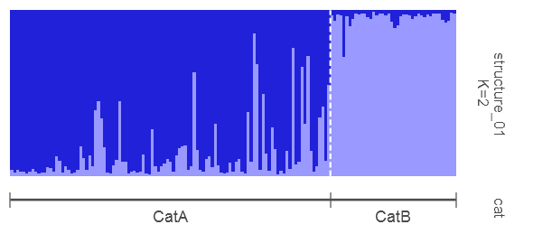  
`r fc(name="fc_plotqsinglegrplab",caption="_STRUCTURE barplot with one group label set._")`  

The group label set title or the header of the group label 'data.frame' is shown on the right strip panel. Several separate plots can be exported using the group labels.

```{r, echo=TRUE, eval=FALSE}
plotQ(qlist=slist[1:3], grplab=onelabset)
```
Similarly, joined plots can be exported.

```{r, echo=TRUE, eval=FALSE}
# plot multiple files with a common label
plotQ(slist[c(1,3)], imgoutput="join", grplab=onelabset, outputfilename="structure-joined-grplab")
```

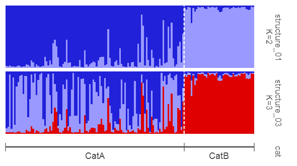  
`r fc(name="fc_plotqjoinedgrplab",caption="_Two runs joined together in one image with group labels._")`  

Group labels with individual labels.

```{r, echo=TRUE, eval=FALSE}
# plot multiple files with a common label
plotQ(slist[c(1,3)], imgoutput="join", grplab=onelabset, showindlab=TRUE, width=16, outputfilename="structure-joined-grplab-indlab")
```

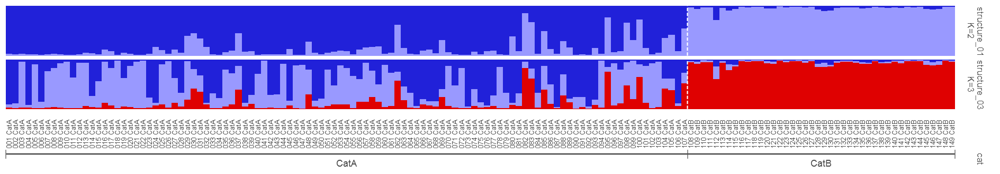  
`r fc(name="fc_plotqjoinedgrplabindlab",caption="_Barplot with single group label and individual labels._")`  

### Sorting with group labels

Individuals can be sorted while using group labels. The individuals are sorted within their groups.

```{r, echo=TRUE, eval=FALSE}
# with grp labels, sort individuals
plotQ(slist[1], grplab=onelabset, sortind="Cluster1")
plotQ(slist[1], grplab=onelabset, sortind="all")
plotQ(slist[1], grplab=onelabset, sortind="label")

# with grp labels, sort individuals, multiple files single
plotQ(slist[1:3], grplab=onelabset, sortind="Cluster1")
plotQ(slist[1:3], grplab=onelabset, sortind="all")
plotQ(slist[1:3], grplab=onelabset, sortind="label")

# with grp labels, sort individuals, multiple files joined
plotQ(slist[c(1,3)], grplab=onelabset, sortind="Cluster1", imgoutput="join")
plotQ(slist[c(1,3)], grplab=onelabset, sortind="all", imgoutput="join")
plotQ(slist[c(1,3)], grplab=onelabset, sortind="label", imgoutput="join")
```

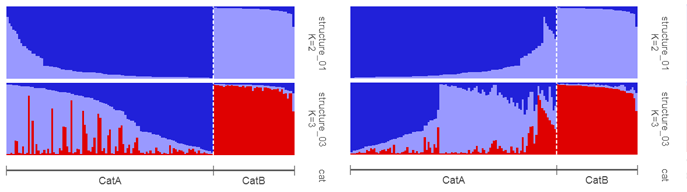  
`r fc(name="fc_plotqlabsort",caption="_(A) Left: Joined plot with group labels sorted by cluster 1. (B) Right: Joined plot with group labels sorted by 'all'._")`  

### Subset/reorder groups

When using group labels, the plot can be subsetted or reordered based on group labels.

```{r, echo=TRUE, eval=FALSE}
# subsetting groups
plotQ(slist[1], grplab=onelabset, subsetgrp="CatB")
# change order of groups
plotQ(slist[1], grplab=onelabset, subsetgrp=c("CatB","CatA"))

# subsetting group and sorting individuals
plotQ(slist[1], grplab=onelabset, subsetgrp="CatB",sortind="Cluster1")
plotQ(slist[1], grplab=onelabset, subsetgrp="CatA",sortind="all")

# change order of groups and sorting individuals
plotQ(slist[1], grplab=onelabset, subsetgrp=c("CatB","CatA"), sortind="Cluster1")
plotQ(slist[c(1,3)], grplab=onelabset, subsetgrp=c("CatB","CatA"), sortind="all", imgoutput="join")
```

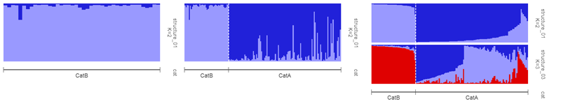  
`r fc(name="fc_plotqlabsubsetreorder",caption="_(A) Left: Single run with with subsetted group. (B) Middle: Single run with reordered groups. (C) Right: Joined plot with reordered groups._")`  

In similar manner, the `plotQ` function can be used to plot from COMBINED, ALIGNED or MERGED files.

```{r,echo=TRUE, eval=FALSE}
# select files from package
co <- system.file("files/STRUCTUREpop_K4-combined.txt",package="pophelper")
al <- system.file("files/STRUCTUREpop_K4-combined-aligned.txt",package="pophelper")
me <- system.file("files/STRUCTUREpop_K4-combined-merged.txt",package="pophelper")

# all runs within the file are plotted
# combined
plotQ(readQ(co), imgoutput="join")
# aligned
plotQ(readQ(al), imgoutput="join")
# merged only one run
plotQ(readQ(me))

# plot with labels
plotQ(readQ(co), grplab=onelabelset)
plotQ(readQ(al), imgoutput="join", grplab=onelabelset)
```

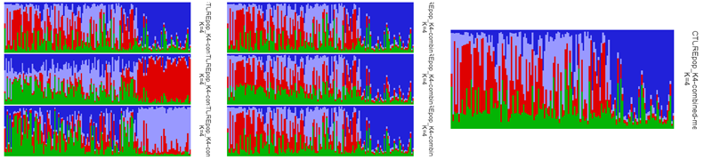  
`r fc(name="fc_plotqclumppnolab",caption="_(A) Left: Combined file (Three STRUCTURE runs for K=4). (B) Middle: Aligned file (Three STRUCTURE runs for K=4 aligned using CLUMPP). (C) Right: Merged file (Three runs for K=4 merged into one table/figure using CLUMPP)._")`   

### Group mean  

An additional feature is the ability to plot mean values (`grpmean=T`) by group when group labels are in use.

```{r,echo=TRUE, eval=FALSE}
# group mean
plotQ(slist[4], grplab=onelabset, grpmean=T)
plotQ(readQ(al), imgoutput="join", grplab=onelabset, grpmean=T)
```

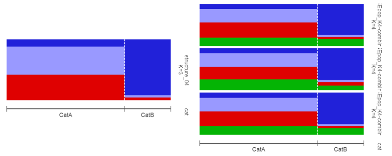  
`r fc(name="fc_plotqlabgrpmean",caption="_(A) Left: STRUCTURE file showing group mean values. (B) Right: Aligned CLUMPP file showing group mean._")`    

### Order groups  

In the example group label so far, the labels were already in contiguous blocks. But, if labels are not in contiguous blocks, ie; there are duplicated non-contiguous blocks of labels, many of the options in `plotQ` cannot be used. Below illustrates this concept.

```{r, echo=TRUE, eval=FALSE}
Contiguous block: A,A,A,A,B,B,C,C,C
Non-contiguous block: A,A,A,B,B,A,A,C,C
```

Here we use a single group label set which is in non-contiguous blocks. And we plot the data.

```{r, echo=TRUE, eval=FALSE}
onelabsetrep <- threelabset[,1,drop=FALSE]
head(onelabsetrep)

# multiple blocks of duplicate labels
rle(onelabsetrep$type)$values

plotQ(qlist=slist[1], grplab=onelabsetrep, outputfilename="plotq-rep-label")
```

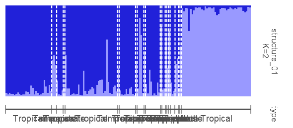  
`r fc(name="fc_plotqreplabel",caption="_Barplot with labels in non-contiguous blocks._")`  

Options such as `subsetgrp` do not work with non-contiguous blocks of labels.

```{r, echo=TRUE, eval=FALSE}
plotQ(qlist=slist[1], grplab=onelabsetrep, subsetgrp="Tropical") #gives error
```

Non-contiguous labels can be grouped into contiguous blocks using `ordergrp=TRUE`. When using this, the labels are sorted alphabetically along with the data. The individuals are no longer in the original order as input.

```{r, echo=TRUE, eval=FALSE}
plotQ(qlist=slist[1], grplab=onelabsetrep, ordergrp=TRUE, subsetgrp=c("Tropical","Temperate"),
      outputfilename="plotq-rep-label-sorted")
```

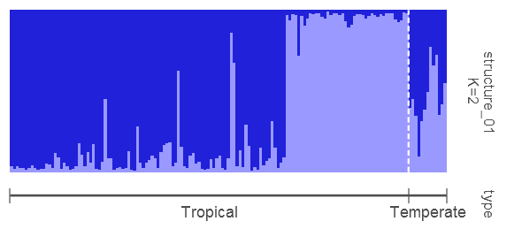  
`r fc(name="fc_plotqreplabelsorted",caption="_Non-contiguous labels ordered to contiguous blocks._")`   

### Multiple label sets

More than one set of group label sets can be be added to the plot simply by providing more columns in the `grplab` 'data.frame'.

```{r, echo=TRUE, eval=FALSE}
threelabset <- read.delim(system.file("files/metadata.txt", package="pophelper"), header=T, stringsAsFactors=F)
head(threelabset)
plotQ(slist[1], grplab=threelabset, outputfilename="plotq-multiple-labels")
```

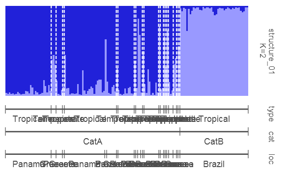  
`r fc(name="fc_plotqmultiplelabels",caption="_Barplot with multiple group labels._")`   

When plotting with mutiple group label sets, one group label set is defined as the selected group. This is declared using the argument `selgrp`. The value in `selgrp` must be one the group label set titles (headers in the grplab 'data.frame'). If `selgrp` is not explicitly specified, the first group label set is taken as `selgrp`. If only one group label set is used, then `selgrp` is automatically the title of that set. `selgrp` denotes which label set is used for `subsetgrp`, `ordergrp` and `grpmean`. `sortind` will sort within `selgrp`.

```{r, echo=TRUE, eval=FALSE}
plotQ(slist[1], grplab=threelabset, selgrp="type", sortind="all", ordergrp=T, outputfilename="plotq-ml-sort-1")
plotQ(slist[1], grplab=threelabset, selgrp="cat", sortind="all", outputfilename="plotq-ml-sort-2")
```

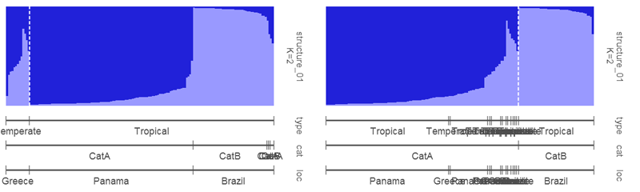  
`r fc(name="fc_plotqmlsort",caption="_(A) Left: Sorted by 'all' using label set 'type'. (B) Right: Sorted by 'all' using label set 'cat'._")`   

Subsetting and reordering works similarly when using multiple label sets.

```{r, echo=TRUE, eval=FALSE}
plotQ(slist[1], grplab=threelabset, selgrp="type", subsetgrp="Tropical", ordergrp=T, outputfilename="plotq-ml-subset-1")
plotQ(slist[1], grplab=threelabset, selgrp="cat", subsetgrp="CatA", outputfilename="plotq-ml-subset-2")
```

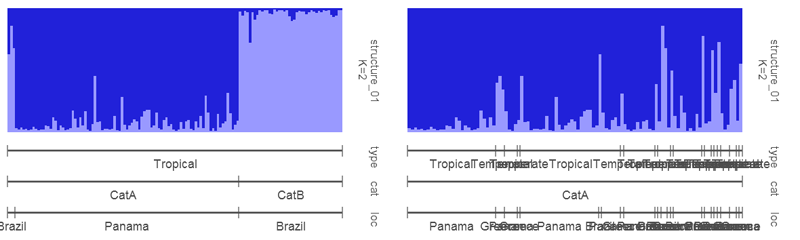  
`r fc(name="fc_plotqmlsubset",caption="_(A) Left: Subsetted for 'Tropical' using label set 'type'. (B) Right: Subsetted for 'CatA' using label set 'cat'._")`   

When using multiple label sets, `ordergrp` orders all group label sets into contiguous blocks starting with `selgrp`. This is shown in previous figures.  

### Divider line

The white dotted line dividing the groups on the panels is called the divider line. By default, the divider line is drawn between groups in the first group label set (See figures above). This can be changed by providing titles of group labels to the argument `divgrp`. `divgrp` can also take more than one label set, which means divider lines can be drawn for multiple group label sets simultaneously. Divider lines can be turned off using `showdiv=FALSE`.

```{r, echo=TRUE, eval=FALSE}
# default dividers drawn for first group label set
plotQ(slist[1], grplab=threelabset)

# use second group label set as dividers
plotQ(slist[1], grplab=threelabset, divgrp="cat")

# use both group label sets as dividers
plotQ(slist[1], grplab=threelabset, selgrp="loc", ordergrp=T, 
      subsetgrp=c("Panama","Greece"), divgrp=c("loc","cat"))
```

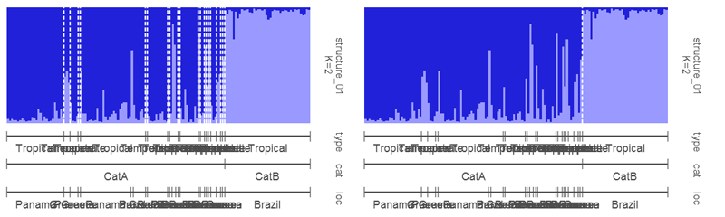  
`r fc(name="fc_plotqdivgrp",caption="_(A) Left: Default divider lines for 'type'. (B) Right: Divider lines for the second group label set 'cat'._")`   

The divider liness can also be modified and adjusted.

```{r, echo=TRUE, eval=FALSE}
# change div colour, type and thickness
plotQ(slist[1], grplab=threelabset, divcol="coral", divtype=1, divsize=0.8, divalpha=0.5)
```

### Title and subtitle  

Title and/or subtitle can be added to separate or joined plots. Title and subtitle are displayed using `showtitle=T` and `showsubtitle=T` respectively. The file name is displayed by default. Custom label can be provided using `titlelab` or `subtitlelab`. If multiple plots are exported, then a character vector of labels equal to number of plots must be provided.

```{r, echo=TRUE, eval=FALSE}
# show title and subtitle default
plotQ(slist[1], showtitle=T, showsubtitle=T)

# custom title and subtitle
plotQ(slist[1], showtitle=T, showsubtitle=T, titlelab="Structure plot", subtitlelab="Population structure of some organism.")

# multiple plots with custom titles
plotQ(slist[1:3], showtitle=T, titlelab=c("Structure plot A","Structure plot B","Structure plot C"))

# title in a joined plot
plotQ(slist[c(2,3)], imgoutput="join", showtitle=T, showsubtitle=T, titlelab="Structure plot", subtitlelab="Population structure of some organism.")
```

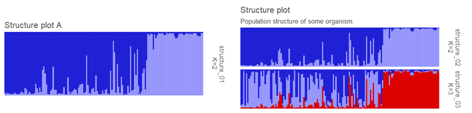  
`r fc(name="fc_plotqtitle",caption="_(A) Left: Custom title on a separate plot. (B) Right: Custom title and subtitle on a joined plot._")`   

### Other options  

Examples of some of plot options that can be modified.  

```{r,echo=TRUE, eval=FALSE}
# adjust label angle and justification
plotQ(slist[1], grplab=threelabset, grplabangle=-90, grplabjust=0.5)

# adjust grplabheight to fit labels
plotQ(slist[1], grplab=threelabset, grplabangle=-90, grplabjust=0.4, grplabheight=3)

# when grplabheight is high enough, use grplabpos to move labels vertically
plotQ(slist[1], grplab=threelabset, grplabheight=3, grplabpos=0.5)
plotQ(slist[1], grplab=threelabset, grplabheight=3, grplabpos=0.3)

# adjust grplabel colour
plotQ(slist[1] ,grplab=threelabset, grplabcol="green")

# adjust marker points
plotQ(slist[1], grplab=threelabset, pointtype=21, pointsize=0.4, pointcol="steelblue", pointbgcol="red")
plotQ(slist[1], grplab=threelabset, pointtype="$", pointcol="green", pointsize=2)

# adjust marker line
plotQ(slist[1], grplab=threelabset, linesize=0.5, linecol="steelblue")
plotQ(slist[1], grplab=threelabset, linecol="steelblue", linetype=3, linesize=0.2)
```

Multiple plot argument adjustments to obtain a new label style.

```{r, echo=TRUE, eval=FALSE}
plotQ(slist[1] ,grplab=onelabset, linesize=3, linealpha=0.2, pointcol="white", pointsize=2, grplabpos=0.5, linepos=0.5, grplabheight=0.75, outputfilename="plotq-newlook")
```

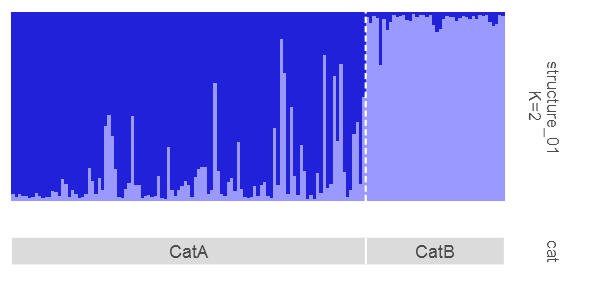   
`r fc(name="fc_plotqnewlook",caption="_Group labels in a different style._")` 

The height, width, resolution and figure format can be changed as shown below. The height specifies the height of one panel if the plot is joined. The function multiplies the height values by the number of panels.

```{r,echo=TRUE, eval=FALSE}
slist <- readQ(sfiles)

# change height and width of figure
plotQ(qlist=slist[1], imgoutput="sep", height=1.5, width=8)
plotQ(qlist=slist[1:3], imgoutput="join", height=1.5, width=8)

# change resolution
plotQ(qlist=slist[1], dpi=600)
# change export figure format
plotQ(qlist=slist[1], imgtype="tiff")
plotQ(qlist=slist[1], imgtype="pdf")
```

The output file name is automatically generated. When `imgoutput="sep"`, the names of the 'qlist' are used to create output labels. When `imgoutput="join"`, one output label is created for all input files in this format: `JoinedNFiles-YYYYMMDDHHMMSS`, where N stands for number of runs joined, and the ending stands for current system date and time. 

A custom output file name can be provided using `outputfilename`. When using `imgoutput="sep"`, `outputfilename` must be a character vector equal to length of input runs. When `imgoutput="join"`, `outputfilename` must be a character of length one. File extensions like .png etc must not be provided.  

Custom fonts can be used for the text in the plot using package `extrafont`. Fonts are rendered well only by pdf imagetype. I have only tried this on Windows OS. Refer to the `extrafont` package for more information.

```{r,echo=TRUE, eval=FALSE}
library(extrafont)
font_import(pattern="^PT Mono",prompt=F)
loadfonts()
fonts()

plotQ(slist[1], grplab=list("lab\n"=grps1$V1), font="PT Mono")
plotQ(slist[1], grplab=list("lab\n"=grps1$V1), font="PT Mono", imgtype="pdf")
```

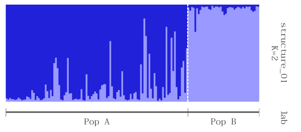  
`r fc(name="fc_plotqfont",caption="_Plot with custom font._")` 

`plotQ()` function has numerous arguments to tweak the plot as required. See `?plotQ` for more arguments and descriptions.

## plotQMultiline  

The `plotQMultiline` function is also used to plot barplots from a 'qlist'. The barplots can be plotted in multiple rows with individual labels to enable easier identification of individuals. The figure is produced as A4 size by default. The number of samples per line `spl` and the number of lines per page `lpp` is automatically calculated but it can also be specified manually. A schematic of the plot parts is shown below.  

   
`r fc(name="fc_plotqmultilineoverview",caption="_An overview of the components of a \x60plotQMultiline()\x60 figure and some of the arguments used to modify them._")`  

It is recommended to read through the `plotQ` section first because many of the arguments are same and better explanied there.  

`plotQMultiline()` plots one run per page. And multiple pages are exported for multiple runs. The output filename is the 'qlist' name followed by a number. Eg: filename-1.png. In case the number of individuals do not fit on a page, extra pages are exported per run. Then extra pages are named filename-2, filename-3 etc. But, the number of samples on a page can be manually controlled using `spl` and `lpp`.

### Basic usage

```{r,echo=TRUE, eval=FALSE}
# basic usage
plotQMultiline(slist[1])
plotQMultiline(slist[1:3])
plotQMultiline(tlist[1])
plotQMultiline(alist[1])
plotQMultiline(flist[1])
plotQMultiline(mclist[1])
plotQMultiline(mslist[1])
plotQMultiline(mtlist[1])

# manually modifying samples per line and lines per page
plotQMultiline(slist[1], lpp=10)
plotQMultiline(slist[1], spl=75, lpp=9)
plotQMultiline(slist[1], spl=149, lpp=9)
# with TESS runs
plotQMultiline(tlist[1], spl=75, lpp=10)
# with TESS runs
plotQMultiline(alist[1], spl=168, lpp=10)

# works with combined, aligned or merged files
plotQMultiline(readQ(co),spl=75, lpp=10)

# change bar width and turn off labels
plotQMultiline(readQ(al), barsize=1, indlab=F)
# yaxis labels and ticks and modified height and width
plotQMultiline(readQ(al), spl=75, lpp=2, indlab=T, showyaxis=T, showticks=T, height=5, width=20)
# modified spl
plotQMultiline(readQ(me), spl=38, height=8, width=14)
```

  
`r fc(name="fc_plotqmultiline",caption="_Left: Default output from \x60plotQMultiline\x60. Right: Modified output with custom \x60spl\x60 and \x60lpp\x60._")`  

### Individual labels

`plotMultiline()` labels individuals numerically with padded zeros (01,02,03..). The number of padded zeros depend on the total number of individuals. Less than 100 individuals start with 01, 02... while hundreds of individuals start with 001, 002.. etc. Labels with padded zeros are better suited for sorting. This is default behaviour `useindlab=F`. Instead of automatically creating the labels, predefined labels can be used from the rownames of input data by specifying `useindlab=T`. Custom labels can be manually added as rownames anytime.

```{r,echo=TRUE, eval=FALSE}
# get a qlist
list1 <- slist[1]
# show rownames
rownames(list1[[1]])

# default labels
plotQMultiline(list1, useindlab=F)

# read some individual labels
inds <- read.delim(system.file("files/structureindlabels.txt",package="pophelper"),
                   header=FALSE, stringsAsFactors=FALSE)

# add labels as rownames to qlist
rownames(list1[[1]]) <- inds$V1

# show custom labels.
plotQMultiline(list1,useindlab=T)

# long ind name
longlabs <- paste0("this_is_a_real_long_label_",inds$V1)
rownames(list1[[1]]) <- longlabs
plotQMultiline(list1, useindlab=T)
plotQMultiline(list1, useindlab=T, spl=75, lpp=4)
plotQMultiline(list1, useindlab=T, spl=75, lpp=4)

# if all runs are equal length, add indlab to all runs
if(length(unique(sapply(slist,nrow)))==1) slist <- lapply(slist,"rownames<-",inds$V1)
# show row names of all runs and all samples
lapply(slist,rownames)
```

Note that runs read in using `readQ()` have rownames 1,2,3.. etc which may not be optimal for sorting by individual labels. For STRUCTURE files with individual labels in them, using `readQ(indlabfromfile=T)` will read them in as rownames. See section `readQ()`.

Individual labels are displayed on the plot when `showindlab=T`. They can be turned off by `showindlab=F`. Note that this only controls the display of individual labels on the plot. The labels are still present in the underlying data and are still in use for sorting etc.

```{r,echo=TRUE, eval=FALSE}
# display ind labels
plotQMultiline(slist[1], indlab=T)
# do not display ind labels
plotQMultiline(slist[1], indlab=F)
```

### Sort individuals

Similar to `plotQ()`, the individuals can be sorted based on the value of any one of the clusters ('Cluster1'), 'all' or 'label'. The 'all' option produces a sort similar to that in the software STRUCTURE. All clusters are taken into account to sort individuals. When using the name of a cluster, like 'Cluster1', 'Cluster2' etc, all individuals are sorted by value of the specified cluster.  

Using `sortind="label"` sorts individuals by individual labels. The default `useindlab=F`, creates labels numerically in the original order of data but with zero padding. For example, if there are 10 individuals, labels are 01, 02 up to 10. if there are 100 individuals, then labels are 001, 002 up to 100. Zero padding to ensure optimal sorting. When `useindlab=T`, labels are used from rownames of 'qlist' dataframes. They are usually labelled 1,2,3.. if read in using `readQ()`. This can be an issue with sorting by labels `sortind="label"`. For STRUCTURE files with individual labels, they can be read in automatically using `readQ(indlabfromfile=T)`. The rownames of 'qlist' dataframes can also be modified by the user. 

```{r,echo=TRUE, eval=FALSE}
sfiles <- list.files(path=system.file("files/structure",package="pophelper"),full.names=T)
slist <- readQ(files=sfiles, indlabfromfile=TRUE)
list1 <- slist[3]

plotQMultiline(slist[1], sortind="Cluster1")
plotQMultiline(slist[1], sortind="all")
plotQMultiline(slist[1], spl=75, lpp=10, sortind="Cluster1")
plotQMultiline(slist[1], spl=75, lpp=10, sortind="all")
```

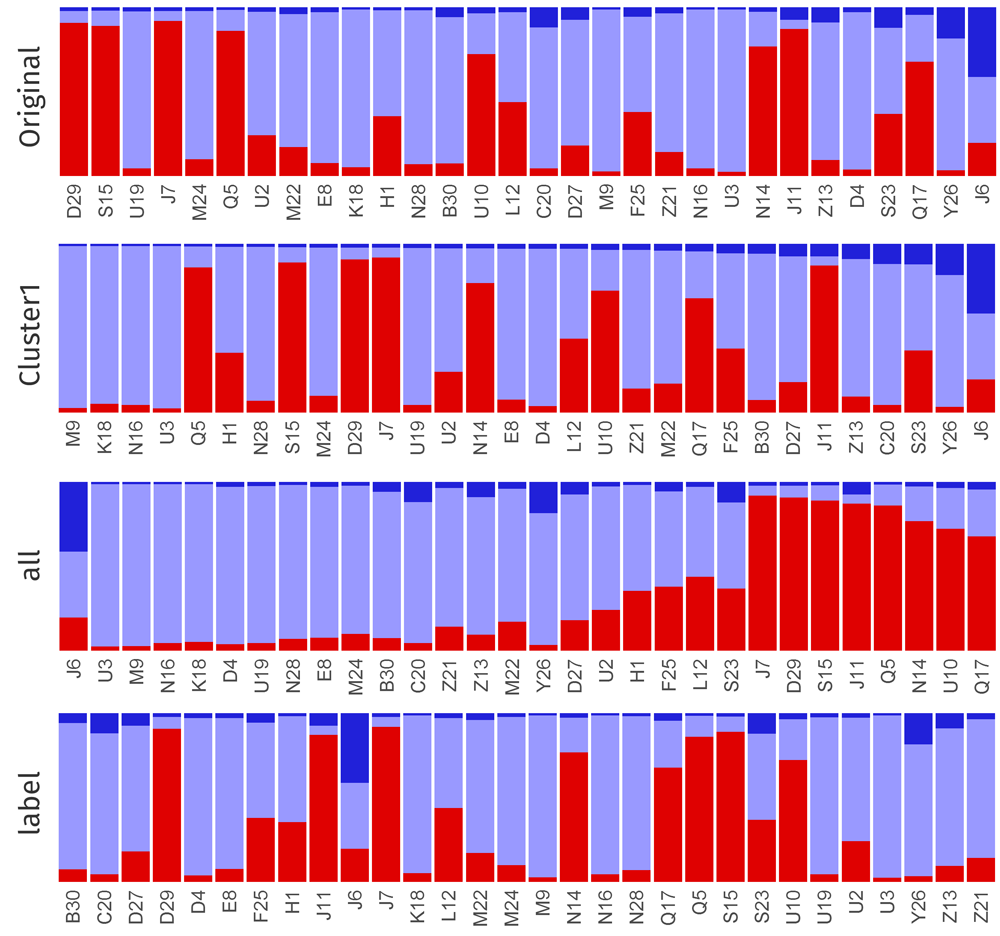   
`r fc(name="fc_plotqmultilinesort",caption="_Various sorting options in plotQMultiline(). Original order, ordered by Cluster1, ordered by all clusters and ordered by individual labels._")`  

### Group labels

One or more sets of group labels can be added to the bottom of barplots by providing a 'data.frame' object. The number of rows of the 'data.frame' must be equal to the number of individuals. The header of the 'data.frame' is the group label set title. See section 'Group labels' under 'plotQ' on more basic information about group labels.  

```{r,echo=TRUE, eval=FALSE}
# add one set of group labels
plotQMultiline(list1, grplab=onelabset, spl=38, indlabsize=12, grplabsize=15)
```
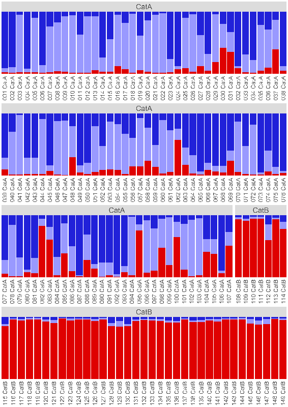  
`r fc(name="fc_plotqmultilinegrplabsingle",caption="_plotQMultiline() with one set of group labels._")`  

Group labels are displayed on the top of the plot as strip panels by default. A gap is added between individuals of same groups. Group labels are also concatenated to the individual labels using separator `indlabsep`. The default label separator is space. For example, individuals 1 and 2 with group labels popA and popB produces labels '1 popA' and '2 popB'. Any number of provided group labels are concatenated one after the other. Top strip panels can be turned off using `showgrplab=FALSE`.

Similarily, multiple group label sets can be added.

```{r,echo=TRUE, eval=FALSE}
# add one set of group labels
plotQMultiline(list1, grplab=threelabset, selgrp="cat", lpp=3, indlabsize=8, grplabsize=12, barsize=1)
```
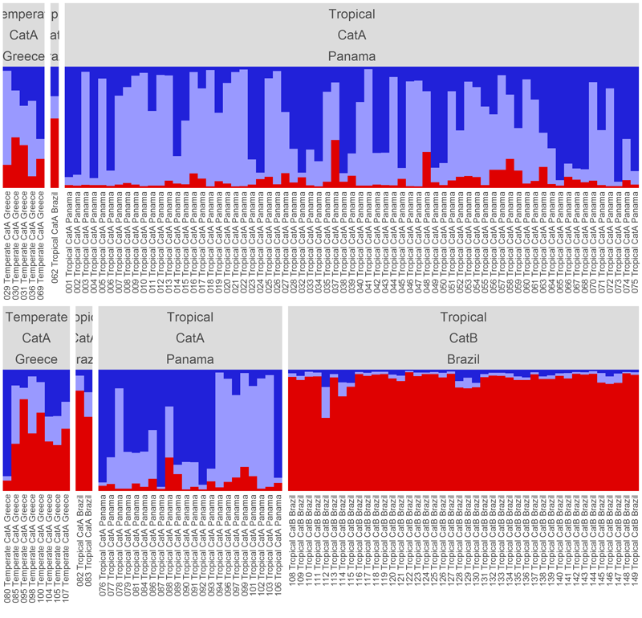  
`r fc(name="fc_plotqmultilinegrplabmultiple",caption="_plotQMultiline() with multiple sets of group labels._")`  

Individuals are grouped into blocks based on combinations of group label sets. Group labels can be used but not displayed by setting `showgrplab=F`. Similarily,  individual labels can be turned off by setting `showindlab=F`.

When sorting individuals, all individuals are sorted by full individual names when using `sortind="labels"`. But when using `sortind="Cluster1"` or `sortind="all"`, individuals are sorted within groups.

```{r,echo=TRUE, eval=FALSE}
sfiles <- list.files(path=system.file("files/structure",package="pophelper"),full.names=T)
slist <- readQ(files=sfiles, indlabfromfile=TRUE)
list1 <- slist[3]
# using ind labs from file
# sort all
plotQMultiline(list1, useindlab=T, spl=30, grplab=onelabset, sortind="all", indlabsize=10)
# sort by cluster 1
plotQMultiline(list1, useindlab=T, spl=30, grplab=onelabset, sortind="Cluster1", indlabsize=10)
# sort by label
plotQMultiline(list1, useindlab=T, spl=30, grplab=onelabset, sortind="label", indlabsize=10)
```

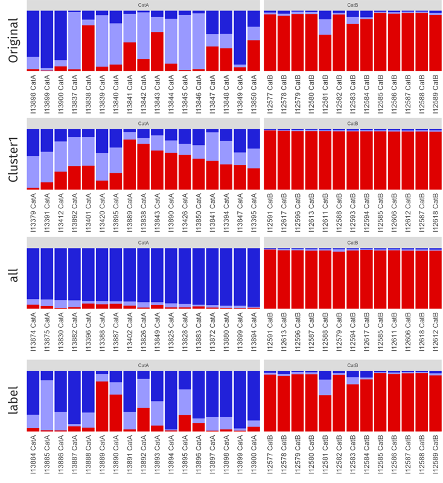   
`r fc(name="fc_plotqmultilinegrplabsort",caption="_plotQMultiline() with single set group labels. Original order, ordered by Cluster1, ordered by all clusters and ordered by individual labels._")`  

For comparison, below are sorted using `useindlab=F`.

```{r,echo=TRUE, eval=FALSE}
# ind labs from file not used
# sort all
plotQMultiline(list1, useindlab=F, spl=30, grplab=onelabset, sortind="all", indlabsize=10)
# sort by cluster 1
plotQMultiline(list1, useindlab=F, spl=30, grplab=onelabset, sortind="Cluster1", indlabsize=10)
# sort by label
plotQMultiline(list1, useindlab=F, spl=30, grplab=onelabset, sortind="label", indlabsize=10)
```

When using multiple group label sets, argument `selgrp` is used to declare which is the selected group. `selgrp` is used for `subsetgrp`, `grpmean` and `ordergrp`. `sortind` will sort within `selgrp`. If labels are in non-contiguous blocks, set `ordergrp=T` to order all labels into contiguous blocks starting with `selgrp`.  

```{r,echo=TRUE, eval=FALSE}
# with multiple group label sets
plotQMultiline(list1, useindlab=T, lpp=3, grplab=threelabset,
               ordergrp=TRUE, sortind="all", indlabsize=8, barsize=1)
```

### Subset/reorder groups

When using group labels, the plot can be subsetted or reordered based on group labels.

```{r, echo=TRUE, eval=FALSE}
# subsetting groups
plotQMultiline(list1, grplab=threelabset, ordergrp=T, subsetgrp="Tropical")
# change order of groups
plotQMultiline(list1, grplab=threelabset, ordergrp=T, subsetgrp=c("Tropical","Temperate"))

# subsetting group and sorting individuals
plotQMultiline(list1, grplab=threelabset, ordergrp=T, subsetgrp="Tropical", sortind="Cluster1")
plotQMultiline(list1, grplab=threelabset, ordergrp=T, subsetgrp="Tropical", sortind="all")

# change order of groups and sorting individuals
plotQMultiline(list1, grplab=threelabset, ordergrp=T, subsetgrp=c("Tropical","Temperate"), sortind="Cluster1")

# use second group label set for subsetting and sorting
plotQMultiline(list1, grplab=threelabset, selgrp="cat", subsetgrp=c("CatA","CatB"), sortind="all")
```

### Title and subtitle  

Title and/or subtitle can be displayed using `showtitle=T` and `showsubtitle=T` respectively. The file name is displayed by default. Custom label can be provided using `titlelab` or `subtitlelab`. If multiple plots are exported, then a character vector of labels equal to number of plots must be provided. Title/subtitle is only displayed in the topmost panel on the first page (in case of multiple pages).  

```{r, echo=TRUE, eval=FALSE}
# show title and subtitle default
plotQMultiline(slist[1], lpp=5, showtitle=T, showsubtitle=T)

# custom title and subtitle
plotQMultiline(slist[1], lpp=5, showtitle=T, showsubtitle=T, titlelab="Structure plot", subtitlelab="Population structure of some organism.")

# multiple plots with custom titles
plotQMultiline(slist[1:3], lpp=5, showtitle=T, titlelab=c("Structure plot A","Structure plot B","Structure plot C"))

# title with group labels
plotQMultiline(slist[3], showtitle=T, showsubtitle=T, titlelab="Structure plot", subtitlelab="Population structure of some organism.", grplab=threelabset, selgrp="cat", lpp=4)
```

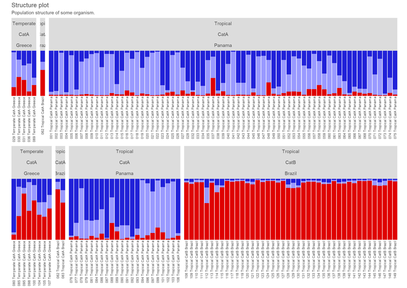  
`r fc(name="fc_plotqmultilinetitle",caption="_Custom title and subtitle with group labels._")`   

### Other options

```{r,echo=TRUE, eval=FALSE}
# change cluster colours
plotQMultiline(list1, useindlab=T, clustercol=c("steelblue","coral","darkorchid3"))

# customise grplabels and indlabels
plotQMultiline(list1, grplab=onelabset, grplabcol="steelblue", grplabbgcol="slategray1",
               indlabcol="darkgreen", indlabangle=45, indlabvjust=1, indlabhjust=1,
               height=12, mar=c(0,0,0,0.5))

# create plot similar to plotQ
plotQMultiline(list1, useindlab=T, barsize=1, spl=149, lpp=1, height=5)
```

  
`r fc(name="fc_plotqmultilinecolours",caption="_Multiline plots with (left) standard colours, (middle) \x60rich.colors()\x60 from \x60gplots\x60 package and (right) \x60brewer.pal(8,'Spectral')\x60 from \x60RColorBrewer\x60 package._")`  

Output file names are created automatically by default using the input 'qlist' names.  When number of individuals exceed one page and extra pages are created, incremental numbers are added to the run name like so: -1, -2 etc. Custom file name can be provided to \code{outputfilename}. The number of labels must be equal to the number of input runs. Incremental numbers are still added if extra pages are created.

Note that this function can be slow and takes several minutes to run depending on number of individuals and number of files selected.

## distructExport

DISTRUCT^7^ is one of the original programs written to generate assignment barplots from a q-matrix. This function generates all output files necessary to run DISTRUCT from a 'qlist'. A directory labelled 'filename-distruct' is created for each input file. Each directory contains the 'filename-indq.txt', 'filename-grpq.txt', 'filename-colours.txt' and 'drawparams'. If grplab is in use, then 'filename-grplabbottom.txt' and/or 'filename-grplabtop.txt' are also created. The DISTRUCT executable can be run in this directory to create a 'filename.ps' postcript vector file. Using `useexe=T` will run the DISTRUCT executable automatically. Remember to cite DISTRUCT^7^ if this option is used. The 'filename.ps' file can be imported into a vector image editing software or seen using a viewer.

```{r,echo=TRUE, eval=FALSE}
# basic usage
distructExport(slist[1])
distructExport(slist[1], quiet=T)
# with bottom labels
distructExport(qlist=slist[1], grplabbottom=grp1$V1)
# with group mean
distructExport(slist[1], grpmean=T)
# grayscale colours
distructExport(slist[1], grayscale=T)
# automatically run distruct executable
distructExport(slist[1], useexe=T)

# TESS files
distructExport(tlist[2])
# ADMIXTURE files, adjust if plot does not fit on canvas
distructExport(alist[3], indwidth=0.36, xorigin=15)
# CLUMPP files
distructExport(readQ(co))
distructExport(readQ(al))
distructExport(readQ(me))
```

  
`r fc(name="fc_destruct",caption="_Left: DISTRUCT plot with \x60grpmean=F\x60. Middle: DISTRUCT plot with \x60grpmean=T\x60. Right: DISTRUCT plot with \x60grayscale=T\x60_")`  

The `useexe=T` argument may not work on all OS and systems.  

----

# Working with qlists  

The `readQ()` function in `pophelper` is used to read in these different input file types and convert them into an R list object. This list is referred to as a 'qlist'. For those familiar with R, a 'qlist' is just a regular list datatype in R. Each table/file is converted to a 'data.frame' object which is stored in a list. Multiple runs would be a list of lists.

A schematic data structure of a two run 'qlist' would look like below:

```{r, eval=FALSE}
$list
+--$list
+  +--$data.frame
+--$list
   +--$data.frame
```

An example is shown below

```{r, eval=FALSE,echo=TRUE}
sfiles <- list.files(path=system.file("files/structure",package="pophelper"),full.names=T)
sf <- readQ(files=sfiles[1:2])
str(sf)
```

The function `is.qlist()` can be used to verify if a 'qlist' meets the basic structure to work with `pophelper` functions. `is.qlist()` returns `TRUE` if yes else `FALSE` with warnings. 

```{r, eval=FALSE,echo=TRUE}
is.qlist(sf)
```

A 'qlist' can also be create manually or generated in R just like any other list without using the `readQ()` function in `pophelper`. But, note that `evannoMethodStructure()` needs the attributes associated with the 'data.frame'. Other functions currently do not use the attributes.

Here is a toy 'qlist' object

```{r, eval=FALSE,echo=TRUE}
# create two data frames
df1 <- data.frame(Cluster1=c(0.2,0.4,0.6,0.2), Cluster2=c(0.8,0.6,0.4,0.8))
df2 <- data.frame(Cluster1=c(0.3,0.1,0.5,0.6), Cluster2=c(0.7,0.9,0.5,0.4))

# one-element qlist
q1 <- list("sample1"=df1)
str(q1)

# two-element qlist
q2 <- list("sample1"=df1, "sample2"=df2)
str(q2)

is.qlist(q1)
is.qlist(q2)
```

Below are some useful R routines that can be used to subset and filter a 'qlist'. Since 'qlist' is a regular R list, all the below scripts are regular R scripts and nothing specific to this package or this object.

```{r,echo=TRUE,eval=FALSE}
# Read some STRUCTURE files (do not use this command to read local files)
sfiles <- list.files(path=system.file("files/structure",package="pophelper"), full.names=T)
slist <- readQ(files=sfiles)

#Subsetting and filtering on an qlist (R list of dataframes).

# get number of runs
length(slist)
# get names of runs
names(slist)
# get number of clusters in each run
sapply(slist,ncol)
# get number of individuals in each run
sapply(slist,nrow)

# Filtering runs
# get runs by position
slist[1:2]
slist[c(3,6,7)]
# get a specific run by name
slist[grep("structure_15",names(slist))]
# get a run based on run name starting with a certain string
slist[grep("^structure",names(slist))]
# get a run based on run name ending with a certain string
slist[grep("12$",names(slist))]
# get runs with more than 2 clusters
slist[sapply(slist,function(x) ncol(x)>2)]
# get runs where any individual has probabilities greater than 0.5 in the first cluster 
slist[sapply(slist,function(x) any(x[,1]>0.5))]

# Filtering clusters
# get the first cluster from all runs
lapply(slist,"[",1)
# get clusters by position from all runs. 
# Can't use 1:3 because first run contain only 2 clusters.
lapply(slist,"[",1:2)

# Filtering individuals
# get individuals by row position from all runs
sapply(slist,function(x) x[2:30,])
# get an individual by name from all runs
sapply(slist,function(x) x[match("I13379",rownames(x)),])
# get multiple individuals by name from all runs
sapply(slist,function(x) x[match(c("I13379","I12616"),rownames(x)),])
# or
labs <- c("I13379","I12616")
sapply(slist,function(x) x[match(labs,rownames(x)),])
# get individuals that start with a certain string from all runs
sapply(slist,function(x) x[grep("^I133",rownames(x)),])
# get individuals that end with a certain string from all runs
sapply(slist,function(x) x[grep("3$",rownames(x)),])
# get individuals that contain a certain string from all runs
sapply(slist,function(x) x[grep("388",rownames(x)),])
# get individuals with probabilities greater than 0.2 
# in the first cluster from all runs
sapply(slist,function(x) x[x[,1]>0.2,])
```

----

# Working code

Here is a list of all functions in a order typical of workflow.

## Structure  

```{r,echo=TRUE, eval=FALSE}
# choose files
sfiles <- choose.files(multi=TRUE)
# STRUCTURE runs to qlist
slist <- readQ(sfiles, filetype="structure")
# tabulate runs
df1 <- tabulateQ(slist)
# summarise runs
df2 <- summariseQ(df1)
# Evanno method
evannoMethodStructure(df2, exportplot=T)
# clumpp export
clumppExport(slist)
# collect clumpp output
collectClumppOutput(prefix="pop", filetype="aligned")
# plot runs
plotQ(slist)
plotQ(slist,imgoutput="join")
# plot multiline
plotQMultiline(slist[1])
plotQMultiline(slist[1], spl=70, lpp=10)

# or all together
analyseQ(sfiles)
```

## Tess  

```{r,echo=TRUE, eval=FALSE}
# collect TESS output
collectRunsTess(runsdir=choose.dir())
# choose files
tfiles <- choose.files(multi=TRUE)
# TESS runs to qlist
tlist <- readQ(tfiles, filetype="tess")
# tabulate runs
df1 <- tabulateQ(tlist)
# summarisee runs
df2 <- summariseQ(df1)
# clumpp export
clumppExport(tlist)
# collect clumpp output
collectClumppOutput(prefix="pop", filetype="aligned")
# plot runs
plotQ(tlist)
plotQ(tlist, imgoutput="join")
# plot multiline
plotQMultiline(tlist[1])
plotQMultiline(tlist[1], spl=70, lpp=10)

# or all together
analyseQ(tfiles)
```

## Basic  
Run files such as Admixture, fastStructure or any delimited numeric text files. 

```{r,echo=TRUE, eval=FALSE}
# choose files
afiles <- choose.files(multi=TRUE)
# delimited-text-runs to qlist
alist <- readQ(afiles, filetype="basic")
# tabulate runs
df1 <- tabulateQ(alist)
# summarise runs
df2 <- summariseQ(df1)
# clumpp export
clumppExport(alist)
# collect clumpp output
collectClumppOutput(prefix="pop", filetype="aligned")
# plot runs
plotQ(files=alist)
plotQ(files=alist, imgoutput="join")
# plot multiline
plotQMultiline(alist[1])
plotQMultiline(alist[1], spl=70, lpp=10)

# or all together
analyseQ(afiles)
```

Many of the functionalities in this package have been implented in the online tool [Pophelper web app](https://www.pophelper.com). For those who prefer a graphical web interface, this may be useful.  

----

# References

1. [Alexander D.H., Novembre, J. and Lange K. (2009). Fast model-based estimation of ancestry in unrelated individuals. Genome Research, 19:1655-1664](http://genome.cshlp.org/content/19/9/1655.long)  

2. [Evanno G., Regnaut S., and Goudet J. (2005). Detecting the number of clusters of individuals using the software STRUCTURE: a simulation study. Molecular ecology, 14(8), 2611-2620](http://onlinelibrary.wiley.com/doi/10.1111/j.1365-294X.2005.02553.x/abstract)  

3. [Francois O., and Durand E. (2010). Spatially explicit Bayesian clustering models in population genetics. Molecular Ecology Resources, 10(5), 773-784](http://onlinelibrary.wiley.com/doi/10.1111/j.1755-0998.2010.02868.x/abstract)  

4. [Jakobsson M., and Rosenberg N. A. (2007). CLUMPP: a cluster matching and permutation program for dealing with label switching and multimodality in analysis of population structure. Bioinformatics, 23(14), 1801-1806](http://bioinformatics.oxfordjournals.org/content/23/14/1801.short)

5. [Pritchard J. K., Stephens M., & Donnelly P. (2000). Inference of population structure using multilocus genotype data. Genetics, 155(2), 945-959](http://www.genetics.org/content/155/2/945.short)  

6. [Raj A., Stephens M., Pritchard J.K. (2014). fastSTRUCTURE: variational inference of population structure in large SNP data sets. Genetics 197, 573-589](http://www.genetics.org/content/early/2014/04/14/genetics.114.164350)  

7. [Rosenberg, Noah A. "DISTRUCT: a program for the graphical display of population structure." Molecular Ecology Notes 4.1 (2004): 137-138.](http://onlinelibrary.wiley.com/doi/10.1046/j.1471-8286.2003.00566.x/abstract)  

----

# Useful Links

* [STRUCTURE program](http://web.stanford.edu/group/pritchardlab/structure.html)  
* [TESS program](http://membres-timc.imag.fr/Olivier.Francois/tess.html)  
* [ADMIXTURE program](https://www.genetics.ucla.edu/software/admixture/)  
* [fastSTRUCTURE program](https://rajanil.github.io/fastStructure/)  
* [CLUMPP program](http://www.stanford.edu/group/rosenberglab/clumpp.html)  
* [Structure Harvester](http://taylor0.biology.ucla.edu/structureHarvester)  
* [Adegenet R package](http://adegenet.r-forge.r-project.org/)  
* [Distruct program](https://web.stanford.edu/group/rosenberglab/distruct.html)  
* [CLUMPAK](http://clumpak.tau.ac.il/)  

----

# Compatibility

The current version of `pophelper` has been tested on the following systems:

+ Windows 10 64bit, R 3.3.3

```{coffee,echo=TRUE, eval=FALSE}
R version 3.3.3 (2017-03-06)
Platform: x86_64-w64-mingw32/x64 (64-bit)
Running under: Windows >= 8 x64 (build 9200)

locale:
[1] LC_COLLATE=English_United Kingdom.1252 
[2] LC_CTYPE=English_United Kingdom.1252   
[3] LC_MONETARY=English_United Kingdom.1252
[4] LC_NUMERIC=C                           
[5] LC_TIME=English_United Kingdom.1252    

attached base packages:
[1] stats     graphics  grDevices utils     datasets  methods   base     

other attached packages:
[1] testthat_1.0.2       captioner_2.2.3.9000 pophelper_2.2.1     
[4] ggplot2_2.2.1        Cairo_1.5-9         

loaded via a namespace (and not attached):
 [1] Rcpp_0.12.10     tidyr_0.6.3      digest_0.6.12    assertthat_0.2.0
 [5] dplyr_0.5.0      crayon_1.3.2     R6_2.2.1         grid_3.3.3      
 [9] plyr_1.8.4       DBI_0.6-1        gtable_0.2.0     magrittr_1.5    
[13] scales_0.4.1     stringi_1.1.5    reshape2_1.4.2   lazyeval_0.2.0  
[17] labeling_0.3     tools_3.3.3      stringr_1.2.0    munsell_0.4.3   
[21] colorspace_1.3-2 gridExtra_2.2.1  tibble_1.3.0   
```

+ Windows 7 64bit, R 3.4.0

DISTRUCT executable worked but unstable.

```{coffee,echo=TRUE, eval=FALSE}
R version 3.4.0 (2017-04-21)
Platform: x86_64-w64-mingw32/x64 (64-bit)
Running under: Windows 7 x64 (build 7601) Service Pack 1

Matrix products: default

locale:
[1] LC_COLLATE=English_United Kingdom.1252 
[2] LC_CTYPE=English_United Kingdom.1252   
[3] LC_MONETARY=English_United Kingdom.1252
[4] LC_NUMERIC=C                           
[5] LC_TIME=English_United Kingdom.1252    

attached base packages:
[1] stats     graphics  grDevices utils     datasets  methods   base     

other attached packages:
[1] pophelper_2.2.1 ggplot2_2.2.1   Cairo_1.5-9     testthat_1.0.2 

loaded via a namespace (and not attached):
 [1] Rcpp_0.12.12     bindr_0.1        knitr_1.16       magrittr_1.5    
 [5] devtools_1.13.3  munsell_0.4.3    colorspace_1.3-2 R6_2.2.2        
 [9] rlang_0.1.1      stringr_1.2.0    dplyr_0.7.2      httr_1.2.1      
[13] plyr_1.8.4       tools_3.4.0      grid_3.4.0       gtable_0.2.0    
[17] git2r_0.19.0     withr_2.0.0      assertthat_0.2.0 lazyeval_0.2.0  
[21] digest_0.6.12    tibble_1.3.3     crayon_1.3.2     bindrcpp_0.2    
[25] gridExtra_2.2.1  reshape2_1.4.2   tidyr_0.6.3      curl_2.8.1      
[29] glue_1.1.1       memoise_1.1.0    labeling_0.3     stringi_1.1.5   
[33] compiler_3.4.0   scales_0.4.1     pkgconfig_2.0.1 
```

+ Scientific Linux 6.8 (Carbon) 64bit, R 3.4.0

```{coffee,echo=TRUE, eval=FALSE}
R version 3.4.0 (2017-04-21)
Platform: x86_64-pc-linux-gnu (64-bit)
Running under: Scientific Linux release 6.9 (Carbon)

Matrix products: default
BLAS: /pica/sw/apps/R/x86_64/3.4.0/milou/lib64/R/lib/libRblas.so
LAPACK: /pica/sw/apps/R/x86_64/3.4.0/milou/lib64/R/lib/libRlapack.so

locale:
 [1] LC_CTYPE=en_US.UTF-8       LC_NUMERIC=C
 [3] LC_TIME=en_US.UTF-8        LC_COLLATE=en_US.UTF-8
 [5] LC_MONETARY=en_US.UTF-8    LC_MESSAGES=en_US.UTF-8
 [7] LC_PAPER=en_US.UTF-8       LC_NAME=C
 [9] LC_ADDRESS=C               LC_TELEPHONE=C
[11] LC_MEASUREMENT=en_US.UTF-8 LC_IDENTIFICATION=C

attached base packages:
[1] stats     graphics  grDevices utils     datasets  methods   base

other attached packages:
[1] pophelper_2.2.1 ggplot2_2.2.1   Cairo_1.5-9     testthat_1.0.2

loaded via a namespace (and not attached):
 [1] Rcpp_0.12.12     bindr_0.1        knitr_1.16       magrittr_1.5
 [5] devtools_1.13.3  munsell_0.4.3    colorspace_1.3-2 R6_2.2.2
 [9] rlang_0.1.1      stringr_1.2.0    dplyr_0.7.2      httr_1.2.1
[13] plyr_1.8.4       tools_3.4.0      grid_3.4.0       gtable_0.2.0
[17] git2r_0.19.0     withr_2.0.0      assertthat_0.2.0 lazyeval_0.2.0
[21] digest_0.6.12    tibble_1.3.3     crayon_1.3.2     bindrcpp_0.2
[25] gridExtra_2.2.1  reshape2_1.4.2   tidyr_0.6.3      curl_2.8.1
[29] glue_1.1.1       memoise_1.1.0    labeling_0.3     stringi_1.1.5
[33] compiler_3.4.0   scales_0.4.1     pkgconfig_2.0.1
```

---

# Disclaimer

The `pophelper` R package is offered free and without warranty of any kind, either expressed or implied. I will not be held liable to you for any damage arising out of the use, modification or inability to use this program. `pophelper` R package can be used, redistributed and/or modified freely for non-commercial purposes subject to the original source being properly cited. Licensed under GPL-3. Please make sure you verify all your results.  

----

# Contact

If you have any comments, suggestions or issues, report on the [Github issues page](https://github.com/royfrancis/pophelper/issues).  
  
__End of Document.__  
