__Roy M Francis__ | 25-July-2016

```{r,echo=FALSE,message=FALSE,results='hide',warning=FALSE,eval=TRUE}
options(rpubs.upload.method = "internal")
knitr::opts_chunk$set(collapse = TRUE)
#source("D:/Data/Dropbox/Rwork/pophelperRpackage/pophelper/R/pophelper.R")
pkgname <- "pophelper"
library(pophelper)
```

# Introduction  

This vignette/tutorial aims to demonstrate the use of R package `pophelper`. This package contains functions that are useful for processing output results from programs used in the analysis of population structure such as ADMIXTURE^1^, fastSTRUCTURE^6^, STRUCTURE^5^, TESS^3^ and any output in a tabular delimited file.

Softwares such as ADMIXTURE, fastSTRUCTURE, STRUCTURE and TESS are popular programs used to discriminate populations, to determine population structure and to reveal genetic composition of individuals using molecular markers. These programs generally use allelic frequency information to assign individuals to a predefined number of populations (*K*). The assignment is usually run for a range of *K* such as from *K*=2 to *K*=10. Multiple repeats are also usually carried out for each *K*. Each output file for each repeat of *K* showing the assignment probabilities of all individuals is referred to as the run file or cluster file. `pophelper` has a set of functions that include tabulating runs, summarising runs, plotting runs etc that can be applied to these run files. 

This vignette covers the use of all important functions in the `pophelper` package. The demonstration is ordered in the manner of a typical workflow. This demonstration has been performed using `R version 3.3.0 (2016-05-03)` on a 64-bit Windows 7 Platform. Input and output codes are printed in a font different from body text like `this`.  

----

# Installation  

The first step is to install the `pophelper` library. The dependent R packages required for the `pophelper` library as also automatically installed. You need to have R (>= 3.2.0) installed on your system. Then, install the `devtools` package. Then, install `pophelper` package from `github` using the `devtools` package. See below for code.

```{r,echo=TRUE,eval=FALSE,results='hide'}
# Install devtools package
install.packages('devtools',dep=T)
library(devtools)

# Install the current version of pophelper
install_github('royfrancis/pophelper')

#load library
library(pophelper)

# check version
packageDescription("pophelper", fields = "Version")
```

The next step is to set the working directory. The working directory is a folder that usually contains the run files of interest so as to allow R to access it. The working directory must have read-write-execute permissions. Functions may produce outputs such as text files or images which will be exported to the working directory. The working directory can be set by running the command below using a path or by selecting the folder interactively in the popup window.

```{r,echo=TRUE,eval=FALSE,results='hide'}
setwd("path")
setwd(choose.dir())
```

For this demonstration, the sample run files will be loaded from the `pophelper` library. Therefore, the working directory will be used for output generated from various `r print(pkgname)` functions.

Standard help and documentation for all functions are obtained using `?`.

```{r,echo=TRUE,eval=FALSE,results='hide'}
?tabulateRunsStructure
?summariseRunsStructure
?collectRunsTess
#If using RStudio, press tab inside function to see arguments.
#tabulateRunsStructure(<press tab>)
```

For functions where one or more files need to be selected, the selection can be performed interactively. Windows users can use `choose.files(multi=T)` for multi-selection or `file.choose()` for single selection. Mac users can use `file.choose()` for single selection and `tk_choose.files()` from `tcltk` package for multiple selection.

----

# Functions & Overview  
All functions in the `pophelper` package are lsited below.  
 
```{r, eval=FALSE,echo=TRUE}
tabulateRunsStructure()   # Get a tabulation of several STRUCTURE files
summariseRunsStructure()  # Summarise runs by repeats for each K
evannoMethodStructure()   # Perform the Evanno method on summarised data
runsToDfStructure()       # Convert STRUCTURE run files to R dataframe
clumppExportStructure()   # Export files for use with CLUMPP

collectRunsTess()         # Collect TESS output from multiple directories into one
tabulateRunsTess()        # Get a tabulation of several TESS files
summariseRunsTess()       # Summarise runs by repeats for each K
runsToDfTess()            # Convert TESS run files to R dataframe
clumppExportTess()        # Export files for use with CLUMPP

tabulateRunsMatrix()      # Get a tabulation of several MATRIX files
summariseRunsMatrix()     # Summarise runs by repeats for each K
runsToDfMatrix()          # Convert MATRIX run files to R dataframe
clumppExportMatrix()      # Export files for use with CLUMPP

collectClumppOutput()     # Collect CLUMPP output into a common directory
plotRuns()                # Plot a barplot from STRUCTURE/TESS/Matrix/table files
PlotMultiline()           # Plot a multi-line barplot from STRUCTURE/TESS/Matrix/table file
distructExport()          # Export files for DISTRUCT from STRUCTURE/TESS/Matrix/table file

plotRunsInterpolate()     # Spatially interpolate clusters from a STRUCTURE/TESS run file
plotRunsSpatial()         # Cluster by max assignment and plot points spatially

analyseRuns()             # A wrapper function to quickly tabulate, summarise, 
                          # perform evanno method, clumpp output and generate barplots 
                          # from STRUCTURE, TESS or MATRIX run files.
```

# Input files  
The input run files expected by the package are STRUCTURE run files, TESS run files (-TR files in folders), or MATRIX run files. MATRIX files are numeric delimited tabular file like ADMIXTURE run files and fastSTRUCTURE meanQ files. Inputs can also be a generic numeric tabular tab, space or comma-delimited files without headers.  

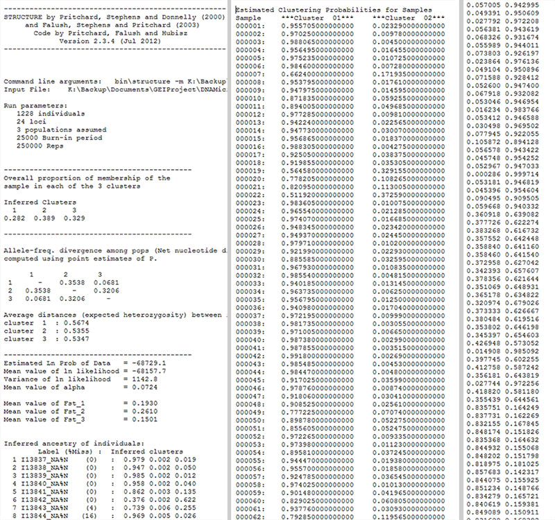  
*__Fig 4__: A preview of the input files. `STRUCTURE` file (Left), `TESS` file (centre) and `MATRIX` file (right).*  

Combined, aligned and merged file used with CLUMPP are referred to as TAB files (table). They can be used for plotting. Input files for population labels and spatial coordinates must be tab-delimited header-free text files.  

----

# Workflow  

In this section, we will look at how these functions are used, their syntax and typical workflow. The workflow differs depending on the run files that are used. Specific functions are available for STRUCTURE, TESS or MATRIX input files. Specific functions are covered in workflow section. Functions that are common and shared for all run types are covered later.  

The `pophelper` library must be loaded and a working directory must be set.

```{r, eval=FALSE,echo=TRUE}
library(pophelper)
setwd(choose.dir())
```

## STRUCTURE runs Workflow  

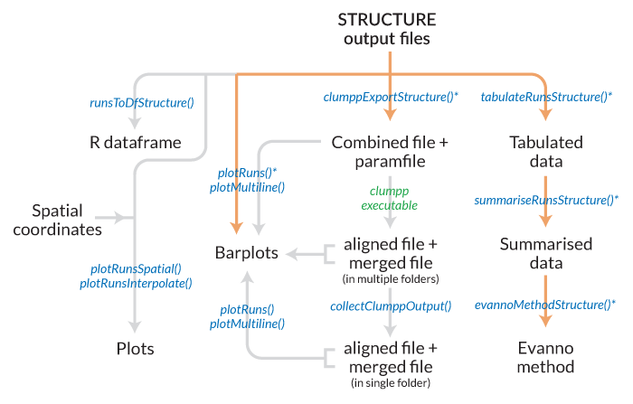  
__Fig 1.__ *Workflow for STRUCTURE files. Files/objects are indicated in black text and functions are indicated in blue. The `analyseRuns()` function is a wrapper function which can be used to run several functions together. This is indicated by the asterisk and the orange path. For clumpp results, the clumpp executable must be run to continue with the workflow.*

### tabulateRunsStructure  
The functions `tabulateRunsStructure()` is used to select any number of run files in a folder and produce a table of runs with various parameters. The only mandatory argument required for this function is a character vector of filenames. The results can be pointed to a variable for further use.

A typical STRUCTURE run produces a large number of output run files as seen below.  

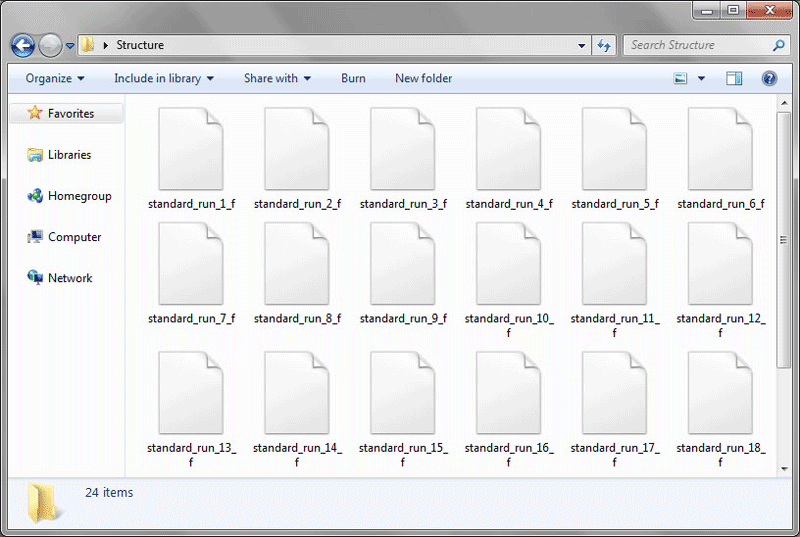  
__Fig. 5.__ *Typical view of Structure output run files.*

```{r,echo=TRUE, eval=FALSE}
# basic usage
df <- tabulateRunsStructure(files=choose.files())

# another usage
files = choose.files(multi=TRUE)
tr1 <- tabulateRunsStructure(files=files)

?tabulateRunsStructure
tabulateRunsStructure(files=NULL, writetable=FALSE, sorttable=TRUE, quiet=FALSE)
# To write results to working directory, set writetable=TRUE
# Result table is sorted by loci, ind and k. To see original order, set sorttable=FALSE
```
For this tutorial, we will use the sample structure files accompanied with this library.

```{r,echo=TRUE, eval=FALSE}
slist <- list.files(path=system.file("files/structure",package="pophelper"),full.names=T)
tr1 <- tabulateRunsStructure(files=slist)

# view output
head(tr1)

```

The `tabulateRunsStructure()` function produces a table listing all selected files showing 10 columns namely file names, value of *K*, number of individuals, number of loci, estimated ln probability of data, mean value of ln likelihood, variance of ln likelihood, number of burn-in and number of repeats. The table is sorted by loci, ind and *K*. Missing values are given NA.

By default, the `tabulateRunsStructure()` function prints the number of selected files as `Number of files selected: 10`. This can be turned off using the `quiet=T` argument. The tabulated output can be written to the working directory as a text file by setting the argument `writetable=T`.

### summariseRunsStructure  

The table produced using `tabulateRunsStructure()` can be further collapsed by *K* based on the number of runs. The output table from `tabulateRunsStructure()` can be passed as input to `summariseRunsStructure()`. 

```{r,echo=TRUE, eval=FALSE}
# basic usage
sr1 <- summariseRunsStructure(data=tr1)
summariseRunsStructure(data=tr1,writetable=TRUE)

# another usage
sr1 <- summariseRunsStructure(data=tabulateRunsStructure(files=choose.files()))

# view output
head(sr1)
```

The `summariseRunsStructure()` function returns 6 columns namely Mean estimated ln probability of data, standard deviation, value of *K*, number of runs for each *K*, estimated ln probability of data plus standard deviation, estimated ln probability of data minus standard deviation.

### evannoMethodStructure  

The `evannoMethodStructure()` function is only applicable to STRUCTURE runs.

The Evanno method^2^ is used to estimate the optimal number of *K*. The summarised runs table output from`summariseRunsStructure()` function can be input to `evannoMethodStructure()`. The `evannoMethodStructure()` function creates an Evanno derivative plot if suitable conditions are met. A resulting table is also returned. The plot can be written to file using argument `exportplot=T`. The table can be written to file using `writetable=T`.

```{r,echo=TRUE, eval=FALSE}
# basic usage
evannoMethodStructure(data=sr1)

# another usage
em <- evannoMethodStructure(summariseRunsStructure(tabulateRunsStructure(slist)))

?evannoMethodStructure
evannoMethodStructure(data=NULL, writetable=FALSE, 
exportplot=FALSE, na.rm=TRUE, imgtype="png", height=NA, width=NA, 
res=NA, units=NA)
# To write result to working directory, set writetable=TRUE
# To export the plots to the working directory, set exportplot=TRUE
# To change export image format, set imgtype="png" or imgtype="jpeg" or imgtype="pdf"
# Figure arguments can be changed if required such as height, width, res and dimension units

# to export a plot
evannoMethodStructure(data=sr1,exportplot=T)

# do not calculate plot, only return results as table
em <- evannoMethodStructure(data=sr1,exportplot=F)

# to export plot and table
evannoMethodStructure(data=sr1,exportplot=T,writetable=T,na.rm=T)
```

  
__Fig. 6.__ *Plots produced from the Evanno method.*

The Evanno method can be computed only if these criteria are met: At least 3 values of *K* must be available, values of *K* must be sequential (ie; there must not be missing values of *K*), number of individuals and loci must be same in all runs. If number of repeats for any *K* is less than 2, then results may not be reliable. In case the Evanno method cannot be computed, a plot of ELPD over *K* is produced referred to as the kPlot.

From the command above, a png file and text file is exported to the working directory. The peak of deltaK in Fig. 6D. is usually used to estimate the best value of *K*.

### runsToDfStructure  

STRUCTURE run files can be converted to R dataframes using the functions `runsToDfStructure()`. If one file is selected, a dataframe is returned. If multiple files are selected, then a list of dataframes are returned.

```{r,echo=TRUE, eval=FALSE}
# basic usage
rtd1 <- runsToDfStructure(files=slist)

# select files interactively
rtd1 <- runsToDfStructure(files=choose.files(multi=TRUE))
```

If individual labels are present in the STRUCTURE file, they can be imported as rownames by setting `indlabfromfile=T`. Space in labels may be replaced by underscore. Incorrect parsing with internal population flags may introduce underscores. If duplicate labels are found, the labels are not imported.

```{r,echo=TRUE, eval=FALSE}
# convert all input files
rtd1 <- runsToDfStructure(files=slist)
# check class of ouput
class(rtd1)
# view head of first converted file
head(rtd1)

# convert only one input file
rtd1.1 <- runsToDfStructure(files=slist[1])
# check class of output
class(rtd1.1)
# view head of first converted file
head(rtd1[[1]])

#include individual names from structure file as row names
runsToDfStructure(files=slist[1],indlabfromfile = T)

```

The dataframe contains the assignment probabilities of all individuals into *K* clusters denoted as Cluster1, Cluster 2 etc.

### clumppExportStructure  

When multiple repeats are run for each *K*, the order of clusters may be jumbled for each run. Therefore, when plotting multiple runs within each *K*, the colours cannot be assigned correctly. The software CLUMPP helps to overcome this issue by reordering the clusters correctly. To read more about CLUMPP^4^, see references.

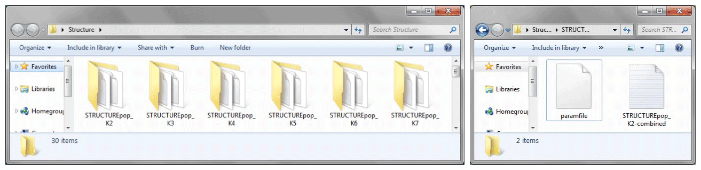  
__Fig. 7.__ *Folders created from clumpp export and the contents of each folder.*

The function `clumppExportStructure()` takes multiple STRUCTURE files and combines runs by *K* and generates a combined data file and a paramfile in separate directories. The combined file contains the tabular cluster data from all the repeats and runs. The paramfile contains information for the CLUMPP executable. The name for the folder can be changed optionally using the argument `prefix="something"`.

```{r,echo=TRUE, eval=FALSE}
# basic usage
clumppExportStructure(files=slist)

# select files interactively
clumppExportStructure(files=choose.files(multi=TRUE))

?clumppExportStructure 
clumppExportStructure(files=NULL, prefix=NA, parammode=NA, paramrep=NA)
# export folders are prefixed as STRUCTUREpop by default, to change, use prefix="foo"
# To change clumpp algorithm, set parammode=1, parammode=2 or parammode=3. 
# If clumpp is slow, increase parammode
# To change number of clumpp repeats, set paramrep=200, paramrep=500 etc.

# optionally change folder name
clumppExportStructure(files=slist,prefix="Set1")
```

The CLUMPP executable needs to be copied and pasted into each of these folder and executed by running it. Alternatively, the CLUMPP executable can now be run automatically by specifying `useexe=T`. The CLUMPP executable uses the combined file and the param file to generate three output files: aligned file, merged file and misc file. 

```{r,echo=TRUE, eval=FALSE}
#auto execute CLUMPP
clumppExportStructure(files=slist, useexe=T)
```

Remember to cite CLUMPP^4^ if this option is used.

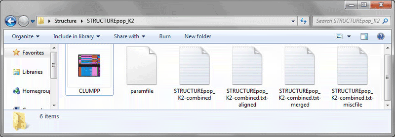  
__Fig. 8.__ *Folder showing CLUMPP results: aligned file, merged file and misc file.*

The aligned file contains all the runs as in the combined file after realignment of clusters. In contrast, the merged file contains only one table which merges all the aligned runs to create a consensus run. The merged file makes sense only if all the aligned runs have similar assignments. The merged file is not recommended for downstream use unless you know what you are doing. The miscfile contains run parameters and other details.

The remaining workflow is common for all input filetypes. Head over to section 'Common functions'.

## TESS runs Workflow  

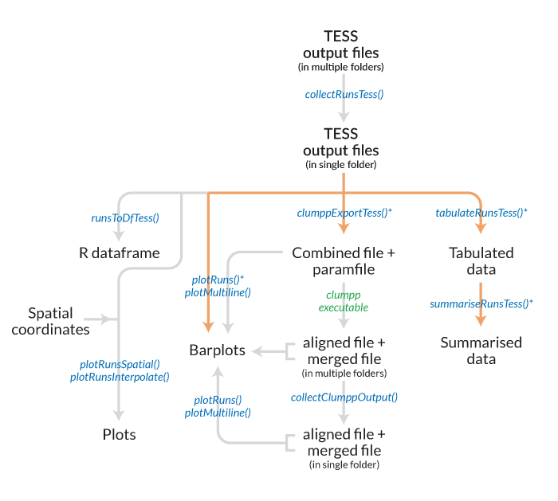  
__Fig 2.__ *Workflow for TESS files. Files/objects are indicated in black text and functions are indicated in blue. The `analyseRuns()` function is a wrapper function which can be used to run several functions together. This is indicated by the asterisk and the orange path. For clumpp results, the clumpp executable must be run to continue with the workflow.*

### collectRunsTess  

This function is applicable only to TESS runs. Unlike STRUCTURE runs which are exported into a single directory, TESS output files are exported into separate directories by run. This means that one needs to go into individual folders to obtain the run file. The function `collectRunsTess()` collects TESS cluster files from individual run folders into one new folder and rename each runfile by the folder name. Set working directory first and run basic usage.

```{r,echo=TRUE, eval=FALSE}
# basic usage
collectRunsTess(runsdir="D:\\RoyDocs\\Dropbox\\Rwork\\pophelperRpackage\\tessoriginal")

# another usage
collectRunsTess(runsdir = choose.dir())
```

Within each TESS run folder, the function searches for filename ending with 'TR.txt' as the cluster file. This file is copied to the new folder and renamed with the name of the respective run directory. Therefore, DO NOT manually rename original TESS run files or directories.

### tabulateRunsTess  

The function `tabulateRunsTess()` is used to select any number of run files in a folder and produce a table of runs with various parameters. The only mandatory argument required for this function is a character vector of filenames. The results can be pointed to a variable for further use.

```{r,echo=TRUE, eval=FALSE}
# basic usage
df <- tabulateRunsTess(files=choose.files(multi=TRUE))

# another usage
files = choose.files(multi=TRUE)
tr1 <- tabulateRunsTess(files=files)

#help
?tabulateRunsTess
tabulateRunsTess(files=NULL, writetable=FALSE, sorttable=TRUE, quiet=FALSE)
# To write results to working directory, set writetable=TRUE
# Result table is sorted by loci, ind and k. To see original order, set sorttable=FALSE
```

For this tutorial, we will use the sample files accompanied with this library.

```{r,echo=TRUE, eval=FALSE}
tlist <- list.files(path=system.file("files/tess",package="pophelper"),full.names=T)
tr2 <- tabulateRunsTess(files=tlist)

# view output
head(tr2)
```

The `tabulateRunsTess()` function returns a table with three columns namely filename, *K* and number of individuals.

By default, the `tabulateRunsTess()` function prints the number of selected files as `Number of files selected: 10`. This can be turned off using the `quiet=T` argument. The tabulated output can be written to the working directory as a text file by setting the argument `writetable=T`.

### summariseRunsTess  

The table produced using `tabulateRunsTess()` can be further collapsed by *K* based on the number of runs. The output table from `tabulateRunsTess()` can be passed as input to `summariseRunsTess()`. 

```{r,echo=TRUE, eval=FALSE}
# basic usage
sr2 <- summariseRunsTess(tr2)

# another usage
sr2 <- summariseRunsTess(data=tabulateRunsTess(files=choose.files()))

# view output
head(sr2)
```

The `summariseRunsTess()` function returns 3 columns namely individuals, *K* and the number of runs. The summarised runs can be written to the working directory as a text file by setting the argument `writetable=T`.

### runsToDfTess  

TESS run files can be converted to R dataframes using the functions `runsToDfTess()`. If one file is selected, a dataframe is returned. If multiple files are selected, then a list of dataframes are returned.

```{r,echo=TRUE, eval=FALSE}
# basic usage
rtd2 <- runsToDfTess(files=tlist)

# select files interactively
rtd2 <- runsToDfTess(files=choose.files(multi=TRUE))
```

```{r,echo=TRUE, eval=FALSE}
# convert all input files
rtd2 <- runsToDfTess(files=tlist)
# check class of ouput
class(rtd2)
# convert only one input file
rtd2.1 <- runsToDfTess(files=tlist[1])
# check class of output
class(rtd2.1)

# view head of first converted file
head(rtd2[[1]])
```

The dataframe contains the assignment probabilities of all individuals into *K* clusters denoted as Cluster1, Cluster 2 etc.

### clumppExportTess  

When multiple repeats are run for each *K*, the order of clusters may be jumbled for each run. Therefore, when plotting multiple runs within each *K*, the colours cannot be assigned correctly. The software CLUMPP helps to overcome this issue by reordering the clusters correctly. To read more about CLUMPP^4^, see references.

The function `clumppExportTESS()` takes multiple TESS files and combines runs by *K* and generates a combined data file and a paramfile in separate directories. The combined file contains the tabular cluster data from all the repeats and runs. The paramfile contains information for the CLUMPP executable. The name for the folder can be changed optionally using the argument `prefix="something"`.

```{r,echo=TRUE, eval=FALSE}
# basic usage
clumppExportTess(files=tlist)

# select files interactively
clumppExportTess(files=choose.files(multi=TRUE))

?clumppExportTess
clumppExportTess(files=NULL, prefix=NA, parammode=NA, paramrep=NA)
# export folders are prefixed as STRUCTUREpop by default, to change, use prefix="foo"
# To change clumpp algorithm, set parammode=1, parammode=2 or parammode=3. 
# If clumpp is slow, increase parammode
# To change number of clumpp repeats, set paramrep=200, paramrep=500 etc.

# optionally change folder name
clumppExportTess(files=slist,prefix="Set1")
```

The CLUMPP executable needs to be copied and pasted into each of these folder and executed.  Alternatively, setting `useexe=T` will automatically run CLUMPP. Remember to cite CLUMPP^4^ if this option is used. The CLUMPP executable uses the combined file and the param file to generate three output files: aligned file, merged file and misc file. 

```{r,echo=TRUE, eval=FALSE}
#auto execute CLUMPP
clumppExportTess(files=tlist, useexe=T)
```

The aligned file contains all the runs in the combined file after realignment of clusters. In contrast, the merged file contains only one table which merges all the aligned runs to create a consensus run. The merged file makes sense only if all the aligned runs have similar assignments. The merged file is not recommended for downstream use unless you know what you are doing. The miscfile contains run parameters and other details.

## MATRIX runs Workflow  

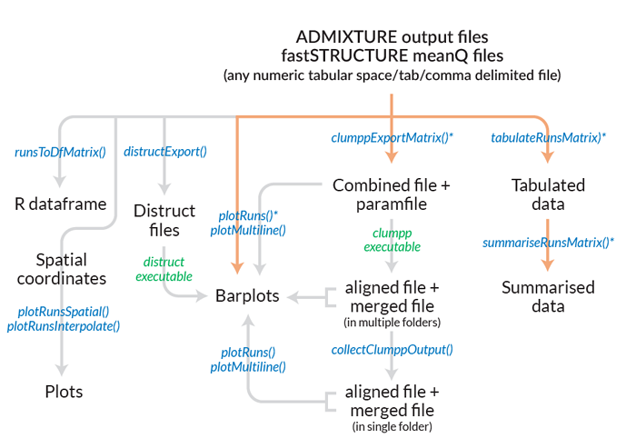  
__Fig 3.__ *Workflow for MATRIX files (fastSTRUCTURE, ADMIXTURE etc). Files/objects are indicated in black text and functions are indicated in blue. The `analyseRuns()` function is a wrapper function which can be used to run several functions together. This is indicated by the asterisk and the orange path. For clumpp results, the clumpp executable must be run to continue with the workflow.*

Any run files from any software or manually created which are numeric, tabular, header-free and delimited by space, tab or comma are referred to as MATRIX files. The ADMIXTURE run files and fastSTRUCTURE meanQ files are such files that can be used this this workflow.  

### tabulateRunsMatrix  

The function `tabulateRunsMatrix()` is used to select any number of run files in a folder and produce a table of runs with various parameters. The only mandatory argument required for this function is a character vector of filenames. The results can be pointed to a variable for further use.

```{r,echo=TRUE, eval=FALSE}
# basic usage
df <- tabulateRunsMatrix(files=choose.files(multi=TRUE))

# another usage
files = choose.files(multi=TRUE)
tr1 <- tabulateRunsMatrix(files=files)

#help
?tabulateRunsMatrix
tabulateRunsMatrix(files=NULL, writetable=FALSE, sorttable=TRUE, quiet=FALSE)
# To write results to working directory, set writetable=TRUE
# Result table is sorted by loci, ind and k. To see original order, set sorttable=FALSE
```

For this tutorial, we will use the sample files accompanied with this library.

```{r,echo=TRUE, eval=FALSE}
#use admixture files
alist <- list.files(path=system.file("files/admixture",package="pophelper"),full.names=T)
tr3 <- tabulateRunsMatrix(files=alist)

#use faststructure files
flist <- list.files(path=system.file("files/faststructure",package="pophelper"),full.names=T)
tr4 <- tabulateRunsMatrix(files=flist)

#use space-delimited tabular files
msfiles <- list.files(path=system.file("files/matrix/space",package="pophelper"),full.names=T)
tr5 <- tabulateRunsMatrix(files=msfiles)

#use tab-delimited tabular files
mtfiles <- list.files(path=system.file("files/matrix/tab",package="pophelper"),full.names=T)
tr6 <- tabulateRunsMatrix(files=mtfiles)

#use comma-separated tabular files
mcfiles <- list.files(path=system.file("files/matrix/comma",package="pophelper"),full.names=T)
tr7 <- tabulateRunsMatrix(files=mcfiles)

# view output
head(tr3)
head(tr4)
head(tr5)
head(tr6)
head(tr7)
```

The `tabulateRunsMatrix()` function returns a table with three columns namely filename, *K* and number of individuals.

By default, the `tabulateRunsMatrix()` function prints the number of selected files as `Number of files selected: 10`. This can be turned off using the `quiet=T` argument. The tabulated output can be written to the working directory as a text file by setting the argument `writetable=T`.

### summariseRunsMatrix

The table produced using `tabulateRunsMatrix()` can be further collapsed by *K* based on number of runs. The output table from `tabulateRunsMatrix()` can be passed as input to `summariseRunsMatrix()` respectively. 

```{r,echo=TRUE, eval=FALSE}
# basic usage
sr3 <- summariseRunsMatrix(tr3)
sr4 <- summariseRunsMatrix(tr4)
sr5 <- summariseRunsMatrix(tr5)
sr6 <- summariseRunsMatrix(tr6)
sr7 <- summariseRunsMatrix(tr7)

# another usage
sr3 <- summariseRunsMatrix(data=tabulateRunsMatrix(files=choose.files(multi=TRUE)))

# view output
head(sr3)
head(sr4)
head(sr5)
head(sr5)
head(sr7)
```

The `summariseRunsMatrix()` function returns 3 columns namely individuals, *K* and number of runs. The summarised runs can be written to the working directory as a text file by setting the argument `writetable=T`.

### runsToDfMatrix  

MATRIX run files (ADMIXTURE, fastSTRUCTURE etc) or any numeric, tabular, header-free space/tab/comma delimited files can be converted to R dataframes using the function `runsToDfMatrix()`. If one file is selected, a dataframe is returned. If multiple files are selected, then a list of dataframes are returned.

```{r,echo=TRUE, eval=FALSE}
# basic usage
rtd3 <- runsToDfMatrix(files=alist)
rtd4 <- runsToDfMatrix(files=flist)
rtd5 <- runsToDfMatrix(files=msfiles)
rtd6 <- runsToDfMatrix(files=mtfiles)
rtd7 <- runsToDfMatrix(files=mcfiles)

# select files interactively
rtd3 <- runsToDfMatrix(files=choose.files(multi=TRUE))
```

```{r,echo=TRUE, eval=FALSE}
# convert all input files
rtd3 <- runsToDfMatrix(files=alist)
# check class of ouput
class(rtd3)
# convert only one input file
rtd3.1 <- runsToDfMatrix(files=alist[1])
# check class of output
class(rtd3.1)

# view head of first converted file
head(rtd3[[1]])
```

The dataframe contains the assignment probabilities of all individuals into *K* clusters denoted as Cluster1, Cluster 2 etc.

### clumppExportMatrix  

When multiple repeats are run for each *K*, the order of clusters may be jumbled for each run. Therefore, when plotting multiple runs within each *K*, the colours cannot be assigned correctly. The software CLUMPP helps to overcome this issue by reordering the clusters correctly. To read more about CLUMPP^4^, see references.  

The function `clumppExportMatrix()` takes multiple MATRIX files and combines runs by *K* and generates a combined data file and a paramfile in separate directories. The combined file contains the tabular cluster data from all the repeats and runs. The paramfile contains information for the CLUMPP executable. The name for the folder can be change optionally if required using the argument `prefix="something"`.  

```{r,echo=TRUE, eval=FALSE}
# basic usage
clumppExportMatrix(files=alist)
clumppExportMatrix(files=flist)

# select files interactively
clumppExportMatrix(files=choose.files(multi=TRUE))

?clumppExportMatrix
clumppExportMatrix(files=NULL, prefix=NA, parammode=NA, paramrep=NA)
# export folders are prefixed as STRUCTUREpop by default, to change, use prefix="foo"
# To change clumpp algorithm, set parammode=1, parammode=2 or parammode=3. 
# If clumpp is slow, increase parammode
# To change number of clumpp repeats, set paramrep=200, paramrep=500 etc.

# optionally change folder name
clumppExportMatrix(files=slist,prefix="Set1")
```

The CLUMPP executable needs to be copied and pasted into each of these folder and executed. Alternatively, the CLUMPP executable can now be run automatically by specifying `useexe=T`. Remember to cite CLUMPP^4^ if this option is used. The CLUMPP executable uses the combined file and the param file to generate three output files: aligned file, merged file and misc file.  

```{r,echo=TRUE, eval=FALSE}
#auto execute CLUMPP
clumppExportMatrix(files=alist, useexe=T)
```

The aligned file contains all the runs in the combined file after realignment of clusters. In contrast, the merged file contains only one table which merges all the aligned runs to create a consensus run. The merged file makes sense only if all the aligned runs have similar assignments. The merged file is not recommended for downstream use unless you know what you are doing. The miscfile contains run parameters and other details.

## Common functions  
These are functions common to all types of input run files.  

### collectClumppOutput  

The CLUMPP output files are now distributed in multiple folders. The aligned, merged or both files can be copied from multiple folders into a single folder for further analyses using the function `collectClumppOutput()`. The working directory is set suitably before running this function. This function need a `prefix` argument which denotes the prefix used in the previous function or the text before the underscore. For ex. a directory named `STRUCTUREpop_K2` has the prefix `STRUCTUREpop`.

```{r,echo=TRUE, eval=FALSE}
# basic usage
setwd(choose.dir())
# collect aligned files from STRUCTURE CLUMPP results. Default prefix is STRUCTUREpop
collectClumppOutput()
# by default, collect aligned files from TESS CLUMPP results
collectClumppOutput(prefix="TESSpop")
# collect aligned files from MATRIX CLUMPP results
collectClumppOutput(prefix="MATRIXpop")

# working directory can also be set using runsdir argument
# collect both aligned and merged files
collectClumppOutput(prefix="STRUCTUREpop",filetype="both",runsdir=choose.dir())
collectClumppOutput(prefix="TESSpop",filetype="both",runsdir=choose.dir())
collectClumppOutput(prefix="MATRIXpop",filetype="both",runsdir=choose.dir())

?collectClumppOutput
collectClumppOutput(prefix = "STRUCTUREpop", filetype = "aligned", runsdir = NA, 
+ newdir = NA, quiet = FALSE)

# change prefix if a different folder prefix was used. copy merged files from 
# to change folder prefix, set prefix="STRUCTUREpop" or prefix="TESSpop" etc
# to change which files are copied, set filetype="aligned", filetype="both" or 
# filetype="merged"
# to change name of new directory, set newdir="somename"

collectClumppOutput()
collectClumppOutput(prefix="TESSpop")
```

Collecting the aligned and merged files into a single folder can be helpful in plotting these files. From the command above, both aligned and merged files are copied into a new directory `STRUCTUREpop-aligned` within the working directory.

### plotRuns  

The function `plotRuns()` is used to create barplots from STRUCTURE, TESS, MATRIX run files, combined files, aligned files or merged files. The combined, aligned or merged files are referred to as TAB files. When plotting STRUCTURE, TESS or MATRIX run files, use `imgoutput="sep"` or `imgoutput="join"`. When `imgoutput="sep"`, each run file is plotted and exported as separate figures. When `imgoutput="join"`, all selected run files are plotted as a single figure and exported. When plotting combined, aligned or merged files, set `imgoutput="tab"`.

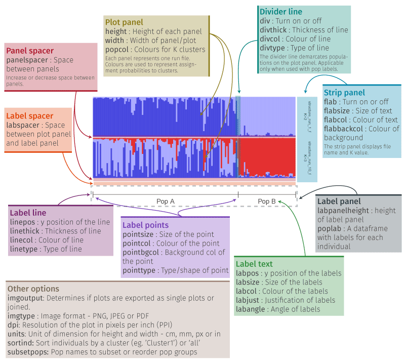 
__Fig 9.__ *An overview of the components of a plot from the function plotRuns() and the arguments used to modify them.*

The default usage below (usage 1) creates barplots of all selected files individually/separately.

```{r,echo=TRUE, eval=FALSE}
# basic usage 1 #plot first 2 runs
plotRuns(files=slist[1])

# same as above
plotRuns(files=slist[1:3], imgoutput="sep")
plotRuns(files=tlist[1:3],imgoutput="sep")
plotRuns(files=alist[1:3],imgoutput="sep")
plotRuns(files=flist[1:3],imgoutput="sep")
plotRuns(files=mcfiles[1:3],imgoutput="sep")
plotRuns(files=msfiles[1:3],imgoutput="sep")
plotRuns(files=mtfiles[1:3],imgoutput="sep")

# usage 2, join files into one figure
plotRuns(files=slist[c(1,3)], imgoutput="join")
plotRuns(files=tlist[1:3],imgoutput="join")
plotRuns(files=alist[1:3],imgoutput="join")
plotRuns(files=flist[1:3],imgoutput="join")
plotRuns(files=mcfiles[1:3],imgoutput="join")
plotRuns(files=msfiles[1:3],imgoutput="join")
plotRuns(files=mtfiles[1:3],imgoutput="join")

# change height and width of figure
plotRuns(files=slist[1], imgoutput="sep", height = 1.5, width=8)
plotRuns(files=slist[1:3], imgoutput="join", height = 1.5, width=8)

# change colour of file name on plot
plotRuns(files=slist[1], flabcol="blue")
# change size of file name on plot
plotRuns(files=slist[1], flabsize=7)
# hide file name on plot
plotRuns(files=slist[1], flabcol="white")
# turn off side panel
plotRuns(files=slist[1], flabcol=F)
# change colour of clusters
plotRuns(files=slist[3:4], imgoutput="join", 
    popcol=c("coral","steelblue","lightblue","purple","orange"))
#output as jpeg
plotRuns(files=slist[1],imgtype = "jpeg")
#output as pdf
plotRuns(files=slist[1],imgtype = "pdf")
```

  
__Fig. 10.__ *(A) Left: Single run plotted separately. (B) Right: Two runs joined together in one image.*

Individuals in a plot can be sorted using any one of the clusters or 'all'. The 'all' option produces a sort similar to that in the software STRUCTURE. Use the name of a cluster in the argument `sortind` like `sortind="Cluster1"`.

```{r,echo=TRUE, eval=FALSE}
#sorted by cluster 1
plotRuns(files=slist[c(1,3)],sortind = "Cluster1")
#sorted by cluster 2
plotRuns(files=slist[1],sortind = "Cluster2")
#sorted by all
plotRuns(files=slist[c(1,3)],sortind = "all")

#sorted by cluster 3
plotRuns(files=tlist[1],sortind = "Cluster3") # gives error because this file contains only 2 clusters

#sorted by cluster 1, three files joined plot
plotRuns(files=slist[c(1,3)],sortind = "Cluster1",imgoutput = "join")
plotRuns(files=slist[c(1,3)],sortind = "all",imgoutput = "join")
```

  
__Fig. 11.__ *(A) Left: Joined plot sorted by cluster 1. (B) Right: Joined plot sorted by 'all'.*

Population labels can be added to this barplot by providing a character vector of labels. The length must be equal to the number of individuals. In this demonstration, we will use the labels table in the `pophelper` library. In case of separate plots and joined plots, the labels are shown only once at the bottom of the plot.

```{r, echo=TRUE, eval=FALSE}
# read labels for STRUCTURE runs
pops <- read.delim(system.file("files/structurepoplabels.txt", package="pophelper"), header=F,stringsAsFactors=F)
head(pops$V1)
length(pops$V1)
tpops <- read.delim(system.file("files/tesspoplabels.txt", package="pophelper"), header=F,stringsAsFactors=F)
head(tpops$V1)
apops <- read.delim(system.file("files/admixturepoplabels.txt", package="pophelper"), header=F,stringsAsFactors=F)
head(apops$V1)
fpops <- read.delim(system.file("files/faststructurepoplabels.txt", package="pophelper"), header=F,stringsAsFactors=F)
head(fpops$V1)

```

```{r, echo=TRUE, eval=FALSE}
# plot all files separately with labels
plotRuns(files=slist[1],poplab=pops$V1)
plotRuns(files=tlist,poplab=tpops$V1)

# plot one of the run files with labels
plotRuns(files=slist[1], imgoutput="sep", poplab=pops$V1)
plotRuns(files=alist[1], imgoutput="sep", poplab=apops$V1)
plotRuns(files=tlist[1],imgoutput="sep",poplab=labs1)

# plot multiple files with a common label
plotRuns(files=slist[c(1,3)], imgoutput="join", poplab=pops$V1)
plotRuns(files=tlist[1:2], imgoutput="join", poplab=tpops$V1)
plotRuns(files=alist[1:2], imgoutput="join", poplab=apops$V1)
plotRuns(files=flist[1:2], imgoutput="join", poplab=fpops$V1)
plotRuns(files=msfiles[1:2], imgoutput="join", poplab=tpops$V1)
plotRuns(files=mtfiles[1:2], imgoutput="join", poplab=tpops$V1)
plotRuns(files=mcfiles[1:2], imgoutput="join", poplab=tpops$V1)

# adjust label angle and justification
plotRuns(files=slist[1] ,poplab=pops$V1, labangle=90, labjust=0.5)

# adjust y position of labels, labpanel and colour
plotRuns(files=slist[1] ,poplab=pops$V1, labangle=90, labpos=0.6, labcol="green",labpanelheight=0.6)
plotRuns(files=slist[1] ,poplab=pops$V1, labangle=45, labpos=0.4, labcol="green",labpanelheight=0.5)

# adjust marker points
plotRuns(files=slist[1] ,poplab=pops$V1, pointtype=20, pointcol="steelblue", pointsize=2)
plotRuns(files=slist[1] ,poplab=pops$V1, pointtype=21, pointcol="green", pointbgcol="red")
plotRuns(files=slist[1] ,poplab=pops$V1, pointtype="$", pointcol="green", pointsize=2)

# adjust marker line
plotRuns(files=slist[1] ,poplab=pops$V1, pointcol="steelblue", linethick=0.5, linecol="steelblue")
plotRuns(files=slist[1] ,poplab=pops$V1, pointcol="steelblue", linecol="steelblue", 
         linetype=3,linethick=0.2)

# 2 line label and adjust label text position
lab1 <- as.factor(paste(as.character(pops$V1),c(rep("Group 1",107), rep("Group 2",42)),sep="\n"))
plotRuns(files=slist[c(1,3,5)], imgoutput="join", poplab=lab1, labpos=0.1, labpanelheight=0.6,labsize=1.2, flabsize=3)
```

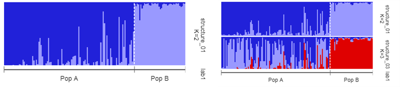  
__Fig. 12.__ *(A) Left: Single run plotted separately with pop labels. (B) Middle: Two runs joined together in one image with pop labels. (C) Right: Three runs joined together with double line population labels.*

Individuals can be sorted while using population labels. The individuals are sorted within their population groups.

```{r, echo=TRUE, eval=FALSE}
#with pop labels, sorted individuals
plotRuns(files=slist[1],poplab=pops$V1,sortind = "Cluster1")
plotRuns(files=slist[1],poplab=pops$V1,sortind = "all")

#with pop labels, sort individuals, multiple files single
plotRuns(files=slist[1:3],poplab=pops$V1,sortind = "Cluster1")
plotRuns(files=slist[1:3],poplab=pops$V1,sortind = "all")

#with pop labels, sort individuals, multiple files joined
plotRuns(files=slist[c(1,3)],poplab=pops$V1,sortind = "Cluster2",imgoutput="join")
plotRuns(files=slist[c(1,3)],poplab=pops$V1,sortind = "all",imgoutput = "join")

#tess files with pop labels, sort individuals
plotRuns(files=tlist[1],poplab=tpops$V1,sortind = "Cluster1")
plotRuns(files=tlist[1],poplab=tpops$V1,sortind = "all")

#admixture files with pop labels, sort individuals
plotRuns(files=alist[1],poplab=apops$V1,sortind = "Cluster1")
plotRuns(files=alist[1],poplab=apops$V1,sortind = "all")

#faststructure files with pop labels, sort individuals
plotRuns(files=flist[2],poplab=fpops$V1,sortind = "Cluster1")
plotRuns(files=flist[2],poplab=fpops$V1,sortind = "all")
```

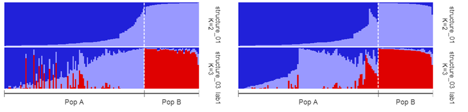  
__Fig. 13.__ *(A) Left: Joined plot with pop labels sorted by cluster 1. (B) Right: Joined plot with pop labels sorted by 'all'.*

When using population labels, the plot can be subsetted or reordered by population groups.

```{r, echo=TRUE, eval=FALSE}
#subsetting populations
plotRuns(files=slist[1],poplab=pops$V1,subsetpops="Pop A")
#change order of populations
plotRuns(files=slist[1],poplab=pops$V1,subsetpops=c("Pop B","Pop A"))

#subsetting pop and sorting individuals
plotRuns(files=slist[1],poplab=pops$V1,subsetpops="Pop A",sortind="Cluster1")
plotRuns(files=slist[1],poplab=pops$V1,subsetpops="Pop A",sortind="all")
#change order of pop and sorting individuals
plotRuns(files=slist[1],poplab=pops$V1,subsetpops=c("Pop B","Pop A"),sortind="Cluster1")
plotRuns(files=slist[c(1,3)],poplab=pops$V1,subsetpops=c("Pop B","Pop A"),sortind="all",imgoutput = "join")
```

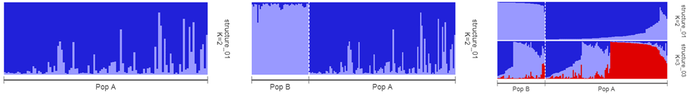  
__Fig. 14.__ *(A) Left: Single run with with subsetted pop label. (B) Middle: Single run with reordered pop labels. (C) Right: Joined plot with reordered pop labels.*

In similar manner, the `plotsRuns` function can be used to plot from combined, aligned or merged files. For this set argument `imgoutput="tab"`.

```{r,echo=TRUE, eval=FALSE}
# select files from package
tabs1 <- c(system.file("files/STRUCTUREpop_K4-combined.txt",package="pophelper"),
          system.file("files/STRUCTUREpop_K4-combined-aligned.txt",package="pophelper"),
          system.file("files/STRUCTUREpop_K4-combined-merged.txt",package="pophelper"))

# basic usage
# combined
plotRuns(files=tabs1[1],imgoutput="tab")
# aligned
plotRuns(files=tabs1[2],imgoutput="tab")
# merged
plotRuns(files=tabs1[3],imgoutput="tab")

# plot with labels
plotRuns(files=tabs1[1],imgoutput="tab",poplab=pops$V1)
plotRuns(files=tabs1[1],imgoutput="tab",poplab=pops$V1, height=1.4, width=6)
```

  
__Fig. 15.__ *(A) Left: Combined file (Three STRUCTURE runs for K=4). (B) Middle: Aligned file (Three STRUCTURE runs for K=4 aligned using CLUMPP). (C) Right: Merged file (Three runs for K=4 merged into one table/figure using CLUMPP)*  

TABLE files (Combined/aligned/merged) files can also be sorted and subsetted/ordered using pop labels.  
```{r,echo=TRUE, eval=FALSE}
#tab files sorting
plotRuns(files=tabs1[1],imgoutput="tab",sortind="Cluster1")
plotRuns(files=tabs1[1],imgoutput="tab",sortind="all")

#tab files sorting with pop labels
plotRuns(files=tabs1[1],imgoutput="tab",sortind="Cluster1",poplab=pops$V1)
plotRuns(files=tabs1[1],imgoutput="tab",sortind="all",poplab=pops$V1)
```

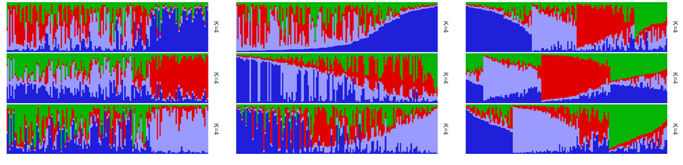  
__Fig. 16.__ *(A) Left: Combined file (Three STRUCTURE runs for K=4). (B) Middle: Combined file sorted by Cluster1. (C) Right: Combined file sorted by 'all'*  

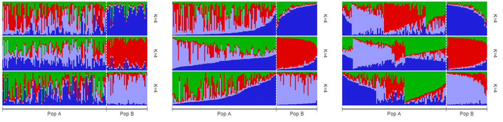  
__Fig. 17.__ *(A) Left: Combined file (Three STRUCTURE runs for K=4) with pop labels. (B) Middle: Combined file with poplabels sorted by Cluster1. (C) Right: Combined file with pop labels sorted by 'all'* 

```{r,echo=TRUE, eval=FALSE}
#tab files subsetting
plotRuns(files=tabs1[1],imgoutput="tab",poplab=pops$V1,subsetpops="Pop A")
#tab files subsetting sorting
plotRuns(files=tabs1[1],imgoutput="tab",poplab=pops$V1,subsetpops="Pop A",sortind="all")
#tab files change order of populations
plotRuns(files=tabs1[1],imgoutput="tab",poplab=pops$V1,subsetpops=c("Pop B","Pop A"))
#tab files change order of populations sort
plotRuns(files=tabs1[2],imgoutput="tab",poplab=pops$V1,subsetpops=c("Pop B","Pop A"),sortind="all")
```

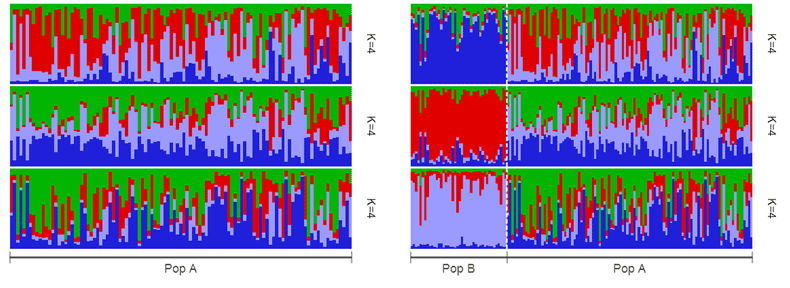  
__Fig. 18.__ *(A) Left: Combined file with subsetted pop labels. (B) Right: Combined file with reordered pop labels.*

Some additional features include ability to plot mean values by population when population labels are in use.

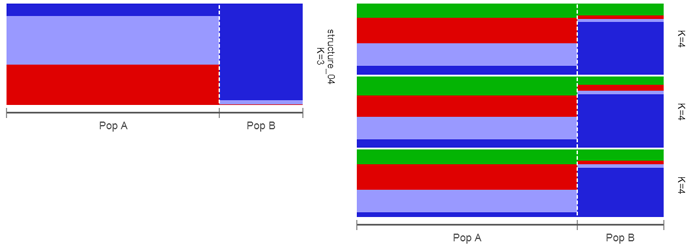  
__Fig. 19.__ *(A) Left: STRUCTURE file showing population mean values. (B) Right: Aligned TAB file showing population mean.*

```{r,echo=TRUE, eval=FALSE}
#pop mean
plotRuns(sfiles[4],poplab=pops$V1,popmean=T)
plotRuns(files=tabs1[2],imgoutput="tab",poplab=pops$V1,popmean=T)
```

`plotRuns()` function has numerous arguments to tweak the plot as required. See `?plotRuns` for more arguments and descriptions.

### plotMultiline  

The `plotMultiline` function is also used to plot STRUCTURE runs, TESS runs, ADMIXTURE runs and TAB files as barplots. This function automatically identifies these input file types. The barplots are plotted in multiple rows to enable easier identification of individuals. The figure is produced on A4 size by default. The number of samples per line `spl` and the number of lines per page `lpp` can be specified.

```{r,echo=TRUE, eval=FALSE}
# basic usage
plotMultiline(slist[1])
plotMultiline(tlist[1])
plotMultiline(alist[1])
plotMultiline(flist[1])
plotMultiline(mcfiles[1])
plotMultiline(msfiles[1])
plotMultiline(mtfiles[1])

# manually modifying samples per line and lines per page
plotMultiline(slist[1],spl=75,lpp=10)
plotMultiline(slist[1],spl=149,lpp=9)
# with TESS runs
plotMultiline(tlist[1],spl=75,lpp=10)
# with TESS runs
plotMultiline(alist[1],spl=168,lpp=10)

# works with combined, aligned or merged files
plotMultiline(tabs1,spl=75,lpp=10)

# change bar width and turn off labels
plotMultiline(tabs1[1], barwidth=1, indlabs=F)
# yaxis labels and ticks and modified height and width
plotMultiline(tabs1[1],spl=75,lpp=2,indlabs=T,yaxislabs=T,ticks=T,height=5,width=20)
# modified spl
plotMultiline(tabs1[1],spl=38,height=8,width=14)
```

Similar to `plotRuns()`, individuals can be sorted by any one cluster or 'all'. The 'all' option takes all clusters into account while sorting and produces a result similar to that produced in the STRUCTURE software 'Sort by Q' option.  

```{r,echo=TRUE, eval=FALSE}
plotMultiline(slist[1],sortind="Cluster1")
plotMultiline(slist[1],sortind="all")
plotMultiline(slist[1],spl=75,lpp=10,sortind="Cluster1")
plotMultiline(slist[1],spl=75,lpp=10,sortind="all")
```

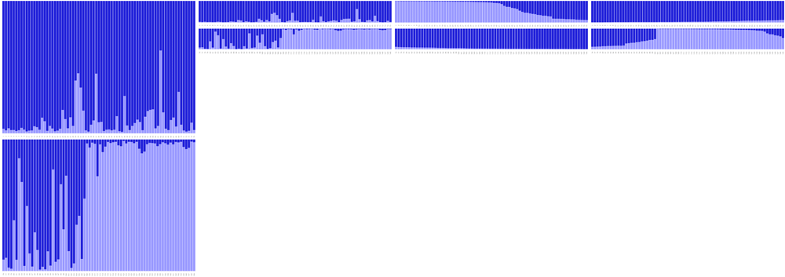  
__Fig. 20.__ *Left: Default output from `plotMultiline`. Middle Left: Modified output with custom `spl` and `lpp`. Middle Right: Sorted by Cluster1. Right: Sorted by 'all'.*

Individual labels can be added as a character vector.
```{r,echo=TRUE, eval=FALSE}
inds <- read.delim(system.file("files/structureindlabels.txt",package="pophelper"),header=FALSE)
#add ind labels.
plotMultiline(slist[1],indlab=inds$V1)
plotMultiline(slist[1],indlab=inds$V1,sortind="all")
plotMultiline(slist[1],indlab=inds$V1,sortind="Cluster1")

#long ind name
inds <- read.delim(system.file("files/structureindlabelslong.txt",package="pophelper"),header=FALSE)
plotMultiline(slist[1],indlab=inds$V1)
plotMultiline(slist[1],indlab=inds$V1,spl=75,lpp=4)
plotMultiline(slist[1:3],indlab=inds$V1,spl=75,lpp=4)
```

For STRUCTURE files, the individual labels if available within the file, can be imported and plotted using `indlabfromfile=T`. `sortlabels` has no effect when `indlabfromfile=T`

```{r,echo=TRUE, eval=FALSE}
#use ind labels from STRUCTURE file.
plotMultiline(slist[1],indlabfromfile=T)
plotMultiline(slist[1],indlabfromfile=T,sortind="all")
```

  
__Fig. 21.__ *Multiline plots with (left) standard colours, (middle) `rich.colors()` from `gplots` package and (right) `brewer.pal(8,"Spectral")` from `RColorBrewer` package.*

Note that this  function can be slow and takes several minutes to run depending on number of individuals and number of files selected.

### distructExport

DISTRUCT^7^ is one of the original programs written to generate assignment barplots tabular output. This function generates all output files necessary to run DISTRUCT from STRUCTURE, TESS, MATRIX or TAB files. A directory labelled 'filename-distruct' is created for each input file. Each directory contains the 'filename-indq.txt', 'filename-popq.txt', 'filename-colours.txt' and 'drawparams'. If poplab is in use, then 'filename-poplabbottom.txt' and/or 'filename-poplabtop.txt' are also created. The DISTRUCT executable can be run in this directory to create a 'filename.ps' postcript vector file. Using `useexe=T` will run the DISTRUCT executable automatically. Remember to cite DISTRUCT^7^ if this option is used. The 'filename.ps' file can be imported into a vector image editing software or seen using a viewer.

```{r,echo=TRUE, eval=FALSE}
#basic usage
distructExport(files = sfiles[1])
#with bottom labels
distructExport(files = sfiles[1],poplabbottom=pops$V1)
#with population means
distructExport(files = sfiles[1],popmean=T)
#grayscale colours
distructExport(files = sfiles[1],grayscale=T)
#run distruct executable
distructExport(files = sfiles[1],useexe=T)

#tess files
distructExport(files = tfiles[2])
#admixture files, adjust if plot does not fit on canvas
distructExport(files = afiles[3],indwidth=0.36,xorigin=15)
#TAB files
distructExport(files = tabs1[1])
distructExport(files = tabs1)
```

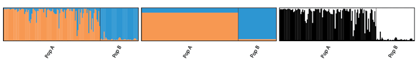  
__Fig. 26.__ *Left: DISTRUCT plot with `popmean=F`. Middle: DISTRUCT plot with `popmean=T`. Right: DISTRUCT plot with `grayscale=T`.*  

### analyseRuns  

This is a wrapper function for easily performing several `pophelper` functions in one function. Input files can be STRUCTURE, TESS or MATRIX run files. The `analyseRuns()` function performs a tabulation of runs, summarising of runs, perform Evanno method (for STRUCTURE runs only), exports clumpp output and generates barplots.

```{r,echo=TRUE, eval=FALSE}
# basic usage
analyseRuns(choose.files())
analyseRuns(files=slist)
analyseRuns(files=tlist)
analyseRuns(files=alist)
```

### plotRunsInterpolate  

The `plotRunsInterpolate()` function allows to spatially interpolate STRUCTURE, TESS or MATRIX runs. Files needed are STRUCTURE, TESS or MATRIX run files and geographical coordinate files of same length. Note that the coordinate file must be tab-delimited text file with no headers. The first column must be x (latitude) and second column y (longitude). Note that none of the methods are able to handle missing coordinate data. All coordinates must be available. Coordinates must be in standard longitude-latitude (LL) decimal format (eg: 21.0232, 43.0232). Note that this is generally a slow function and can take several minutes.

Here, we will use some sample files from the library.

```{r,echo=TRUE, eval=FALSE}
#specify path for datafile and coordsfile
tlist <- list.files(path=system.file("files/tess",package="pophelper"),full.names=T)
cd1 <- system.file("files/coords75.txt",package="pophelper")

# basic usage
plotRunsInterpolate(datafile=tlist[2],coordsfile=cd1)

#adjusting legend size and legend text
plotRunsInterpolate(datafile=tlist[2],coordsfile=cd1,legendsize=0.4,legendtextsize=6)

#removing legend
plotRunsInterpolate(tlist[2],cd1,legend=FALSE)

# try some structure files
s1 <- system.file("files/Structure239_4",package="pophelper")
cd2 <- system.file("files/coords239.txt",package="pophelper")
plotRunsInterpolate(datafile=s1,coordsfile=cd2)
# get dimensions and legend size as required
plotRunsInterpolate(datafile=s1,coordsfile=cd2,height=15,width=22,legendsize=0.4)
# finer grid # very slow
plotRunsInterpolate(datafile=s1,coordsfile=cd2,height=15,width=22,legendsize=0.4, 
                    gridsize=100)

# try admixture files
s1 <- system.file("files/admixture/admixture_01",package="pophelper")
cd2 <- system.file("files/coords1592.txt",package="pophelper")
plotRunsInterpolate(datafile=s1,coordsfile=cd2,method = "bilinear",height=10,width=26)

# try fast-structure files
s1 <- system.file("files/faststructure/fast-structure_02.meanQ",package="pophelper")
cd2 <- system.file("files/coords22.txt",package="pophelper")
plotRunsInterpolate(datafile=s1,coordsfile=cd2,method = "bilinear",height=10,width=26)
```

The default interpolation algorithm is Kriging (`method="krig"`). By default, `exportplot=T` exports an image to the working directory. By default `clusters=NA` which means that all clusters in the file are plotted. By default, `imgoutput="join"`, therefore all clusters are plotted in a single figure. The default `gridsize=60` produces rather pixellated grids. Increase gridsize to produce finer grid but at a higher computational cost.

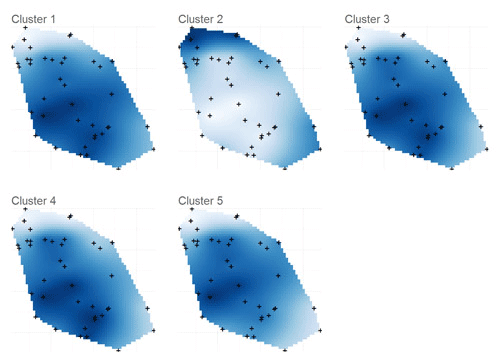  
__Fig. 22.__ *Interpolated plot of one TESS run file containing 6 clusters (K=6). The default interpolation algorithm (method) used was kriging. In this particular case, it is known that K=2, therefore only cluster 2 has useful information.*

We can choose only cluster 2 and try out different interpolation methods. Five methods are currently implemented: bilinear, bicubic, inverse distance weighting, nearest neighbour and kriging. Kriging is predictive while others are essentially direct spatial interpolation.

```{r,echo=TRUE, eval=FALSE}
df1 <- list.files(path=system.file("files/tess",package="pophelper"),full.names=T)[2]
cd1 <- system.file("files/coords75.txt",package="pophelper")

p1 <- plotRunsInterpolate(df1,cd1,legendsize=0.3,legendtextsize=5,
                          clusters=2,dataout=T,method="bilinear",exportplot=F)
p2 <- plotRunsInterpolate(df1,cd1,legendsize=0.3,legendtextsize=5,
                          clusters=2,dataout=T,method="bicubic",exportplot=F)
p3 <- plotRunsInterpolate(df1,cd1,legendsize=0.3,legendtextsize=5,
                          clusters=2,dataout=T,method="idw",exportplot=F)
p4 <- plotRunsInterpolate(df1,cd1,legendsize=0.3,legendtextsize=5,
                          clusters=2,dataout=T,method="nn",exportplot=F)
p5 <- plotRunsInterpolate(df1,cd1,legendsize=0.3,legendtextsize=5,
                          clusters=2,dataout=T,method="krig",exportplot=F)

library(gridExtra)
png("MethodsComparison.png",height=16,width=22,res=200,units="cm",type="cairo")
grid.arrange(p1[[1]],p2[[1]],p3[[1]],p4[[1]],p5[[1]],nrow=2,ncol=3)
dev.off()
```

We specify `clusters=2` which plots only cluster 2. The `dataout=T` allows to save the ggplot plot object to a variable and then modify them or combine with other plots. Due to `exportplot=F`, no plots are exported.

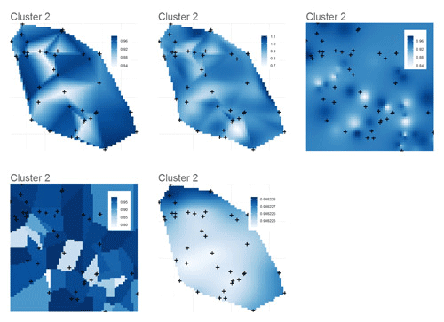  
__Fig. 23.__ *Interpolated plot of one cluster (Cluster 2) of one TESS run file containing 6 clusters (K=6) showing different interpolation methods. Row 1 from left: bilinear, bicubic and Inverse distance weighting. Row 2 from left: Nearest neighbour and Kriging.*

The colours can be easily changed by feeding in required colours to the argument `colours`. The R package `RColorBrewer` has a wide range of nice colours.

```{r,echo=TRUE, eval=FALSE}
# view Colorbrewer colours
library(RColorBrewer)
display.brewer.all()

# sample plots with custom colours
p1 <- plotRunsInterpolate(df1,cd1,clusters=2:3,colours=brewer.pal(8,"RdYlBu"),
                          legend=F,exportplot=F,dataout=T)
p2 <- plotRunsInterpolate(df1,cd1,clusters=2,colours=brewer.pal(8,"Spectral"),
                          legend=F,exportplot=F,dataout=T)
p3 <- plotRunsInterpolate(df1,cd1,clusters=2,colours=rev(brewer.pal(8,"BuPu")),
                          legend=F,exportplot=F,dataout=T)

png("PlotColours.png",height=8,width=24,res=200,units="cm",type="cairo")
grid.arrange(p1[[1]],p1[[2]],p2[[1]],p3[[1]],ncol=4)
dev.off()
```

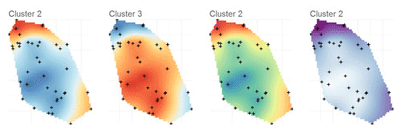  
__Fig. 24.__ *Interpolation plots showing some of the colour palettes available in package. Left 2 plots are `brewer.pal(8,"RdYlBu")`, 3^rd^ plot is `brewer.pal(8,"Spectral")` and 4^th^ plot is `brewer.pal(8,"BuPu")`.*  

Note that when using `plotRunsInterpolate()`, all methods may not work with all sorts of coordinate inputs.  

### plotRunsSpatial  

Estimate clusters using the highest probability of assignment for each individual and plot these clusters to spatial coordinates. The clusters are denoted by colour or point shape. The clusters can also be marked by confidence ellipses or convex hulls. Files needed are STRUCTURE, TESS or MATRIX run files and geographical coordinate files of same length. Note that the coordinate file must be tab-delimited text file with no headers. The first column must be x (latitude) and second column y (longitude). Note that none of the methods are able to handle missing coordinate data. All coordinates must be available. Coordinates must be in standard longitude-latitude (LL) decimal format (eg: 21.0232, 43.0232).

```{r,echo=TRUE, eval=FALSE}
library(RColorBrewer)
s1 <- system.file("files/Structure239_4",package="pophelper")
cd2 <- system.file("files/coords239.txt",package="pophelper")

# basic usage
plotRunsSpatial(datafile=s1,coordsfile=cd2)
# needs more height. set height and width as required in cm.
plotRunsSpatial(datafile=s1,coordsfile=cd2,height=12)
# set UTM coordinates. Better geographic distance representation over a scale 
# such as normal countries.
plotRunsSpatial(datafile=s1,coordsfile=cd2,height=12,setutm=T)
# without ellipses
plotRunsSpatial(datafile=s1,coordsfile=cd2,height=12,ellipse=F)

# create a 2x2 montage with varying parameters
# don't export plot, export data, add title
p1 <- plotRunsSpatial(datafile=s1,coordsfile=cd2,exportplot=F,dataout=T, plottitle="Fig 1")
# without ellipse, with square points and transparency added
p2 <- plotRunsSpatial(datafile=s1,coordsfile=cd2,exportplot=F,dataout=T, plottitle="Fig 2",
                      ellipse=F,pointtype=15,pointtransp=0.4)
# without ellipse, with convex hulls, coordinates in UTM, points by cluster, 
# custom colours,show axis
p3 <- plotRunsSpatial(datafile=s1,coordsfile=cd2,exportplot=F,dataout=T, 
                      plottitle="Fig 3",ellipse=F,chull=T, setutm=T,pointtype=NA,
                      pointsize=2,popcol=brewer.pal(5,"Dark2"),showaxis=T)
# no ellipse, with convex hull, decreased convexhull transparency, convexhull linetype, 
# change cluster labels, custom colours, show axis
p4 <- plotRunsSpatial(datafile=s1,coordsfile=cd2,exportplot=F,dataout=T, plottitle="Fig 4",
                      ellipse=F,chull=T,chulltransp=0.2,chulltype=3,
                      legendlabels=c("PopA","PopB","PopC","PopD","PopE"),
                      popcol=brewer.pal(5,"Set1"),showaxis=T)

png("PlotRunsSpatial.png",height=20,width=20,res=250,units="cm",type="cairo")
gridExtra::grid.arrange(p1,p2,p3,p4,nrow=2,ncol=2)
dev.off()
```
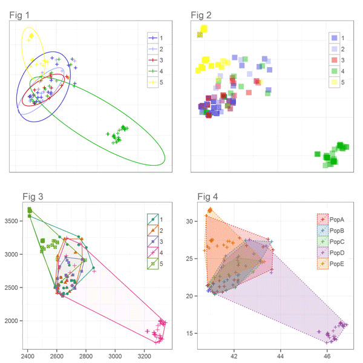  
__Fig. 25.__ *Some of the plots created using the function `plotRunsSpatial()`. Fig 1: The basic usage of the function with title added `plottitle="Fig 1"`. Fig 2: The ellipses are turned off `ellipse=F` and the point shape is changed `pointtype=15` and transparency added to points `pointtransp=0.4`. Fig 3: Convex hulls are turned on `chull=T` and coordinates are transformed to UTM `setutm=T`. The points shapes are based on clusters `pointtype=NA`. Custom colours are used `brewer.pal(5,"Dark2")` and axis are shown `showaxis=T`. Fig 4: Convex hull transparency is lowered `chulltransp=0.2`, convex hull linetype is changed `chulltype=3`, legend labels are changed `legendlabels=c("PopA","PopB","PopC","PopD","PopE")`. Custom colours are used `brewer.pal(5,"Set1")`.*  

```{r,echo=TRUE, eval=FALSE}
# try some fast-structure files
s1 <- system.file("files/faststructure/fast-structure_02.meanQ",package="pophelper")
cd2 <- system.file("files/coords22.txt",package="pophelper")
plotRunsSpatial(datafile=s1,coordsfile=cd2)
```

# Working code

Here is a list of all functions in a order typical of workflow.

## Structure  

```{r,echo=TRUE, eval=FALSE}
#choose files
slist <- choose.files(multi=TRUE)
#tabulate runs
df1 <- tabulateRunsStructure(slist)
#summarise runs
df2 <- summariseRunsStructure(df1)
#Evanno method
evannoMethodStructure(df2,exportplot=T)
#clumpp export
clumppExportStructure(slist)
#collect clumpp output
collectClumppOutput(prefix="STRUCTUREpop",filetype="aligned")
#plot runs
plotRuns(files=slist)
plotRuns(files=slist,imgoutput="join")
#for clumpp output
plotRuns(files=choose.files(multi=TRUE),imgoutput="tab")
#plot multiline
plotMultiline(slist[1])
plotMultiline(slist[1],spl=70,lpp=10)
#structure runs to data frame
runsToDfStructure(slist)

#or all together
analyseRuns(slist)
```

## Tess  

```{r,echo=TRUE, eval=FALSE}
#collect TESS output
collectRunsTess(runsdir=choose.dir())
#choose files
tlist <- choose.files(multi=TRUE)
#tabulate runs
df1 <- tabulateRunsTess(tlist)
#summarisee runs
df2 <- tabulateRunsTess(df1)
#clumpp export
clumppExportTess(tlist)
#collect clumpp output
collectClumppOutput(prefix="TESSpop",filetype="aligned")
#plot runs
plotRuns(files=tlist[1])
plotRuns(files=tlist[1:2],imgoutput="join")
#for clumpp outputs 
plotRuns(files=choose.files(multi=TRUE),imgoutput="tab")
#plot multiline
plotMultiline(tlist[1])
plotMultiline(tlist[1],spl=70,lpp=10)
#TESS runs to data frame
runsToDfTess(tlist)

#or all together
analyseRuns(tlist)
```

## Admixture/fastStructure/Other  

```{r,echo=TRUE, eval=FALSE}
#choose files
alist <- choose.files(multi=TRUE)
#tabulate runs
df1 <- tabulateRunsMatrix(alist)
#summarise runs
df2 <- summariseRunsMatrix(df1)
#clumpp export
clumppExportMatrix(alist)
#collect clumpp output
collectClumppOutput(prefix="MATRIXpop",filetype="aligned")
#plot runs
plotRuns(files=alist[1])
plotRuns(files=alist[1:2],imgoutput="join")
#for clumpp outputs
plotRuns(files=choose.files(multi=TRUE),imgoutput="tab")
#plot multiline
plotMultiline(alist[1])
plotMultiline(alist[1],spl=70,lpp=10)
#TESS runs to data frame
runsToDfMatrix(alist)

#or all together
analyseRuns(alist)
```

Most of the functionalities in this package have been implented in the online tool [Pophelper web app](https://www.pophelper.com). For those who prefer a graphical web interface, this may be useful.  

----

# References

1. [Alexander D.H., Novembre, J. and Lange K. (2009). Fast model-based estimation of ancestry in unrelated individuals. Genome Research, 19:1655-1664](http://genome.cshlp.org/content/19/9/1655.long)  

2. [Evanno G., Regnaut S., and Goudet J. (2005). Detecting the number of clusters of individuals using the software STRUCTURE: a simulation study. Molecular ecology, 14(8), 2611-2620](http://onlinelibrary.wiley.com/doi/10.1111/j.1365-294X.2005.02553.x/abstract)  

3. [Francois O., and Durand E. (2010). Spatially explicit Bayesian clustering models in population genetics. Molecular Ecology Resources, 10(5), 773-784](http://onlinelibrary.wiley.com/doi/10.1111/j.1755-0998.2010.02868.x/abstract)  

4. [Jakobsson M., and Rosenberg N. A. (2007). CLUMPP: a cluster matching and permutation program for dealing with label switching and multimodality in analysis of population structure. Bioinformatics, 23(14), 1801-1806](http://bioinformatics.oxfordjournals.org/content/23/14/1801.short)

5. [Pritchard J. K., Stephens M., & Donnelly P. (2000). Inference of population structure using multilocus genotype data. Genetics, 155(2), 945-959](http://www.genetics.org/content/155/2/945.short)  

6. [Raj A., Stephens M., Pritchard J.K. (2014). fastSTRUCTURE: variational inference of population structure in large SNP data sets. Genetics 197, 573-589](http://www.genetics.org/content/early/2014/04/14/genetics.114.164350)  

7. [Rosenberg, Noah A. "DISTRUCT: a program for the graphical display of population structure." Molecular Ecology Notes 4.1 (2004): 137-138.](http://onlinelibrary.wiley.com/doi/10.1046/j.1471-8286.2003.00566.x/abstract)  
----

# Useful Links

* [STRUCTURE program](http://pritchardlab.stanford.edu/structure.html)  
* [TESS program](http://membres-timc.imag.fr/Olivier.Francois/tess.html)  
* [ADMIXTURE program](https://www.genetics.ucla.edu/software/admixture/)  
* [fastSTRUCTURE program](https://rajanil.github.io/fastStructure/)  
* [CLUMPP program](http://www.stanford.edu/group/rosenberglab/clumpp.html)  
* [Structure Harvester](http://taylor0.biology.ucla.edu/structureHarvester)  
* [Adegenet R package](http://adegenet.r-forge.r-project.org/)  
* [Distruct program](https://web.stanford.edu/group/rosenberglab/distruct.html)

----

# Disclaimer

The `pophelper` R package is offered free and without warranty of any kind, either expressed or implied. I will not be held liable to you for any damage arising out of the use, modification or inability to use this program. `pophelper` R package can be used, redistributed and/or modified freely for non-commercial purposes subject to the original source being properly cited. Licensed under GPL-3. Please make sure you verify all your results by eye atleast once per batch.  

----

# Contact

Feel free to email me if you have any comments, suggestions or issues. Preferred email is roy[dot]m[dot]francis[at]outlook[dot]com.  
  
  
__2016 Roy M Francis__  
